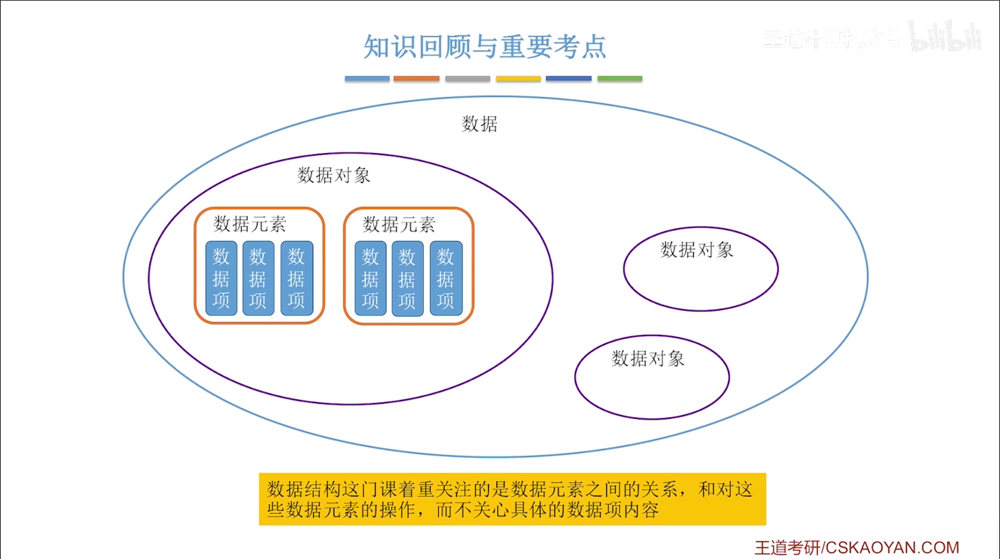
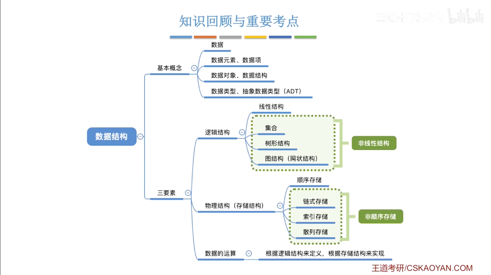
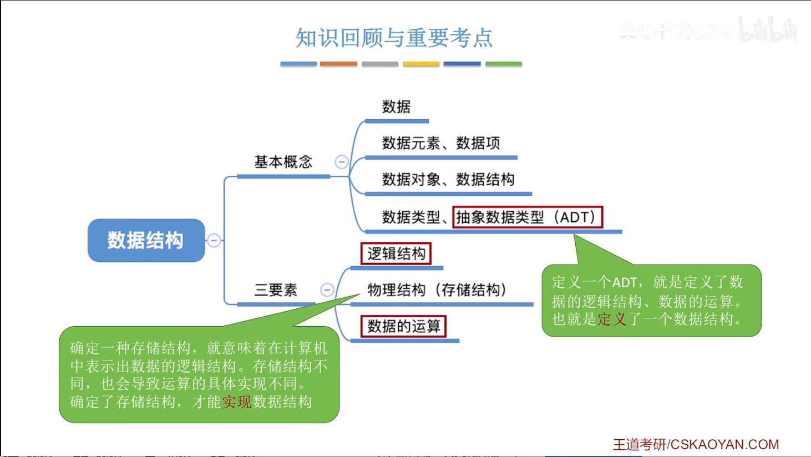
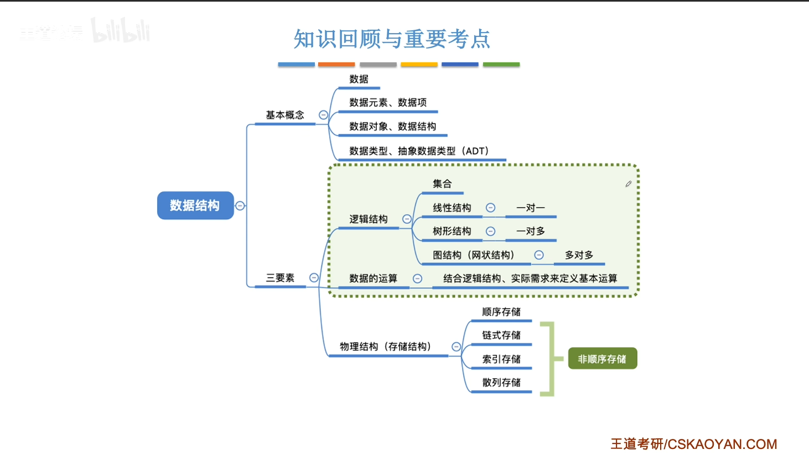
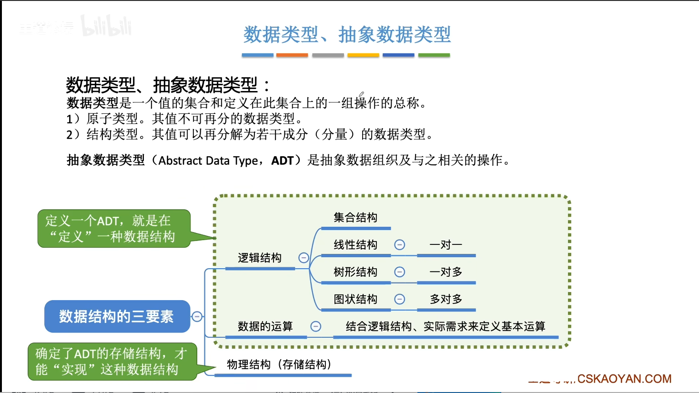
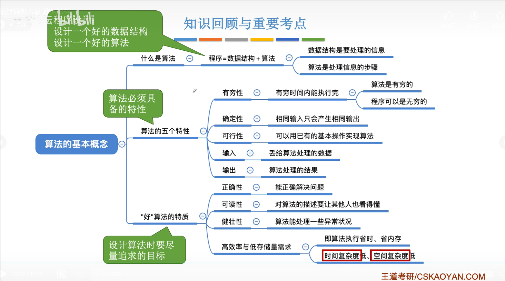
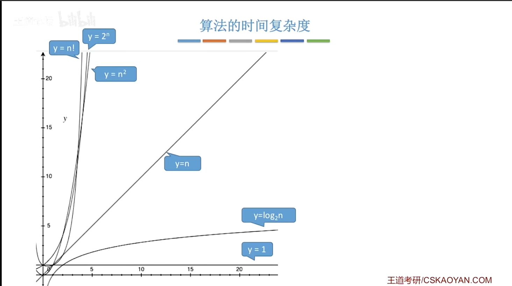
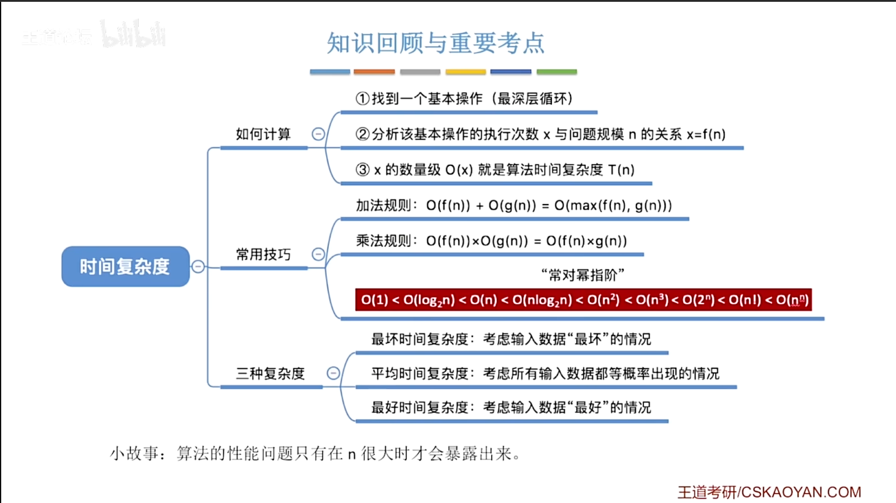

# 1.0_数据结构在学什么

- 如何用程序代码把现实世界的问题信息化
- 如何用计算机高效地处理这些信息，从而创造价值


# 1.1_数据结构的基本概念

## 一、学习定位

- 本章性质：非408大纲重点章节，但帮助搭建学习思维框架
- 学习建议：抓大放小，不必纠结细节，后续课程会不断巩固理解
- 后续学习思路：每学一种数据结构，都从“三要素”角度去分析

## 二、基本概念

### 1. 数据
- 信息的载体
- 描述客观事物的符号
- 能输入计算机并被程序识别和处理
- 计算机视角本质：二进制0/1

### 2. 数据元素（数据的基本单位）
- 整体考虑和处理
- 根据业务需求确定粒度
- 示例：海底捞排队系统 → 每桌顾客 = 一个数据元素

### 3. 数据项（数据元素的基本单元）
- 构成数据元素的每个具体属性
- 示例：某桌顾客的数据项包括——号数、取号时间、就餐人数等
- 不可再分的最小单元：组合项（如“生日”可拆为年/月/日）

### 4. 数据对象
- 具有相同性质的数据元素的集合
- 强调“性质相同”，不强调元素间的关系
- 示例：所有门店的排队顾客信息属于同一数据对象

### 5. 数据结构
- 相互之间存在一种或多种特定关系的数据元素集合
- 核心：强调数据元素之间的关系

## 三、数据结构三要素

### （一）逻辑结构（数据元素间的逻辑关系）

| 类型 | 关系 | 示例 |
| :--- | :--- | :--- |
| 集合 | 无其他关系，同属一集合 | 烤盘上的食物 |
| 线性结构 | 一对一 | 烤串、海底捞排队队列 |
| 树形结构 | 一对多 | 思维导图、电脑各级目录 |
| 图状/网状结构 | 多对多 | 微信好友关系 |

> 课程对应：线性（第2-3章）、树形（第4章）、图（第5章），集合基本不讨论。

### （二）物理结构 / 存储结构（逻辑关系如何在计算机中表示）

| 存储方式 | 特点 | 优点 | 缺点 |
| :--- | :--- | :--- | :--- |
| 顺序存储 | 逻辑相邻 → 物理相邻；需连续存储空间 | 查找快（下标直接取） | 插入/删除需大量移动 |
| 链式存储 | 逻辑相邻 → 物理可不相邻；用指针表示先后关系 | 插入/删除方便（改指针） | 查找需遍历 |
| 索引存储 | 建立索引表记录关键字与地址的对应关系 | 查找较快 | 需额外空间存索引表 |
| 散列存储 | 根据关键字直接计算出存储地址 | 查找极快 | 有冲突问题（详见第7章） |

**核心理解两点：**

- 顺序存储 → 物理连续；非顺序存储（链式/索引/散列）→ 物理可离散（类比：排队 vs 银行叫号随便坐）
- 存储结构影响：存储空间分配的方便程度；数据运算速度（查找/插入/删除等）

### （三）数据运算（对数据施加的操作）
- 针对逻辑结构定义需要哪些操作（如队列的入队、出队）
- 针对存储结构实现具体方式（例：顺序队列入队需挪位置，链式队列入队只需改指针）

**小结**：三要素的关系——定义数据结构 = 逻辑结构 + 数据运算；实现数据结构 = 根据存储结构实现具体运算。

## 四、数据类型 vs 抽象数据类型

### 1. 数据类型
**定义**：值的集合 + 定义在该集合上的操作的总称

| 分类 | 说明 | 示例 |
| :--- | :--- | :--- |	
| 原子类型 | 值不可再分 | bool（{true,false} + 与/或/非）、int（整数范围 + 加减乘除） |	
| 结构类型 | 值可分解为多个分量 | struct结构体，分量可不同数据类型 |	

### 2. 抽象数据类型（ADT, Abstract Data Type）
**定义**：抽象数据组织 + 与之相关的操作

- 用数学化语言定义：逻辑结构 + 数据运算（不关心存储结构）
- 存储结构只在具体实现时考虑

## 五、概念关系图





## 六、核心理解（后续学习不断巩固）

- 数据结构 = 逻辑结构 + 存储结构 + 数据运算（三要素）
- ADT = 逻辑结构 + 数据运算（存储结构暂不考虑）
- 同一逻辑结构 → 多种存储结构 → 运算实现方式不同 → 性能不同
- 学新数据结构时，主动从三要素角度思考


# 1.1_2_数据结构的三要素

> 承接绪论和开篇笔记，本讲深入讲解**数据结构的三要素**（逻辑结构、数据运算、物理结构）及**数据类型/抽象数据类型**概念。这是后续所有章节学习的分析框架。

## 一、数据结构三要素总览

| 要素 | 核心问题 | 类比（汽车） |
|------|---------|-------------|
| **逻辑结构** | 数据元素之间是什么关系？ | 定义：汽车有4个轮子+方向盘+发动机 |
| **数据运算** | 对这种数据可以进行哪些操作？ | 定义：汽车可以加速、刹车、转弯 |
| **物理结构（存储结构）** | 如何在计算机内存中表示这种关系？ | 实现：用V8还是三缸发动机？零部件如何布局？ |

> 关键理解：**定义 vs 实现** 是两回事——定义是"打嘴炮"，实现是"落到实处"。

## 二、逻辑结构（4种）

数据元素之间的逻辑关系。

| 逻辑结构 | 关系类型 | 核心特征 | 生活示例 |
|---------|---------|---------|---------|
| **集合** | 无关系 | 同属一个集合，无其他关系 | "中国最有钱的400个人"（只关心谁在集合里，不关心谁第一） |
| **线性结构** | 一对一 | 串成一条线；除首元素外有唯一前驱，除尾元素外有唯一后继 | 富豪排行榜、排队等位 |
| **树形结构** | 一对多 | 像自然界的大树，从根发出分支 | 思维导图、电脑文件系统（文件夹→子文件夹→文件） |
| **图状/网状结构** | 多对多 | 任意元素之间可能有联系 | 道路信息（城市间多条路互联）、微信好友关系 |

### 课程对应章节
- 线性结构 → 第2~3章（重点）
- 树形结构 → 第4章
- 图状结构 → 第5章
- 集合 → 408考纲已删除，不做探讨

## 三、数据运算

**定义**：针对某种特定的逻辑结构，结合实际需求，定义常用的基本操作。

### 核心理解
> 基于逻辑结构定义"需要什么运算"，而非"如何实现这些运算"。

### 线性结构的通用运算示例
以富豪排行榜为例：
- **查找**：排名第8的人是谁？（查）
- **插入**：某人财富暴增，插入到第3位（增）
- **删除**：某人财富缩水跌出榜单，移除元素（删）

> 这些操作对"所有线性结构"都是通用的——不管是富豪榜、排队队列还是其他线形数据，都可能需要"查第n个""在n位置插入""删除第n个"这些操作。

## 四、物理结构（存储结构）——4种

**核心问题**：如何用计算机内存表示数据元素之间的逻辑关系？

> 以"线性结构"为例，展示4种存储方式如何反映"前后关系"。

| 存储方式 | 存储方式 | 逻辑关系如何表示 | 特点 |
|---------|---------|----------------|------|
| **顺序存储** | 逻辑相邻→物理相邻 | 物理位置相邻直接反映前后关系 | 需分配连续存储空间 |
| **链式存储** | 逻辑相邻→物理可不相邻 | 用**指针**链接元素 | 离散存储，哪里有空位放哪里 |
| **索引存储** | 元素可放任意位置 | 建立**索引表**，记录关键字→存储地址 | 通过索引表查找元素 |
| **散列存储（Hash）** | 根据关键字直接计算地址 | 关键字→存储地址（直接映射） | 第六章详讲，暂不展开 |

### 存储结构对"存储空间分配"的影响
- **顺序存储**：需要一整片连续空间 → 内存碎片多时可能存不下
- **非顺序存储**（链式/索引/散列）：离散存放，哪里有空位插哪里 → 更灵活

### 存储结构对"运算速度"的影响（重点！）
**场景**：在线性结构 B 和 D 之间插入新元素 C

| | 顺序存储 | 链式存储 |
|---|---------|---------|
| **操作方式** | 把 D、E、F…全部往后挪，空出位置放C | 把C放到任意空闲位置，改B的指针→C，C的指针→D |
| **时间复杂度** | 高（需挪动大量数据） | 低（只改几个指针） |

> **核心结论**：运算的**定义**针对逻辑结构（如"在第二个位置插入"）；运算的**实现**针对存储结构（顺序存储挪数据 vs 链式存储改指针），不同存储结构影响运算效率。


## 五、数据类型与抽象数据类型（ADT）

### 1. 数据类型
**定义**：**值的集合** + **定义在该集合上的操作** 的总称。

| 分类 | 说明 | 示例 |
|------|------|------|
| **原子类型** | 值不可再分解 | bool（{true,false}+与或非）、int（整数范围+加减乘除） |
| **结构类型** | 值可分解为若干分量 | struct坐标（x,y顺序有逻辑含义；可定义相加/相减/算距原点距离等操作） |

> 使用数据类型时，使用者只关心："能取什么值？能做什么操作？"——不关心底层如何实现（用补码还是原码？加法器怎么设计的？）

### 2. 抽象数据类型（ADT, Abstract Data Type）

> 定义：**抽象数据组织 + 与之相关的操作**。本质就是**对数据结构逻辑特性的描述**。

| 角色 | 关心的问题 |
|------|-----------|
| **ADT使用者** | 逻辑结构什么样？能进行哪些操作？（只需知道"怎么用"） |
| **ADT实现者** | 采用什么存储结构？各操作如何用代码实现？（关心"怎么造"） |

> **一句话**：ADT = 逻辑结构 + 数据运算（不涉及存储结构）；当确定了存储结构并实现具体代码，才算"实现了一个数据结构"。


## 六、概念关系图




## 七、核心结论

1. **三要素确定一个数据结构的全貌**：逻辑关系是什么？能做什么操作？怎么在计算机里实现？
2. **ADT = 逻辑结构 + 数据运算**（定义层面，不涉及存储）
3. **运算的定义针对逻辑结构，运算的实现针对存储结构** —— 同一个操作（如"插入"），在不同存储结构下实现方式不同，效率也不同。


# 1.2_1_算法的基本概念

> 继数据结构三要素之后，本节进入**算法**模块。先理清算法是什么、算法的五个必备特性，以及好算法的评价标准。**程序 = 数据结构 + 算法** 是本讲的核心公式。

## 一、算法是什么？

### 1. 王道定义
**算法** 是对特定问题求解步骤的一种描述，是指令的有限序列，每条指令表示一个或多个操作。

### 2. 通俗理解（番茄炒蛋类比）

| 要素 | 计算机领域 | 做菜类比 |
|------|-----------|---------|
| **数据结构** | 如何用数据描述问题（要加工的“食材”） | 食材：鸡蛋、西红柿、料酒…… |
| **算法** | 如何处理这些数据（加工的“步骤”） | 菜谱：切块→打蛋→倒油→翻炒→…… |

>  算法就是“菜谱”，数据结构就是“食材”。有食材没有菜谱，做不出菜；有菜谱没有食材，巧妇难为无米之炊。

### 3. 算法示例：按年龄递增排序
**输入**：5个人的年龄数据（线性表）
**目标**：按年龄从小到大排列

**算法步骤**：
1. 第1轮：扫描全部5人，找出年龄最小的（18岁谢玉），放到第1位
2. 第2轮：扫描剩下4人，找出年龄最小的（40岁），放到第2位
3. 第3轮：扫描剩下3人，找出年龄最小的，放到第3位
4. 第4轮：扫描剩下2人，找出年龄最小的，放到第4位

> 算法可以用自然语言、伪代码、流程图或真正的编程语言（C/Java等）描述。用计算机实现时，最终要写成代码。

## 二、算法的五个特性（必备条件）

> 以下5个特性**缺一不可**，不满足任何一个就不能称之为“算法”。

| 特性 | 含义 | 关键点 |
|------|------|--------|
| **有穷性** | 算法必须在执行有限步后结束，每一步在有限时间内完成 | 算法≠程序：算法必须终止，程序可以无限运行（如微信、死循环） |
| **确定性** | 每条指令无歧义；相同输入必须得到相同输出 | 相同输入→相同输出；不能让算法“随机”选择 |
| **可行性** | 算法中的操作都必须能用计算机代码实现 | 不能描述无法编码的操作 |
| **输入** | 可有0个或多个输入，输入取自特定数据对象 | 如 Hello World 程序：0个输入 |
| **输出** | 必须有1个或多个输出，输出与输入有特定关系 | 无输出的“算法”没有意义 |

### 确定性补充说明
- 排序示例：两个人同龄（都是49岁），若算法有时马排前、有时丁排前，则不具备确定性
- 解决方式：增加规定——同龄时，原顺序靠前者排前面（稳定性保证）
- 因此，用自然语言描述算法时，要避免“找到年龄最小的一个”这类说法（若多人同龄，谁算“最小”不明确），需补充无歧义规则

### 算法与函数的联系
算法本质与数学函数 `y = f(x)` 高度一致：
- `x` = 输入（数据）
- `f` = 算法（映射/处理规则）
- `y` = 输出（处理结果）

## 三、好算法的四个特质（评价标准）

> 具备五个特性的算法只能叫“算法”，但不一定是“好算法”。以下四个特质是好算法的追求目标。

| 特质 | 含义 | 重要性 |
|------|------|--------|
| **正确性** | 能正确解决问题（排序后结果确实按年龄递增） | 底线要求，不正确则无意义 |
| **可读性** | 代码/描述易于理解，便于团队协作和维护 | 成熟程序员会写注释；“自己写的代码几个月后看不懂”很常见 |
| **健壮性** | 输入非法数据（如年龄=-100）时能恰当处理/报错，而非产生莫名其妙的结果 | 鲁棒性（Robustness），处理边界情况 |
| **高效率 + 低存储需求** | 执行时间少 + 内存开销小 | 即“时间复杂度低”+“空间复杂度低”，是下两节重点 |

### 正确性的边界
一个不正确的算法仍然可以称为“算法”（因为它可能满足五个特性），但**不是好算法**。

### 可读性的现实意义
- 团队协作时队友看得懂
- 自己以后回看也能快速理解
- 考研手写代码时加注释，阅卷老师印象更好

### 健壮性的示例
如果输入数据中混入 `age = -100`，算法应当识别并报错，而不是将其当作正常数据参与排序。

## 四、总结：设计好程序的两步走

好的程序 = 好的数据结构(如何描述问题) + 好的算法(如何高效处理)

1. **设计好的数据结构**：数据元素之间如何组织（逻辑结构），在计算机中如何表示（存储结构）
2. **设计好的算法**：基于该数据结构，高效地完成各种操作（查找、插入、删除、排序……）

### 核心公式
> **程序 = 数据结构 + 算法**（P = D + A）

## 五、后续预告

算法的“高效率”和“低存储需求”对应两个关键度量指标：
- **时间复杂度**：算法执行时间随数据规模增长的趋势
- **空间复杂度**：算法执行过程中占用的内存随数据规模增长的趋势

下两节将硬核讲解如何度量这两个复杂度，是第一章的重要考点。

## 六、本章知识脉络



**关键结论回顾：**
- 算法必须有穷 → 程序可无穷；算法必须有输出 → 无输出不叫算法
- 确定性要求：同样输入永远同样输出，不能模棱两可
- 好算法不止要“能跑通”，还要“可读、健壮、高效”
- 时间/空间复杂度是后续硬核考点，也是算法优劣的量化标准


# 1.2_2_算法的时间复杂度

> 继算法特性之后，本讲进入算法效率度量的核心——**时间复杂度**。后续还有空间复杂度。本讲核心回答：如何**在算法运行前**预估其时间开销 T(n) 与问题规模 n 的关系。

## 一、为什么不用“事后统计”来评价算法？

| 缺陷 | 说明 |
|------|------|
| 机器性能影响 | 同样的算法，好机器跑得快、差机器跑得慢 |
| 编程语言影响 | C语言效率通常高于Java等高级语言 |
| 编译质量影响 | 编译器生成的机器指令质量不同 |
| 不可事后测试 | 导弹控制算法不能先发射再统计 |

> **结论**：需要在算法运行**之前**预估时间开销，且要**排除与算法本身无关的外界因素**。这就是时间复杂度的意义。

## 二、时间复杂度的核心思路

**核心目标**：分析算法的时间开销 T(n) 与问题规模 n 之间的**函数关系**，并只关注其**数量级**（大O表示法）。

### 基本假设
- 执行任意一行代码所花时间**相同**（简化分析）
- 只关注问题规模 n 足够大时（n→∞）的增长趋势

### 第一步分析：逐行计数法（以“爱你n遍”为例）

```c
void love(int n) {         // 1次
    int i = 1;             // 1次
    while (i <= n) {       // n+1次（多一次判断退出）
        i++;               // n次
        printf("爱你%d\n"); // n次
    }
    printf("爱你完了");    // 1次
}
```

T(3000) = 1 + 1 + 3001 + 3000 + 3000 + 1 = 9004（具体数字）
T(n) = 3n + 3（用 n 表示）

> 但逐行计数不实用，代码太长时不可行。需要**简化**。

## 三、大O表示法（核心！）

### 1. 简化原则：只保留最高阶项，忽略系数和低阶项

| 精确表达式 | 大O表示 | 原因 |
|-----------|--------|------|
| T(n) = 3n + 3 | **O(n)** | 保留最高阶 n，系数3忽略，常数3忽略 |
| T(n) = n² + 3n + 1000 | **O(n²)** | n² 是最高阶 |
| T(n) = n³ + n² + n | **O(n³)** | n³ 最高阶 |

### 2. 大O的数学定义（了解即可）
> 存在常数 C > 0，使得当 n 足够大时，T(n) ≤ C × f(n)，则称 T(n) = O(f(n))

通俗说：当 n 足够大时，T(n) 的增长速度**不超过** f(n) 的常数倍。

### 3. 加法规则与乘法规则

| 规则 | 含义 | 示例 |
|------|------|------|
| **加法规则** | 多项相加，只保留最高阶 | O(n²) + O(n) = O(n²) |
| **乘法规则** | 嵌套循环/函数，复杂度相乘 | O(n) × O(n) = O(n²)；O(n) × O(log n) = O(n log n) |


## 四、常见数量级排序（必须记住！）

> **口诀**：常对幂指阶（从低到高）

**数量级从低到高（增长速度从慢到快）**：

| 大O表示 | 名称 | 增长速度 | n=1000时约 |
|--------|------|---------|-----------|
| O(1) | 常数阶 | 不随n增长 | 1 |
| O(log n) | 对数阶 | 缓慢增长 | 10 |
| O(n) | 线性阶 | 随n线性增长 | 1000 |
| O(n log n) | 线性对数阶 | 比线性略快 | 10000 |
| O(n²) | 平方阶 | 快速增长 | 1,000,000 |
| O(n³) | 立方阶 | 更快 | 1,000,000,000 |
| O(2ⁿ) | 指数阶 | 爆炸性增长 | 巨大 |
| O(n!) | 阶乘阶 | 最恐怖 | 天文数字 |



> **同一数量级视为同等优秀**，如 O(3n) 和 O(100n) 都是 O(n)，认为它们一样好。


## 五、时间复杂度分析的简化技巧

### 技巧1：顺序执行的代码 → 忽略，只影响常数项
- 1000行顺序代码 + 一个O(n)循环 → 整体还是 O(n)
- 加法规则：O(n) + O(1) = O(n)

### 技巧2：多层嵌套循环 → 只关注最深层循环的执行次数
- 外层 n 次 × 内层 n 次 = O(n²)
- 口诀：**嵌套相乘，并列相加**

### 技巧3：循环变量变化规律 → 分析循环次数 x 与 n 的关系

**例1：循环变量翻倍（i = i*2）**
```c
int i = 1;
while (i <= n) {
    printf("爱你");  // 执行x次
    i = i * 2;
}
```
- 循环 x 次后：i = 2^x
- 退出条件：2^x > n → x = ⌊log₂n⌋ + 1
- **时间复杂度：O(log n)**

**例2：循环变量平方增长、每次减半**——同理推导，本质都是看循环变量如何逼近 n。


## 六、最好、最坏、平均时间复杂度

> 当算法**输入数据不同**导致执行次数不同时，需分情况讨论。

**场景**：在长度为 n 的数组中查找元素 n（元素位置未知）

| 情况 | 条件 | 循环次数 | 时间复杂度 |
|------|------|---------|-----------|
| **最好情况** | n 在第1个位置 | 1 | O(1) |
| **最坏情况** | n 在第 n 个位置 | n | O(n) |
| **平均情况** | 等概率出现在任意位置 | (1+2+...+n)/n = (n+1)/2 | O(n) |

> **一般只关心最坏和平均**，最好情况参考意义不大。评价算法时，主要看最坏情况下能否接受。


## 七、分析步骤总结



## 八、重要结论回顾

1. **事后统计不靠谱** → 需要事前分析，排除外界因素
2. **只关注数量级**（大O） → 忽略常数、低阶项
3. **常对幂指阶** → 牢记数量级排序，判断谁“更高阶”
4. **嵌套相乘，并列相加** → 快速分析代码结构
5. **关注最坏+平均** → 评价算法的实际表现


# 1.2_3_算法的空间复杂度

# 2.1_线性表的定义和基本操作
-
# 2.2.1_顺序表的定义
-
# 2.2.2_1_顺序表的插入删除
-
# 2.2.2_2_顺序表的查找
-
# 2.3.1_单链表的定义
-
# 2.3.2_1_单链表的插入删除
-
# 2.3.2_2_单链表的查找
-
# 2.3.2_3_单链表的建立
-
# 2.3.3_双链表
-
# 2.3.4_循环链表
-
# 2.3.5_静态链表
-
# 2.3.6_顺序表和链表的比较
-
# 3.1.1_栈的基本概念
-
# 3.1.2_栈的顺序存储实现
-
# 3.1.3_栈的链式存储实现
-
# 3.2.1_队列的基本概念
-
# 3.2.2_队列的顺序实现
-
# 3.2.3_队列的链式实现
-
# 3.2.4_双端队列
-
# 3.3.1_栈在括号匹配中的应用
-
# 3.3.2_1_栈在表达式求值中的应用(上)
-
# 3.3.2_2_栈在表达式求值中的应用(下)
-
# 3.3.3_栈在递归中的应用
-
# 3.3.4+3.3.5_队列的应用
-
# 3.4.1-3.4.4_特殊矩阵的压缩存储
-
# 4.1_1_串的定义和基本操作
-
# 4.1_2_串的存储结构
-
# 4.2_1_朴素模式匹配算法
-
# 4.2_2_KMP算法(上)
-
# 4.2_3_KMP算法(下)
-
# 4.2.2_1_KMP算法
-
# 4.2.2_2_求next数组
-
# 4.2.3_KMP算法的进一步优化
-
# 5.1.1+5.1.2_树的定义和基本术语
-
# 5.1.3 树的性质
-
# 5.2.1_1_二叉树的定义和基本术语
-
# 5.2.1_2_二叉树的性质
-
# 5.2.2_二叉树的存储结构
-
# 5.3.1_1_二叉树的先中后序遍历
-
# 5.3.1_2_二叉树的层次遍历
-
# 5.3_3_由遍历序列构造二叉树
-
# 5.3.2_1_线索二叉树的概念
-
# 5.3.2_2_二叉树的线索化
-
# 5.3.2_3_在线索二叉树中找前驱后继
-
# 5.4.1 树的存储结构
-
# 5.4.2 树、森林与二叉树的转换
-
# 5.4.3 树和森林的遍历
-
# 5.5.1_哈夫曼树
-
# 5.5.2_1_并查集
-
# 5.5.2_2_并查集的进一步优化
-
# 6.1.1_图的基本概念
-
# 6.2.1_邻接矩阵法
-
# 6.2.2_邻接表法
-
# 6.2.3+6.2.4_十字链表、邻接多重表
-
# 6.2.5_图的基本操作
-
# 6.3.1_图的广度优先遍历
-
# 6.3.2_图的深度优先遍历
-
# 6.4.1_最小生成树
-
# 6.4.2_1最短路径问题_BFS算法
-
# 6.4.2_2最短路径问题_Dijkstra算法
-
# 6.4.2_3_最短路径问题_Floyd算法
-
# 6.4.3_有向无环图描述表达式
-
# 6.4.4_拓扑排序
-
# 6.4.5_关键路径
-
# 7.1_查找的基本概念
-
# 7.2.1_顺序查找
-
# 7.2.2_折半查找
-
# 7.2.3_分块查找
-
# 7.3.1 二叉排序树
-
# 7.3.2_1 平衡二叉树
-
# 7.3.2_2_平衡二叉树的删除
-
# 7.3.3_1_红黑树的定义和性质
-
# 7.3.3_2_红黑树的插入
-
# 7.3.3_3_红黑树的删除
-
# 7.4.1_1_B树
-
# 7.4.1_2_B树的插入删除
-
# 7.4.2_B+树
-
# 7.5.1 散列表的基本概念
-
# 7.5.2 散列函数的构造
-
# 7.5.3_1 处理冲突的方法_拉链法
-
# 7.5.3_2 处理冲突的方法_开放定址法
-
# 7.5.4 散列查找的性能分析
-
# 8.1_排序的基本概念
-
# 8.2.1+8.2.2_插入排序
-
# 8.2.3_希尔排序
-
# 8.3.1_冒泡排序
-
# 8.3.2_快速排序
-
# 8.4.1_简单选择排序
-
# 8.4.2_1_堆排序
-
# 8.4.2_2_堆的插入删除
-
# 8.5.1_归并排序
-
# 8.5.2_基数排序
-
# 8.5.3 计数排序
-
# 8.7.1+8.7.2_外部排序
-
# 8.7.3_败者树
-
# 8.7.4_置换-选择排序
-
# 8.7.5_最佳归并树