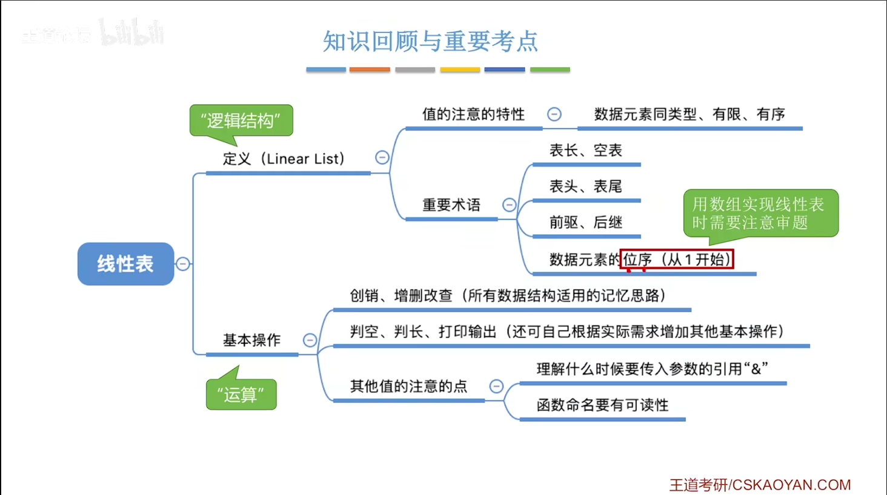
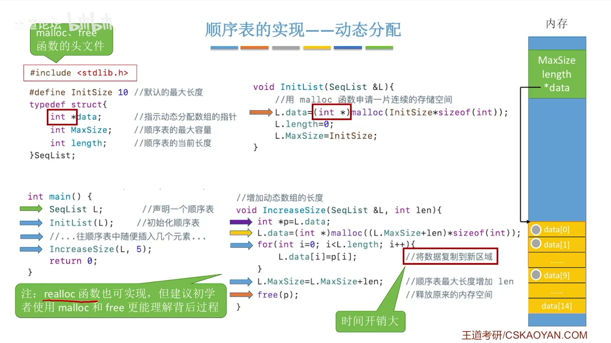
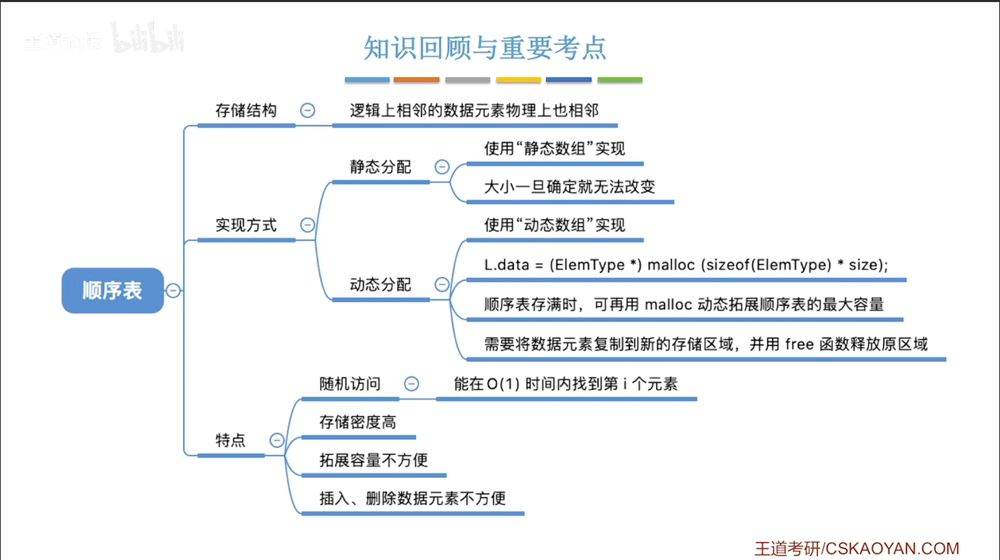
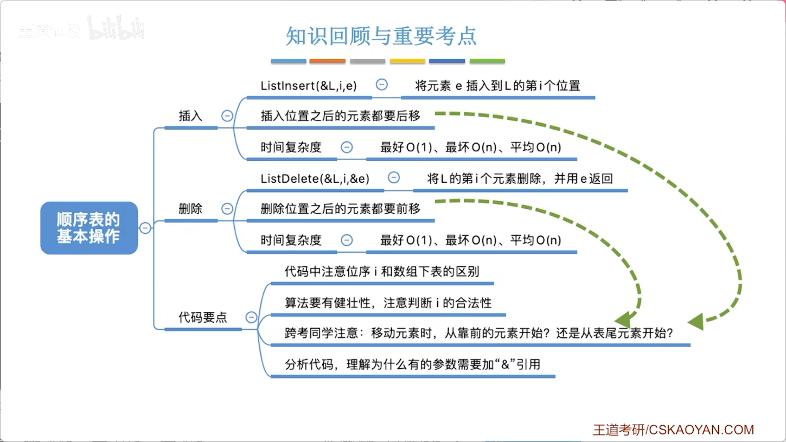
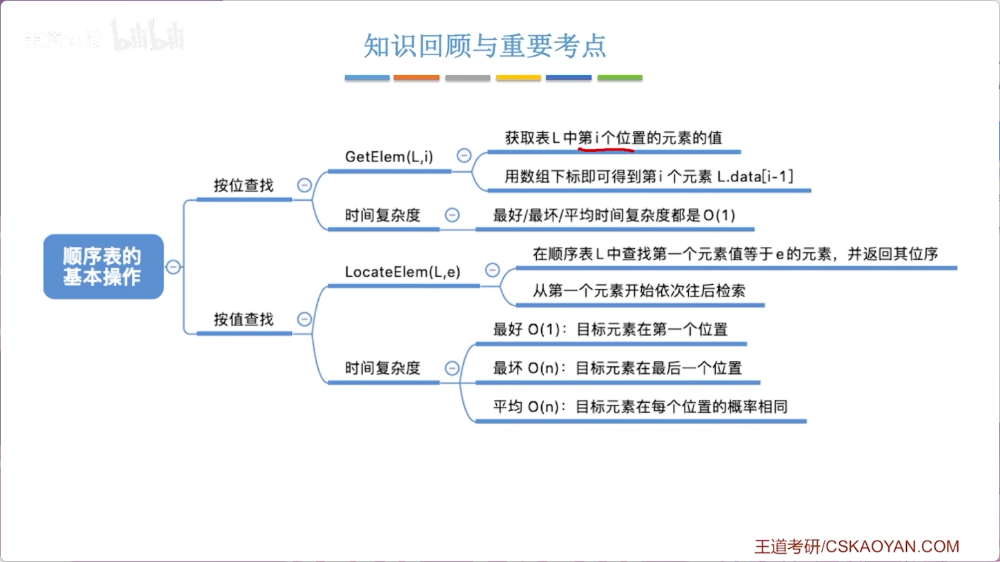
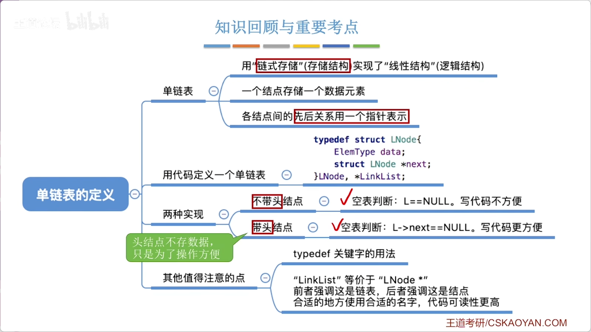
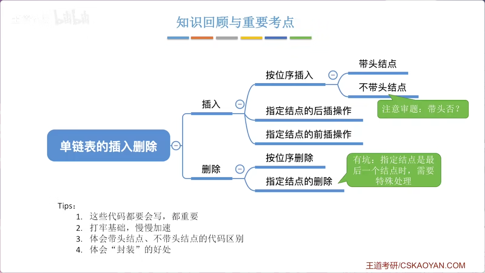
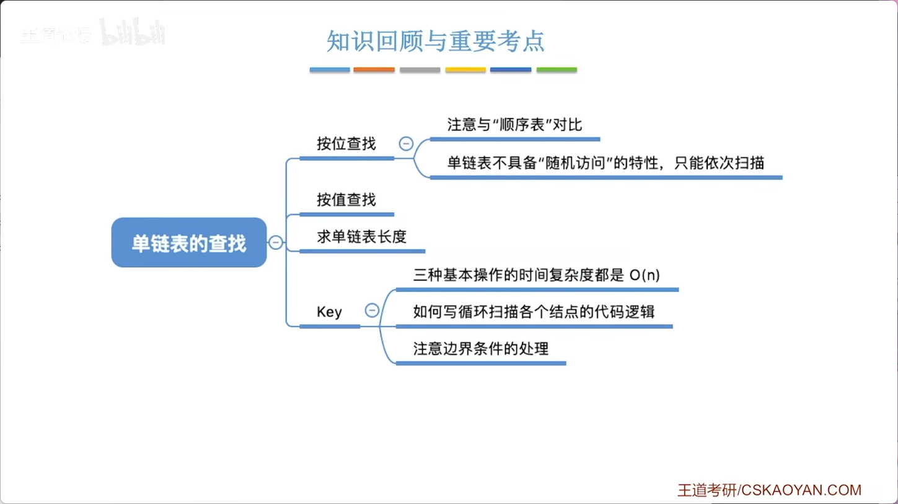

# 2.1_线性表的定义和基本操作

> 第二章正式进入第一个具体数据结构——**线性表**。本讲按照三要素框架，先探讨**逻辑结构**和**数据运算（基本操作）** ，存储结构将在后续小节展开。

## 一、线性表的定义（逻辑结构）

### 1. 大白话理解
> 各个数据元素之间的逻辑关系是“一条线”——被穿到一起，有前后关系。

### 2. 严谨定义
**线性表**：具有**相同数据类型**的 n 个数据元素的**有限序列**。

记作：**L = (a₁, a₂, a₃, ……, aₙ)**

### 3. 定义中的三个关键点

| 特性 | 含义 | 注意 |
|------|------|------|
| **数据类型相同** | 所有数据元素类型一致 | 确保每个元素占相同存储空间 → 计算机可快速定位 |
| **序列（有次序）** | 元素之间有先后顺序 | “线性”的核心体现 |
| **有限性** | 数据元素个数 n 是有限的 | 反例：“所有整数按递增排列”不是线性表（整数无限） |

### 4. 重要术语

| 术语 | 含义 |
|------|------|
| **表长** | 线性表中数据元素的个数 n |
| **空表** | 表长 n = 0 的线性表 |
| **位序** | 元素在线性表中的位置（第几个），**从 1 开始计数** |
| **表头元素** | 第一个元素 a₁ |
| **表尾元素** | 最后一个元素 aₙ |
| **直接前驱** | 除第一个元素外，每个元素前面相邻的那个元素 |
| **直接后继** | 除最后一个元素外，每个元素后面相邻的那个元素 |

### 5. 为什么叫“表”？

- 英文：**Linear List**（线性列表）
- List = 列表（如代办事项 To-Do List），天然是元素的有序集合
- 从形式上看，每个元素包含多个数据项时，呈现出的就是一张**表格**


## 二、线性表的基本操作（数据运算）

### 1. 核心操作（“创销增删改查”）

| 操作 | 函数接口 | 功能 | 是否需引用参数 |
|------|---------|------|--------------|
| 初始化 | **InitList(&L)** | 创建空表，分配内存 |  需要（要带回创建的表） |
| 销毁 | **DestroyList(&L)** | 释放表占用的内存空间 |  需要（要清空原表） |
| 插入 | **ListInsert(&L, i, e)** | 在第 i 个位置插入元素 e |  需要（要带回修改后的表） |
| 删除 | **ListDelete(&L, i, &e)** | 删除第 i 个元素，并用 e 返回其值 |  都需要（L要改，e要带回被删值） |
| 按值查找 | **LocateElem(L, e)** | 查找值为 e 的元素位置 |  不需要（只读不写） |
| 按位查找 | **GetElem(L, i)** | 获取第 i 个元素的值 |  不需要（只读不写） |

### 2. 辅助操作

| 操作 | 函数接口 | 功能 |
|------|---------|------|
| 求表长 | **Length(L)** | 返回线性表长度 |
| 打印输出 | **PrintList(L)** | 按顺序输出所有元素值 |
| 判空 | **Empty(L)** | 若表空返回 true，否则 false |

### 3. 数据运算的共同规律

> 无论哪种数据结构，基本操作都围绕**“创销增删改查”**展开。学习新数据结构时，可以主动思考这六个方面如何实现。


## 三、关键重点：引用类型参数（&）

### 1. 核心规则

> **如果对参数的修改结果需要“带回来”，就必须使用引用类型（&）。**

### 2. 对比演示

**不用引用（C语言默认传值）**：

```c
void test(int x) {
    x = 1024;        // 修改的是x的“复制品”
}
int main() {
    int x = 1;
    test(x);
    printf("%d", x); // 输出还是 1（修改没带回来）
}
```

**使用引用（C++写法）**：

```c
void test(int &x) {  // 加&
    x = 1024;        // 修改的是x本身
}
int main() {
    int x = 1;
    test(x);
    printf("%d", x); // 输出 1024（修改带回来了）
}
```

### 3. 本质理解

- **传值**：函数内部操作的是实参的一份**复制品** → 修改影响不到外部
- **传引用**：函数内部操作的**就是实参本身**（别名） → 修改直接影响外部

>  **注意**：`&` 是 C++ 语法，C 语言不支持。用 C 语言环境编译会报错，需用 C++ 编译器。


## 四、为什么要封装成基本操作？

| 原因 | 说明 |
|------|------|
| **团队协作** | 数据结构的定义者提供统一接口，队友直接调用，无需关心内部实现 |
| **避免重复劳动** | 常用操作封装成函数，每次需要时调用即可，不需要重新写代码 |
| **提高可维护性** | 内部实现变化时，只要接口不变，调用方代码无需改动 |

>  学编程不仅要关注“怎么做”，更要思考“为什么这么做”——理解意义才能真正内化。


## 五、命名规范与可读性

| 规范 | 示例 | 优点 |
|------|------|------|
| 函数名见名知义 | `DestroyList` 一眼知道是销毁 | 队友/阅卷老师易理解 |
| 变量名有含义 | `length` 比 `len` 好，`a` 最差 | 代码可维护性强 |
| 参考经典教材命名 | 严蔚敏版《数据结构》的命名风格 | 考研答题更讨喜 |

> 不要起名为 `f()`、`fun()`、`a()`——除了你自己没人看得懂。




# 2.2.1_顺序表的定义

> 从逻辑结构到物理结构的落地：线性表用顺序存储方式实现 → **顺序表**。本讲重点：顺序表在内存中如何表示？如何用代码实现？静态分配和动态分配有何区别？

## 一、顺序表的核心定义

### 1. 什么是顺序表
> 用**顺序存储**方式实现的线性表。

- 逻辑上相邻的数据元素 → **物理上也相邻**
- 用元素在内存中的**物理相邻**直接体现逻辑上的“前后关系”

### 2. 关键计算：如何快速定位任意元素？

由于所有数据元素**类型相同**（每个元素占相同空间大小），且**连续存放**，第 i 个元素的存储地址：

- LOC(i) = LOC(1) + (i-1) × sizeof(数据元素类型)


| 要素 | 说明 |
|------|------|
| LOC(1) | 第一个元素的起始地址（基地址） |
| sizeof(数据类型) | 每个元素占用的字节数，用 `sizeof()` 获取 |
| (i-1) × 元素大小 | 从第1个到第i个之间的偏移量 |

> 这就是 **随机访问** 特性的数学基础——知道下标 i，O(1) 时间就能算出地址。


## 二、顺序表的两种实现方式

### 方式一：静态分配（定长数组）

```c
#define MaxSize 10                // 最大容量（宏定义）
typedef struct {
    ElemType data[MaxSize];       // 静态数组存放元素
    int length;                   // 当前长度
} SqList;                         // Sq = Sequence 顺序
```

#### 初始化函数

```c
void InitList(SqList &L) {
    for (int i = 0; i < MaxSize; i++)
        L.data[i] = 0;            // 设置默认值（可省略）
    L.length = 0;                 // 必须设置！
}
```

####  关键问题：为什么要初始化 length？

**内存“脏数据”问题**：

- 声明 `SqList L;` 时，系统分配内存空间
- 这片空间之前可能存过其他数据（遗留的脏数据）
- 如果不设置 `L.length = 0`，`length` 可能是随机值 → 程序无法知道表实际有多长

> **结论**：给 `length` 赋初始值**绝对不能省略**；给 `data[]` 设默认值可以省略（因为正确操作只访问有效范围内的元素，访问范围由 length 控制）。

#### 静态分配的局限性
- 数组大小一旦确定**不可更改**
- 存满了 → 只能放弃治疗
- 设太大浪费内存，设太小不够用 → **容量不可变**是最大缺陷


### 方式二：动态分配（动态数组）

```c
#define InitSize 10
typedef struct {
    ElemType *data;               // 指向第一个元素的指针（动态数组）
    int MaxSize;                  // 最大容量
    int length;                   // 当前长度
} SqList;
```

#### 核心函数：malloc 和 free

| 函数 | 头文件 | 功能 |
|------|--------|------|
| `malloc(size)` | `#include <stdlib.h>` | 申请 size 字节的连续空间，返回起始地址（void*） |
| `free(ptr)` | `#include <stdlib.h>` | 释放 ptr 指向的内存空间 |

#### 初始化动态顺序表

```c
void InitList(SqList &L) {
    L.data = (ElemType*)malloc(InitSize * sizeof(ElemType));
    L.length = 0;
    L.MaxSize = InitSize;
}
```

#### 动态增加容量（关键操作）

```c
void IncreaseSize(SqList &L, int len) {
    ElemType *p = L.data;                     // p暂存旧数组地址
    L.data = (ElemType*)malloc(
        (L.MaxSize + len) * sizeof(ElemType)  // 申请新空间（更大）
    );
    for (int i = 0; i < L.length; i++)
        L.data[i] = p[i];                     // 复制数据到新区域
    L.MaxSize = L.MaxSize + len;              // 更新最大容量
    free(p);                                  // 释放旧空间
}
```


#### 动态扩展背后的内存变化

1. 初始状态：data指针 → 旧数组（可存10个元素）
2. 需要扩容：malloc 申请新数组（可存15个元素）
3. data指针 → 新数组
4. 用 for 循环把旧数据复制到新数组
5. free(p) 释放旧数组空间


>  **重要**：扩容需要把旧数据**全部复制**到新区域，时间复杂度高（O(n)），因此即便动态分配解决了容量问题，扩容操作仍然代价较大。

#### 补充：realloc 函数
C语言也提供 `realloc` 可以一步完成“申请新空间+复制+释放旧空间”，但实际使用中可能遇到意想不到的问题（如搬迁失败等）。建议先自己用 `malloc + free` 实现，更清晰理解底层过程。


## 三、C++ 替代方案（了解即可）

如果使用 C++ 编译器：
- `new` → 替代 `malloc`
- `delete` → 替代 `free`

但考研更多用 C 语言风格，重点掌握 `malloc` 和 `free`。


## 四、顺序表的四个特点（记住！）

| 特点 | 说明 | 影响 |
|------|------|------|
| **① 随机访问** | 知道下标 i，O(1) 时间找到第 i 个元素 | 这是数组天然特性，定位极快 |
| **② 存储密度高** | 每个节点只存数据，不存指针 | 相比链表，空间利用率高 |
| **③ 扩容不方便** | 静态分配不可扩容；动态分配需复制全部数据 | 扩容代价大（O(n)） |
| **④ 插入/删除不方便** | 需要移动大量元素 | 下节详细展示 |

>  **存储密度** = 数据本身所占空间 / 结点总空间。顺序表每个结点只存数据 → 密度≈1；链表每个结点存数据+指针 → 密度<1。


## 五、易错点：位序 vs 数组下标

| 概念 | 起始值 | 说明 |
|------|--------|------|
| **位序**（逻辑） | 从 1 开始 | 第1个元素、第2个元素…… |
| **数组下标**（物理） | 从 0 开始 | data[0] 对应第1个元素 |

代码中务必注意转换：逻辑第 i 个元素 → 数组下标 `i-1`。


## 六、本节核心总结




# 2.2.2_1_顺序表的插入删除

> 本讲承上启下：在上一讲“如何定义顺序表”基础上，深入实现**插入**和**删除**两个核心操作，并分析其时间复杂度。你将直观感受到顺序表“插入/删除需要移动大量元素”意味着什么。

## 一、插入操作

### 1. 核心思想
在顺序表第 i 个位置（**位序从1开始**）插入新元素 e：
- 将第 i 个位置及其后的所有元素**从后往前**依次后移一位
- 将新元素 e 放入第 i 个位置
- 表长 length + 1

**逻辑→物理的映射**：用“物理位置的相邻”体现“逻辑上的前后关系”。

### 2. 代码实现（静态分配）

```c
// 插入操作：在第i个位置插入元素e
bool ListInsert(SqList &L, int i, int e) {
    // ① 健壮性检查
    if (i < 1 || i > L.length + 1)      // 插入位置不合法
        return false;
    if (L.length >= MaxSize)            // 表已满
        return false;
    
    // ② 后移元素（从最后一个元素开始依次后移）
    for (int j = L.length; j >= i; j--) {
        L.data[j] = L.data[j - 1];      // 注意：数组下标从0开始
    }
    
    // ③ 插入新元素
    L.data[i - 1] = e;
    L.length++;
    return true;
}
```

### 3. 移动元素的顺序（重点理解）

**为什么从后往前移？**


- 初始：a1 a2 a3 a4 a5   ← 在第3位插入c
- 步骤：
    1. 先移 a5 → 第6位：a1 a2 a3 a4 a5 (a5)
    2. 再移 a4 → 第5位：a1 a2 a3 a4 (a4) a5
    3. 再移 a3 → 第4位：a1 a2 (a3) a4 a5
    4. 最后把 c 放入第3位：a1 a2 c a3 a4 a5


如果**从前往后移**，a3 会被覆盖，造成数据丢失。

> 口诀：**插入 → 后移 → 从后往前**

### 4. 健壮性设计（好代码的素养）

| 异常情况 | 处理方式 |
|----------|---------|
| 插入位置 i < 1 或 i > length+1 | 返回 false |
| 顺序表已满（length ≥ MaxSize） | 返回 false |
| 插入成功 | 返回 true |

**为什么必须加引用 `&`？**
- 插入操作需要修改 L 的数据和 length，修改必须“带回去”给调用者
- 若不加 `&`，函数操作的是 L 的复制品，外部 L 不会改变


## 二、删除操作

### 1. 核心思想
删除顺序表第 i 个位置的元素，并用 e 返回被删元素的值：
- 用 e 保存被删元素的值
- 将第 i+1 个位置及其后的元素**从前往后**依次前移一位
- 表长 length - 1

### 2. 代码实现

```c
bool ListDelete(SqList &L, int i, int &e) {
    // ① 健壮性检查
    if (i < 1 || i > L.length)      // 删除位置不合法（必须是已存在的元素）
        return false;
    
    // ② 取出被删元素
    e = L.data[i - 1];
    
    // ③ 前移元素（从 i 后面一个开始，依次前移）
    for (int j = i; j < L.length; j++) {
        L.data[j - 1] = L.data[j];
    }
    
    // ④ 表长减1
    L.length--;
    return true;
}
```

### 3. 移动元素的顺序（与插入对比）


- 初始：a1 a2 a3 a4 a5   ← 删除第3位
- 步骤：
    1. 先移 a4 → 第3位：a1 a2 a4 a4 a5
    2. 再移 a5 → 第4位：a1 a2 a4 a5 a5
    3. length-- → 有效数据为前4个：a1 a2 a4 a5


> 💡 口诀：**删除 → 前移 → 从前往后**

### 4. 为什么有两个 `&` 参数？

```c
bool ListDelete(SqList &L, int i, int &e)
```

| 参数 | 为何加 `&` |
|------|-----------|
| `SqList &L` | 删除后表变了，要带回去 |
| `int &e` | 要把被删元素的值“带回去”给调用者 |


## 三、时间复杂度分析

### 插入操作

| 情况 | 位置 | 移动次数 | 时间复杂度 |
|------|------|---------|-----------|
| **最好** | 表尾（i = n+1） | 0 | **O(1)** |
| **最坏** | 表头（i = 1） | n | **O(n)** |
| **平均** | 等概率插入到 n+1 个位置 | 平均 n/2 | **O(n)** |

**平均情况计算**（理解即可，不要求推导）：
- 有 n+1 个可插入位置，概率均为 1/(n+1)
- 移动到后移次数：1/(n+1) × (n + n-1 + ... + 0) = n/2
- 时间复杂度：O(n)

### 删除操作

| 情况 | 位置 | 移动次数 | 时间复杂度 |
|------|------|---------|-----------|
| **最好** | 表尾（i = n） | 0 | **O(1)** |
| **最坏** | 表头（i = 1） | n-1 | **O(n)** |
| **平均** | 等概率删除 n 个元素 | 平均 (n-1)/2 | **O(n)** |


## 四、插入 vs 删除对比表

| 对比项 | 插入 | 删除 |
|--------|------|------|
| 核心操作 | 元素后移 | 元素前移 |
| 移动方向 | **从最后一个元素开始**往前移 | **从第一个要移的元素开始**往后移 |
| 表长变化 | length + 1 | length - 1 |
| 合法性检查 | 1 ≤ i ≤ length+1 | 1 ≤ i ≤ length |
| 是否需存被删值 | 否 | 是（e 带回来） |
| 最好复杂度 | O(1)（插表尾） | O(1)（删表尾） |
| 最坏复杂度 | O(n)（插表头） | O(n)（删表头） |
| 平均复杂度 | O(n) | O(n) |


## 五、易错点清单

### 1. 数组下标 vs 位序（极其重要！）

- 位序：第1个、第2个……第n个  （从1开始）
- 下标：data[0]、data[1]……data[n-1]  （从0开始）

- 第i个元素 → data[i-1]


### 2. 插入时后移的方向

```c
//  错误：从前往后移（会覆盖数据）
for (int j = i; j <= L.length; j++)
    L.data[j] = L.data[j-1];

//  正确：从后往前移
for (int j = L.length; j >= i; j--)
    L.data[j] = L.data[j-1];
```

### 3. 删除时前移的方向

```c
//  错误：从后往前移（逻辑错乱）
for (int j = L.length; j >= i+1; j--)
    L.data[j-1] = L.data[j];

//  正确：从前往后移
for (int j = i; j < L.length; j++)
    L.data[j-1] = L.data[j];
```

### 4. 参数引用符号

> **只要需要“修改实参的值并带回去”，就必须加 `&`。**

在插入和删除中：
- `L` 需要改（表变化了）→ 加 `&`
- 删除中的 `e` 需要把被删值带回去 → 加 `&`
- 插入中的 `e` 只是传入要插入的值 → 不加 `&`

### 5. length 的更新
- 插入成功 → `L.length++`
- 删除成功 → `L.length--`

**千万不要忘记！否则后续操作都会出错。**


## 六、好代码的素养（从本讲开始养成）

| 素养 | 体现 |
|------|------|
| **健壮性** | 检查参数是否合法、表是否已满/空 |
| **反馈性** | 用 bool 返回值告知调用者成功/失败 |
| **接口友好** | 使用者通过函数操作数据，不直接访问内部数组 |
| **可读性** | 函数名见名知义，参数含义清晰 |


## 七、课后建议

1. **手写代码**：跨考或代码基础薄弱的同学，务必在纸上完整写一遍插入和删除操作
2. **逐步跟踪**：写一个简单的 main 函数，用少量数据逐步调试，观察移动过程
3. **理解引用**：这是 C++ 语法，若用 C 编译器会报错；考研手写代码时注意用 `&`，这是加分项




# 2.2.2_2_顺序表的查找

> 本讲学习顺序表的两种查找方式：**按位查找**（基于位置）和**按值查找**（基于内容）。两者时间复杂度差异巨大，根源在于顺序表的“随机访问”特性。

## 一、按位查找（GetElem）

### 1. 核心功能
获取顺序表 L 中**第 i 个位置**（位序从1开始）的数据元素值。

### 2. 代码实现（极其简单）

```c
// 静态分配版本
ElemType GetElem(SqList L, int i) {
    // 健壮性检查（可选）
    if (i < 1 || i > L.length)
        return ERROR;  // 或抛出异常
    
    return L.data[i - 1];  // 位序i → 下标i-1
}

// 动态分配版本（data是指针，但用法相同）
ElemType GetElem(SqList L, int i) {
    return L.data[i - 1];  // 指针也可以用数组下标方式访问
}
```

### 3. 为什么指针也能用数组下标？—— 深入理解指针与数组

**场景**：动态分配中 `data` 是一个指针，指向 malloc 申请的一片连续空间。

- 内存布局（假设 int 占4字节，起始地址2000）：
- 地址：2000  2004  2008  2012  ...
- │data[0]│data[1]│data[2]│data[3]│ ...

1. L.data[0] → 从地址2000开始取4字节（第1个元素）
2. L.data[1] → 从地址2004开始取4字节（第2个元素）
3. L.data[2] → 从地址2008开始取4字节（第3个元素）

**关键结论**：
- 指针 `data` 指向起始地址，`data[i]` 等价于 `*(data + i)`
- 系统根据指针指向的数据类型（int占4字节）自动计算偏移量：`data + i×4`
- 这也是为什么 malloc 返回的 `void*` 必须**强制转换**为具体类型指针——否则系统不知道每次取几个字节

### 4. 时间复杂度：O(1)

> 没有循环，没有递归，常数级操作——这就是 **“随机存取”** 特性的体现。

### 5. 随机存取的本质条件

| 条件 | 作用 |
|------|------|
| 数据元素**连续存放** | 地址可计算 |
| 数据元素**类型相同** | 每个元素所占字节数固定 |
| 知道起始地址 | 基地址 + (i-1)×元素大小 |

满足以上三点 → 任何元素都能 **瞬间找到** → O(1) 随机访问。


## 二、按值查找（LocateElem）

### 1. 核心功能
在顺序表 L 中查找**值等于 e** 的数据元素，返回其位序（若不存在则返回 0 或 -1）。

### 2. 代码实现

```c
int LocateElem(SqList L, ElemType e) {
    for (int i = 0; i < L.length; i++) {
        if (L.data[i] == e)      // 判断元素值是否相等
            return i + 1;        // 返回位序（下标+1）
    }
    return 0;                    // 未找到
}
```

### 3. 关键：结构体的比较问题

```c
// 基本数据类型 → 可以直接用 ==
int a = 5, b = 5;
if (a == b) { ... }   // 正确

// 结构体类型 →  不能直接用 ==
struct Customer {
    int num;
    int people;
};
struct Customer a, b;
if (a == b) { ... }   // 编译错误！
```

**结构体必须逐分量比较**：

```c
bool isEqual(Customer a, Customer b) {
    return (a.num == b.num && a.people == b.people);
}
```

### 4. 时间复杂度：O(n)

| 情况 | 目标位置 | 循环次数 | 时间复杂度 |
|------|---------|---------|-----------|
| **最好** | 表头（第1个） | 1 | **O(1)** |
| **最坏** | 表尾（第n个） | n | **O(n)** |
| **平均** | 等概率出现在任一位置 | (n+1)/2 | **O(n)** |

**平均情况推导**：
- 出现在第1位 → 循环1次；第2位 → 2次；……；第n位 → n次
- 总次数：1+2+…+n = n(n+1)/2
- 除以 n（等概率）→ 平均 (n+1)/2 次
- 数量级：**O(n)**


## 三、两种查找对比总结

| 对比项 | 按位查找 | 按值查找 |
|--------|---------|---------|
| 查找依据 | 位置（第几个） | 值（内容） |
| 代码复杂度 | 1行 return | for循环 + 判断 |
| 是否需遍历 | 否 | 是（最坏全表扫描） |
| 时间复杂度 | **O(1)** | **O(n)** |
| 依赖特性 | 随机存取（连续存放+同类型） | 只能逐个比较 |
| 有序表优化 | 无 | 有序时可用二分查找优化（后续章节） |

>  按值查找为什么慢？因为**不知道目标在哪里**，只能挨个问“是你吗？”，平均要问 n/2 次。


## 四、易错点盘点

### 1. 位序与下标（老生常谈）


- 位序（逻辑）：  第1个,  第2个,  … , 第i个
- 数组下标（物理）：0  ,   1   ,  … , i-1

- 返回位序时：return i + 1;   // 下标→位序
- 获取元素时：L.data[i - 1];  // 位序→下标


### 2. 按值查找的返回值约定

- 找到 → 返回该元素的**位序**（≥1）
- 未找到 → 返回 **0** 或 **-1**（约定俗成）

> 因为位序从1开始，0正好可以表示“不存在”。

### 3. 动态分配中 data 的强制转换

```c
// 错误：没有强制转换
L.data = malloc(InitSize * sizeof(ElemType));

// 正确：转换为对应类型指针
L.data = (ElemType*)malloc(InitSize * sizeof(ElemType));
```

不强制转换导致的问题：
- 编译器不知道每次取几个字节
- 指针运算（如 data+1）会出错


## 五、本节核心图




# 2.3.1_单链表的定义

> 从顺序表到链表：本讲开始学习线性表的**链式存储**实现——**单链表**。你将看到一种与顺序表截然不同的存储方式，其优缺点正好与顺序表互补。

## 一、为什么需要链表？

### 顺序表的痛点

| 问题 | 说明 |
|------|------|
| 需要大片连续空间 | 内存碎片多时可能分配失败 |
| 扩容不方便 | 静态分配不可变；动态分配需复制全部数据，代价大 |
| 插入/删除需移动大量元素 | 时间复杂度 O(n) |

### 单链表的解决方案

> **离散存放 + 指针链接**：每个节点在内存中可任意位置，用指针串联起逻辑顺序。

-  不需要连续大片空间，哪里有空间放哪里
-  扩容只需申请一个新节点，O(1) 插入
-  不支持随机存取，查找第 i 个元素必须从头遍历

## 二、单链表的节点结构

### 1. 节点组成

- 数据域  │  指针域   │
- (data)  │  (next)  │


| 部分 | 作用 |
|------|------|
| **数据域 data** | 存放数据元素本身 |
| **指针域 next** | 存放**下一个节点**的地址（指向后继节点） |

### 2. 代码定义

```c
// 定义节点结构体
typedef struct LNode {
    ElemType data;           // 数据域
    struct LNode *next;      // 指针域（指向下一个节点）
} LNode, *LinkList;
```

### 3. 理解重命名（typedef）

```c
// 等价拆解：
struct LNode { ... };                 // ① 定义结构体类型 struct LNode
typedef struct LNode LNode;           // ② 取别名 LNode（表示节点）
typedef struct LNode *LinkList;       // ③ 取别名 LinkList（表示指向节点的指针）

// 用法对比：
LNode *p;      // p 指向一个节点
LinkList L;    // L 指向一个单链表（本质上也是指向节点的指针）
```

>  **LNode \* 和 LinkList 本质完全等价**，都是指向 struct LNode 的指针。区别在于**语义**：
> - `LNode *p` → 强调 p 指向一个**节点**
> - `LinkList L` → 强调 L 是一个**单链表**（的头指针）


## 三、单链表的两种实现方式

### 方式一：不带头节点


- 头指针 L → │data│next│ → │data│next│ → │data│next│ → NULL
    -  第1个节点就是实际存放数据的节点

**初始化**：
```c
bool InitList(LinkList &L) {
    L = NULL;      // 空表：头指针指向 NULL
    return true;
}
```

**判空**：
```c
bool Empty(LinkList L) {
    return (L == NULL);
}
```

### 方式二：带头节点

```
头指针 L → ┌────────────┬────┐   ┌────┬────┐   ┌────┬────┐
           │ 头节点      │next│ → │data│next│ → │data│next│ → NULL
           │(不存数据)   └────┘   └────┴────┘   └────┴────┘
           └────────────┘
           ↑ 头节点不存放数据，仅用于“占位”
```

**初始化**：
```c
bool InitList(LinkList &L) {
    L = (LNode*)malloc(sizeof(LNode));   // 分配头节点
    if (L == NULL) return false;         // 内存不足
    L->next = NULL;                      // 头节点指针域置空
    return true;
}
```

**判空**：
```c
bool Empty(LinkList L) {
    return (L->next == NULL);   // 头节点后面没有节点
}
```

## 四、两种方式对比

| 对比项 | 不带头节点 | 带头节点 |
|--------|-----------|----------|
| 头指针指向 | 第1个实际节点（或 NULL） | 头节点（永远存在） |
| 空表判断 | `L == NULL` | `L->next == NULL` |
| 第1个数据节点 | 头指针指向的节点 | 头节点→next 指向的节点 |
| 插入/删除操作 | 在表头操作时需特殊处理 | 统一逻辑，不需要特殊处理 |
| 代码复杂度 | **更麻烦** | **更方便** |

### 带头节点的核心优势

> 无论链表是否为空，**头指针永远指向一个存在的头节点**。因此在表头插入、删除元素时，不需要单独判断“是否为空表”，操作逻辑与在其他位置一致。

**考研建议**：除非题目特别说明，**默认使用带头节点的单链表**。


## 五、本节重点图示

```
单链表完整结构（带头节点）：

LinkList L（头指针）
    │
    ▼
┌────────────┐    ┌──────────┐    ┌──────────┐    ┌──────────┐
│   头节点    │    │  节点1   │    │  节点2   │    │  节点3   │
│  data: 无  │    │ data: a1 │    │ data: a2 │    │ data: a3 │
│  next: ────┼───→│ next: ───┼───→│ next: ───┼───→│ next:NULL│
└────────────┘    └──────────┘    └──────────┘    └──────────┘
                          ▲
                    第1个数据节点
                    头节点→next
```


## 六、核心概念提炼

| 术语 | 含义 |
|------|------|
| **头指针 L** | 指向链表中第一个节点的指针（无论是否带头节点，它都叫头指针） |
| **头节点** | 在第一个数据节点之前附加的一个节点，不存数据（仅带头节点时存在） |
| **首元节点** | 第一个**存放数据**的节点 |
| **NULL** | 指针不指向任何有效地址，表示链表结束或为空 |


## 七、易错点提醒

### 1. 头节点 vs 头指针（概念区分）

- **头指针**：必须存在，是链表的“身份证”
- **头节点**：可选，带头节点时有，不带头时没有

### 2. 初始化时务必置 NULL

```c
// 带头节点初始化
L->next = NULL;   // 千万不能忘记！否则 next 是脏数据
```

### 3. 申请头节点后要判空

```c
L = (LNode*)malloc(sizeof(LNode));
if (L == NULL) return false;   // 内存分配可能失败
```


## 八、type define 详解（C语言基础补课）

```c
// 用法1：给基本类型起别名
typedef int 整数;     // 以后用"整数"等价于"int"

// 用法2：给指针类型起别名
typedef int* 整数指针; // 以后用"整数指针"等价于"int*"

// 用法3：给结构体起别名
typedef struct LNode LNode;              // LNode = struct LNode
typedef struct LNode* LinkList;          // LinkList = struct LNode*
```

**考研代码中常见**：
- `LNode *p` 强调“这是一个节点指针”
- `LinkList L` 强调“这是一个链表”




# 2.3.2_1_单链表的插入删除

> 本讲深入单链表的核心操作：插入和删除。重点掌握**带头节点与不带头节点的区别**、**指针修改顺序**（防断链），以及**“偷天换日”**的骚操作技巧。


## 一、按位插入（带头节点）—— 重点掌握

**核心逻辑**：要在第 i 个位置插入节点，需找到**第 i-1 个节点**（前驱节点），将新节点插入其后。

**关键代码**：
```c
bool ListInsert(LinkList &L, int i, ElemType e) {
    if (i < 1) return false;
    LNode *p = L;          // p指向头节点（视为第0个节点）
    int j = 0;             // j表示当前p指向第几个节点
    while (p != NULL && j < i - 1) {
        p = p->next;
        j++;
    }
    if (p == NULL) return false;  // i不合法（太大）
    
    LNode *s = (LNode*)malloc(sizeof(LNode));
    s->data = e;
    //  下面两步顺序绝对不能颠倒！！！
    s->next = p->next;    // ① 先让新节点指向后继
    p->next = s;          // ② 再让前驱指向新节点
    return true;
}
```

### 1. 指针修改顺序（防断链）

> **口诀**：**先连后，再接前**。

```c
s->next = p->next;  //  正确：新节点先“拉住”后面的节点
p->next = s;        //  正确：前驱再“放开”指向新节点
```

**如果写反**：
```c
p->next = s;        //  前驱直接指向新节点（断链！）
s->next = p->next;  //  此时 p->next 就是 s，s->next 指向自己，后面节点丢失！
```

### 2. 带头节点的好处（此处体现）
- 头节点视为**第 0 个节点**
- 在**第 1 个位置**插入时，`i-1 = 0`，while 循环不执行，`p` 直接指向头节点，逻辑与普通位置完全一致，**不需要特殊处理**。

### 3. 时间复杂度
- 最好（插表头）：**O(1)**
- 最坏/平均（插表尾/平均）：**O(n)**（需遍历找到第 i-1 个节点）


## 二、按位插入（不带头节点）

> **差异**：不存在“第0个节点”，插入第 1 个位置时需**特殊处理**（修改头指针 L）。

```c
bool ListInsert(LinkList &L, int i, ElemType e) {
    if (i < 1) return false;
    if (i == 1) {                        // ① 特殊处理表头插入
        LNode *s = (LNode*)malloc(...);
        s->data = e;
        s->next = L;                     // 新节点指向原第1个节点
        L = s;                           // 头指针指向新节点
        return true;
    }
    // ② i > 1 时，逻辑与带头节点相同，但 p 从第1个节点开始找
    LNode *p = L;
    int j = 1;                           // j 从1开始（p指向第1个节点）
    while (p != NULL && j < i - 1) {
        p = p->next;
        j++;
    }
    // ... 后续插入逻辑相同
}
```

>  **结论**：带头节点统一了表头与表内操作逻辑，代码更简洁，**默认优先使用**。


## 三、指定节点的后插操作

**功能**：在已知节点 `p` 的**后面**插入新节点 `s`（或数据 e）。

```c
bool InsertNextNode(LNode *p, ElemType e) {
    if (p == NULL) return false;
    LNode *s = (LNode*)malloc(sizeof(LNode));
    if (s == NULL) return false;  // 内存分配失败（健壮性）
    s->data = e;
    s->next = p->next;
    p->next = s;
    return true;
}
```
- **时间复杂度**：**O(1)**
- **应用**：按位插入可拆解为 `找到前驱` + `后插`，体现模块化思想。


## 四、指定节点的前插操作（“偷天换日”）

**问题**：单链表只能往后找，**无法直接知道 p 的前驱**。

**方案一（土办法）**：传入头指针，遍历找到 p 的前驱，再后插。→ **O(n)**

**方案二（骚操作）**：**“偷天换日”**（王道常考技巧）—— 插入到后面，交换数据。

```c
bool InsertPriorNode(LNode *p, ElemType e) {
    if (p == NULL) return false;
    LNode *s = (LNode*)malloc(sizeof(LNode));
    if (s == NULL) return false;
    
    s->next = p->next;   // ① 新节点s接在p后面
    p->next = s;         // ② p指向s
    
    // 核心：交换数据域
    s->data = p->data;   // ③ 把p原来的数据放到s中
    p->data = e;         // ④ 把新数据放到p中
    return true;
}
```

**图示逻辑**：
```
原：... → [p | x] → [next]
新：... → [p | e] → [s | x] → [next]
```
> 逻辑上，数据 `e` 插在了 `p` 之前，物理上 `s` 在 `p` 之后，但通过交换数据实现等效。

- **时间复杂度**：**O(1)**（免去遍历找前驱）


## 五、按位删除（带头节点）

**核心**：删除第 i 个节点，需找到其**前驱节点 p**（即第 i-1 个节点），修改指针并释放节点。

```c
bool ListDelete(LinkList &L, int i, ElemType &e) {
    if (i < 1) return false;
    LNode *p = L;          // 指向头节点
    int j = 0;
    while (p != NULL && j < i - 1) { // 循环找到第 i-1 个节点
        p = p->next;
        j++;
    }
    if (p == NULL || p->next == NULL) return false; // i不合法
    
    LNode *q = p->next;    // q指向被删节点
    e = q->data;           // 取出数据（引用带回）
    p->next = q->next;     // 断开链接
    free(q);               // 释放内存（C语言必须手动释放）
    return true;
}
```
- **时间复杂度**：**O(n)**（需遍历找到前驱）
- **最好情况**（删表头，i=1）：**O(1)**


## 六、删除指定节点（“偷天换日”的逆用）

**问题**：已知要删除节点 `p`，但找不到其前驱。

**方案一（土办法）**：传入头指针，遍历找前驱。→ **O(n)**

**方案二（骚操作）**：**“偷梁换柱”**——复制后继节点数据，删除后继节点。

```c
bool DeleteNode(LNode *p) {
    if (p == NULL) return false;
    LNode *q = p->next;
    if (q == NULL) {        //  p是最后一个节点，无后继！
        // 此时只能遍历找前驱来删除（退化为O(n)）
        // 或者返回false，由上层处理
        return false;
    }
    // ① 复制后继数据过来
    p->data = q->data;
    // ② 绕过q
    p->next = q->next;
    // ③ 释放q
    free(q);
    return true;
}
```

**致命边界**：如果 `p` 是**最后一个节点**（`p->next == NULL`），此法失效（无法复制NULL的数据）。

> **考研应对**：若题目要求删除给定节点指针，且未说明非尾节点，**默认使用遍历找前驱的方式**更稳妥（虽然O(n)但绝对正确）。若题目强调“高效”且确认非尾节点，再用偷天换日。


## 七、核心易错点汇总

| 易错点 | 正确做法 |
|--------|---------|
| **插入断链** | 先 `s->next = p->next`，再 `p->next = s`（先连后，再接前） |
| **头节点 vs 头指针** | 带头节点：头指针永远指向头节点；不带头节点：头指针指向首元节点，首元变化需修改 L |
| **删除时内存泄漏** | 删除节点后必须 `free(q)`（C/C++），Java/Python 可省略 |
| **删除最后一个节点** | “偷天换日”法失效，只能遍历找前驱 |
| **位序与遍历计数** | 带头节点：`j=0` 从头节点开始；不带头节点：`j=1` 从首元节点开始 |


## 八、封装思想（模块化）

本讲实现的后插操作 `InsertNextNode` 可被按位插入复用，体现**函数封装**：
- 主逻辑（找前驱） + 子逻辑（后插）分离
- 代码更清晰，便于维护
- 后续学习其他数据结构时，也应有模块化意识


## 九、单链表 vs 顺序表（插入删除对比）

| 对比项 | 顺序表 | 单链表 |
|--------|--------|--------|
| 插入/删除操作 | 需移动大量元素（O(n)） | 只需修改指针（O(1)），但查找位置需O(n) |
| 已知插入位置（前驱） | 无意义 | **O(1)** 完成插入 |
| 存储空间 | 需连续大空间，扩容难 | 离散空间，扩容方便 |
| 随机访问 |  O(1) |  O(n) |




# 2.3.2_2_单链表的查找

> 本讲学习单链表的**按位查找**和**按值查找**操作。核心难点不在于代码本身，而在于理解查找逻辑如何被**封装复用**，以及如何处理边界情况。有了查找操作，之前学习的插入/删除代码可以大幅简化。


## 一、按位查找（GetElem）

### 1. 核心功能
找到单链表 L 中**第 i 个节点**（带头节点），返回该节点的指针。

### 2. 代码实现

```c
LNode *GetElem(LinkList L, int i) {
    if (i < 0) return NULL;          // i不合法，返回NULL
    LNode *p = L;                    // p指向头节点（第0个节点）
    int j = 0;                       // j表示当前p指向第几个节点
    while (p != NULL && j < i) {     // 循环找到第i个节点
        p = p->next;
        j++;
    }
    return p;                        // 若i超出表长，返回NULL
}
```

### 3. 边界情况分析

| 传入 i 值 | 执行结果 | 返回值 |
|-----------|---------|--------|
| i = 0 | while 不执行，p 指向头节点 | 返回头节点（**带头节点的特性**） |
| i = 合法值（如 3） | 循环 3 次，p 指向第3个节点 | 返回第3个节点指针 |
| i > 表长（如 i=8，表长5） | 循环到 p=NULL 跳出 | 返回 NULL |

>  **巧妙设计**：当查找位置不合法（超出表长）时，返回 `NULL`，调用方只需判断返回值是否为 `NULL` 即可知道查找是否成功。


## 二、两种常见写法对比

### 写法1（课件/王道视频推荐）：从头节点开始，j=0

```c
LNode *GetElem(LinkList L, int i) {
    if (i < 0) return NULL;
    LNode *p = L;
    int j = 0;
    while (p != NULL && j < i) {
        p = p->next;
        j++;
    }
    return p;
}
```
- 优点：代码统一，i=0 也能正常返回头节点

### 写法2（王道书）：从第一个数据节点开始，j=1，单独处理 i=0

```c
LNode *GetElem(LinkList L, int i) {
    if (i == 0) return L;            // 单独处理 i=0，返回头节点
    if (i < 1) return NULL;
    LNode *p = L->next;              // p指向第一个数据节点
    int j = 1;
    while (p != NULL && j < i) {
        p = p->next;
        j++;
    }
    return p;
}
```
- 更符合“位序从1开始”的直觉
- 两种写法**完全等价**，选你习惯的即可，考研阅卷都认可


## 三、封装复用思想（重点理解）

### 有了 GetElem 之后，插入/删除代码可大幅简化

```c
// 原先的按位插入（第 i 个位置插入）
bool ListInsert(LinkList &L, int i, ElemType e) {
    LNode *p = GetElem(L, i - 1);      // ① 找到第 i-1 个节点（前驱）
    if (p == NULL) return false;       // ② 若前驱不存在，插入失败
    return InsertNextNode(p, e);       // ③ 调用后插操作
}
```

**封装的好处**：

| 好处 | 说明 |
|------|------|
| **代码复用** | 查找逻辑只写一次，插入/删除都调用它 |
| **可维护性强** | 若 GetElem 有 bug，只需改一处，所有调用方自动修正 |
| **代码可读性高** | `GetElem(L, i-1)` 一眼看出“找前驱”的意图 |

>  **工程启示**：模块化、封装、复用——写好代码的核心素养。


## 四、健壮性的体现（边界情况处理）

```c
bool ListInsert(LinkList &L, int i, ElemType e) {
    LNode *p = GetElem(L, i - 1);
    if (p == NULL) return false;    //  若i不合法，p=NULL，直接失败
    return InsertNextNode(p, e);
}
```

- 若 i 超出范围（如 i=8，表长只有5），`GetElem(L, 7)` 返回 `NULL`
- 此时 `if (p == NULL)` 触发，不会执行 `InsertNextNode`
- 如果 `InsertNextNode` 内部没有判空，这里也拦住了

> **你写的每一处边界检查，都是在为使用你代码的队友“排雷”。**


## 五、按值查找（LocateElem）

### 1. 核心功能
在单链表 L 中查找**数据域值等于 e** 的节点，返回其指针。

### 2. 代码实现

```c
LNode *LocateElem(LinkList L, ElemType e) {
    LNode *p = L->next;                    // 从第一个数据节点开始
    while (p != NULL && p->data != e) {    // 逐个扫描
        p = p->next;
    }
    return p;                              // 找到返回节点指针，未找到返回NULL
}
```

### 3. 查找过程示例
- 查找值 `e = 8`：
  - p 遍历节点：1→2→3→5→8（匹配）→ 返回节点
- 查找值 `e = 6`（不存在）：
  - p 遍历到表尾 NULL → 跳出循环 → 返回 NULL

### 4. 结构体比较的注意点

> 若 `ElemType` 是结构体类型，不能直接用 `!=`，需**逐分量比较**。回顾顺序表小节的内容。

### 5. 时间复杂度：O(n)（最坏/平均）


## 六、求表长

```c
int Length(LinkList L) {
    int len = 0;
    LNode *p = L->next;      // 从第一个数据节点开始
    while (p != NULL) {
        len++;
        p = p->next;
    }
    return len;
}
```
- **时间复杂度**：O(n)（需遍历整表）


## 七、单链表 vs 顺序表——查找对比

| 对比项 | 顺序表 | 单链表 |
|--------|--------|--------|
| 按位查找 | **O(1)** —— 随机存取 | **O(n)** —— 需遍历 |
| 按值查找 | O(n) | O(n) |
| 求表长 | O(1)（有length变量） | O(n)（需遍历计数） |

>  这是顺序表相对于单链表的**核心优势**——随机存取。


## 八、带头节点 vs 不带头节点的小结

本讲所有代码基于**带头节点**的单链表。若为**不带头节点**：

| 操作 | 差异 |
|------|------|
| 按位查找 | 不存在“第0个节点”，i=0无意义；需从首元节点开始遍历 |
| 按值查找 | 无本质区别，从 L 开始（L 指向第一个数据节点） |
| 求表长 | 无本质区别，循环条件改为 `p != NULL`，`p` 从 `L` 开始 |


## 九、核心收获

1. **查找是其他操作的基础**：GetElem 封装后，插入/删除代码大幅简化
2. **NULL 的双重含义**：既可以表示“不存在”，也可以表示“查找失败”
3. **代码健壮性**：边界检查不是冗余，而是保证程序容错的关键
4. **单链表只能顺序存取**：这是它与顺序表在性能上的本质差异




# 2.3.2_3_单链表的建立
-
# 2.3.3_双链表
-
# 2.3.4_循环链表
-
# 2.3.5_静态链表
-
# 2.3.6_顺序表和链表的比较
-
# 3.1.1_栈的基本概念
-
# 3.1.2_栈的顺序存储实现
-
# 3.1.3_栈的链式存储实现
-
# 3.2.1_队列的基本概念
-
# 3.2.2_队列的顺序实现
-
# 3.2.3_队列的链式实现
-
# 3.2.4_双端队列
-
# 3.3.1_栈在括号匹配中的应用
-
# 3.3.2_1_栈在表达式求值中的应用(上)
-
# 3.3.2_2_栈在表达式求值中的应用(下)
-
# 3.3.3_栈在递归中的应用
-
# 3.3.4+3.3.5_队列的应用
-
# 3.4.1-3.4.4_特殊矩阵的压缩存储
-
# 4.1_1_串的定义和基本操作
-
# 4.1_2_串的存储结构
-
# 4.2_1_朴素模式匹配算法
-
# 4.2_2_KMP算法(上)
-
# 4.2_3_KMP算法(下)
-
# 4.2.2_1_KMP算法
-
# 4.2.2_2_求next数组
-
# 4.2.3_KMP算法的进一步优化
-
# 5.1.1+5.1.2_树的定义和基本术语
-
# 5.1.3 树的性质
-
# 5.2.1_1_二叉树的定义和基本术语
-
# 5.2.1_2_二叉树的性质
-
# 5.2.2_二叉树的存储结构
-
# 5.3.1_1_二叉树的先中后序遍历
-
# 5.3.1_2_二叉树的层次遍历
-
# 5.3_3_由遍历序列构造二叉树
-
# 5.3.2_1_线索二叉树的概念
-
# 5.3.2_2_二叉树的线索化
-
# 5.3.2_3_在线索二叉树中找前驱后继
-
# 5.4.1 树的存储结构
-
# 5.4.2 树、森林与二叉树的转换
-
# 5.4.3 树和森林的遍历
-
# 5.5.1_哈夫曼树
-
# 5.5.2_1_并查集
-
# 5.5.2_2_并查集的进一步优化
-
# 6.1.1_图的基本概念
-
# 6.2.1_邻接矩阵法
-
# 6.2.2_邻接表法
-
# 6.2.3+6.2.4_十字链表、邻接多重表
-
# 6.2.5_图的基本操作
-
# 6.3.1_图的广度优先遍历
-
# 6.3.2_图的深度优先遍历
-
# 6.4.1_最小生成树
-
# 6.4.2_1最短路径问题_BFS算法
-
# 6.4.2_2最短路径问题_Dijkstra算法
-
# 6.4.2_3_最短路径问题_Floyd算法
-
# 6.4.3_有向无环图描述表达式
-
# 6.4.4_拓扑排序
-
# 6.4.5_关键路径
-
# 7.1_查找的基本概念
-
# 7.2.1_顺序查找
-
# 7.2.2_折半查找
-
# 7.2.3_分块查找
-
# 7.3.1 二叉排序树
-
# 7.3.2_1 平衡二叉树
-
# 7.3.2_2_平衡二叉树的删除
-
# 7.3.3_1_红黑树的定义和性质
-
# 7.3.3_2_红黑树的插入
-
# 7.3.3_3_红黑树的删除
-
# 7.4.1_1_B树
-
# 7.4.1_2_B树的插入删除
-
# 7.4.2_B+树
-
# 7.5.1 散列表的基本概念
-
# 7.5.2 散列函数的构造
-
# 7.5.3_1 处理冲突的方法_拉链法
-
# 7.5.3_2 处理冲突的方法_开放定址法
-
# 7.5.4 散列查找的性能分析
-
# 8.1_排序的基本概念
-
# 8.2.1+8.2.2_插入排序
-
# 8.2.3_希尔排序
-
# 8.3.1_冒泡排序
-
# 8.3.2_快速排序
-
# 8.4.1_简单选择排序
-
# 8.4.2_1_堆排序
-
# 8.4.2_2_堆的插入删除
-
# 8.5.1_归并排序
-
# 8.5.2_基数排序
-
# 8.5.3 计数排序
-
# 8.7.1+8.7.2_外部排序
-
# 8.7.3_败者树
-
# 8.7.4_置换-选择排序
-
# 8.7.5_最佳归并树