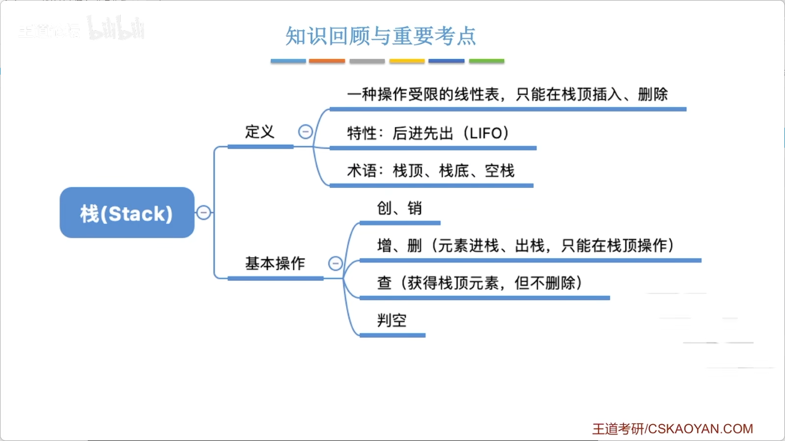
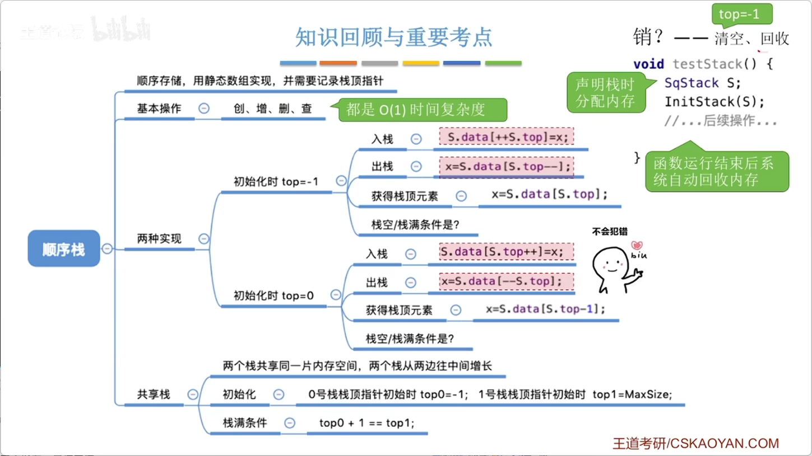
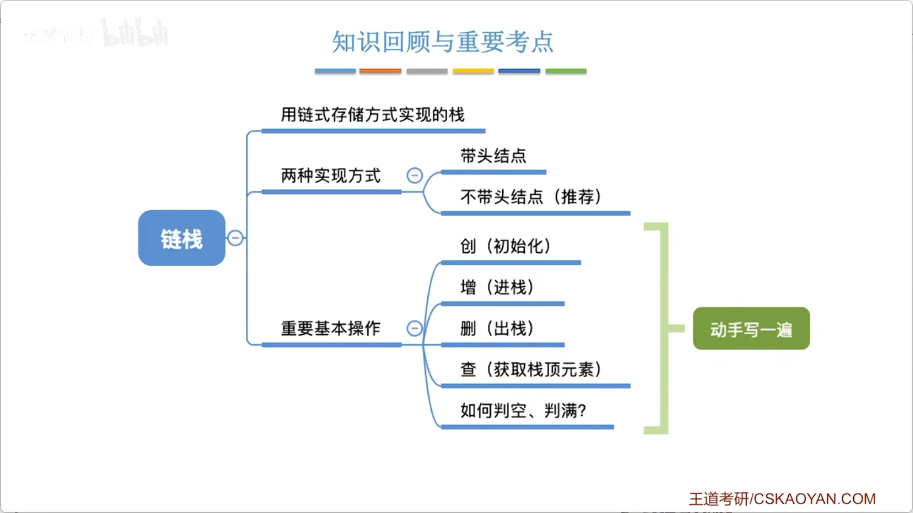
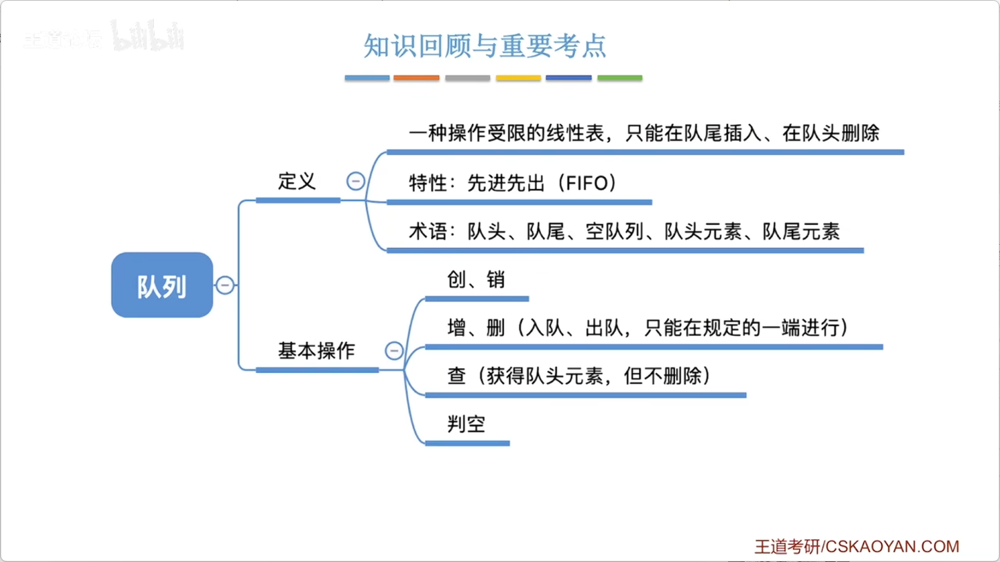
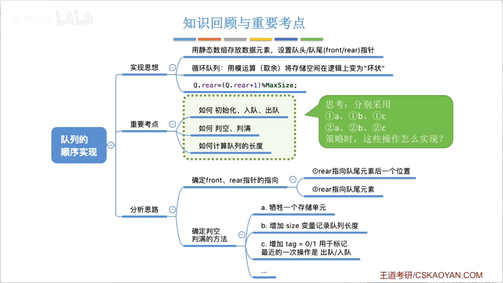
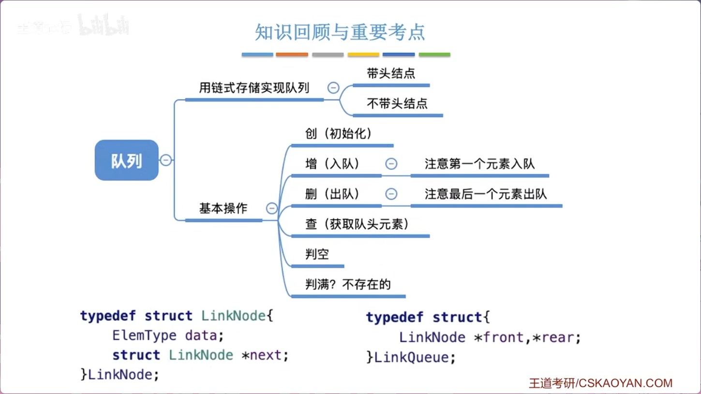
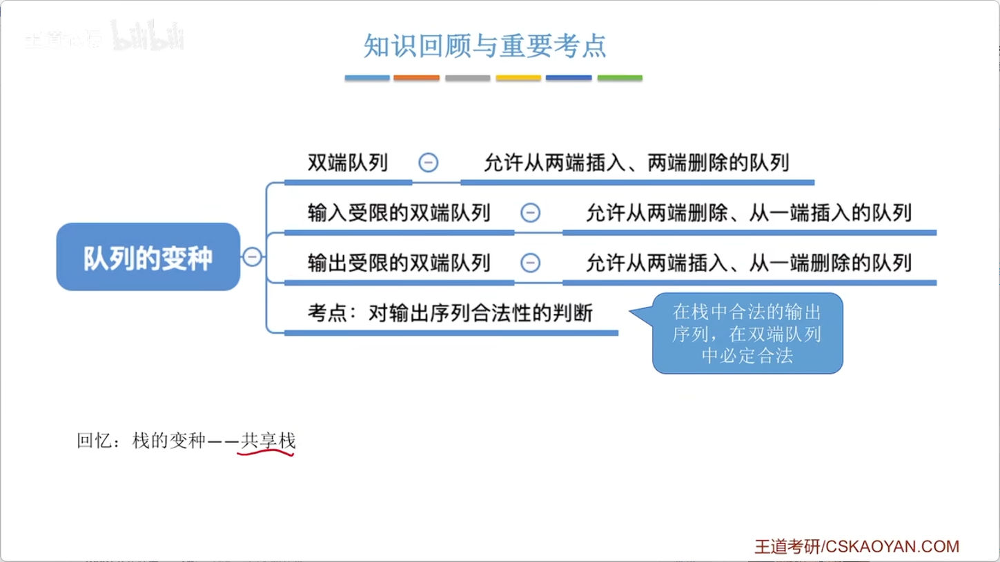
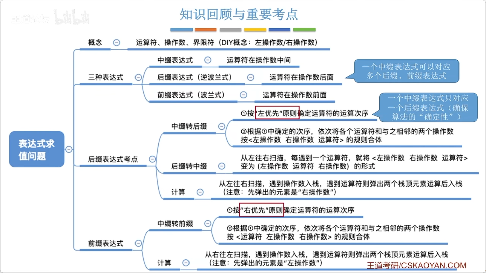
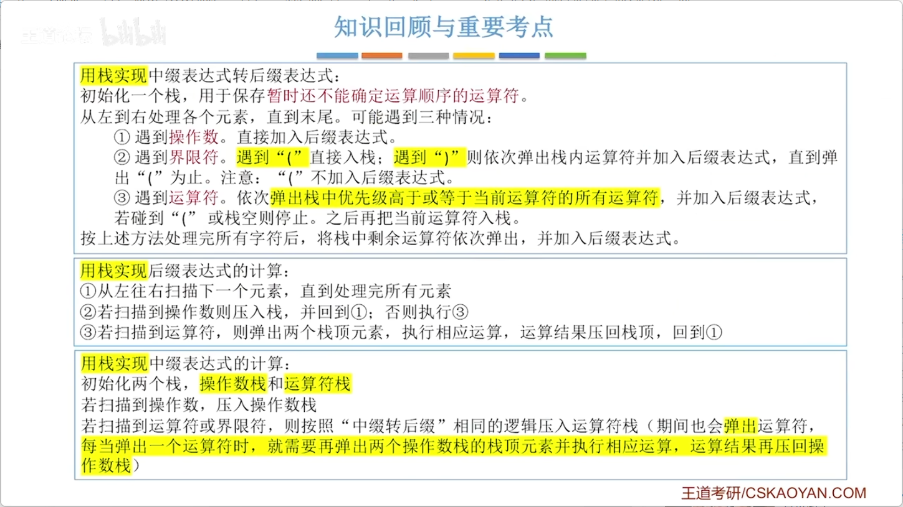

# 3.1.1_栈的基本概念

> 第三章开篇：从线性表到栈。栈是一种**操作受限**的线性表——插入和删除只能在表的一端（栈顶）进行。本讲核心：栈的定义、特点、基本操作，以及出栈顺序合法性的判断思路。

## 一、栈的定义

### 1. 栈是什么？

**栈（Stack）** 是一种**特殊的线性表**，其插入和删除操作被限制在**表的一端**进行。

| 对比 | 普通线性表 | 栈 |
|------|-----------|-----|
| 逻辑结构 | 线性结构（一对一） | 线性结构（一对一） |
| 插入位置 | **任意位置** | **只能在栈顶** |
| 删除位置 | **任意位置** | **只能在栈顶** |

> 栈的本质 = 线性表 + **操作受限**（只能在一端进行增删）

### 2. 术语

| 术语 | 含义 |
|------|------|
| **栈顶（Top）** | 允许插入和删除的一端 |
| **栈底（Bottom）** | 不允许插入和删除的一端 |
| **空栈** | 不含任何数据元素的栈 |
| **栈顶元素** | 最上方的元素 |
| **栈底元素** | 最下方的元素 |

### 3. 生活类比

| 场景 | 栈的体现 |
|------|----------|
| 摞盘子 | 后放的盘子在上面，先取走的也是上面的盘子 |
| 烤串 | 先穿的肉在下面，后穿的肉在上面，吃的时候从上往下 |
| 石头堆 | 新石头只能放顶部，拿石头也只能从顶部拿 |
| 浏览器的后退按钮 | 后访问的页面先被退回 |


## 二、栈的特点

### 1. 操作受限
- 插入（进栈/压栈）：**只能在栈顶进行**
- 删除（出栈/弹栈）：**只能在栈顶进行**

### 2. 后进先出（LIFO, Last In First Out）

> 栈的核心特性：**后进入栈的元素，会先出栈**。

**示例**：依次进栈 A₁ → A₂ → A₃ → A₄ → A₅

若全部进栈后再出栈，出栈顺序为：
```
A₅ → A₄ → A₃ → A₂ → A₁
```
正好是进栈顺序的**逆序**。

### 3. 进栈和出栈可以穿插进行

不一定要全部进栈后再出栈，可以在进栈过程中穿插出栈操作，从而产生多种不同的出栈序列。

**示例**：
```
操作序列：
① A进 ② B进 ③ B出 ④ C进 ⑤ D进 ⑥ E进 ⑦ E出 ⑧ D出 ⑨ C出 ⑩ A出

出栈序列：B → E → D → C → A
```


## 三、栈的基本操作

> 参照线性表的思路，栈的基本操作也围绕“创销增删改查”展开，但受“操作受限”影响，操作形式更加简洁。

| 操作 | 函数接口 | 功能 | 是否需引用 |
|------|---------|------|-----------|
| **初始化** | `InitStack(&S)` | 创建空栈，分配内存 | 需要 |
| **销毁** | `DestroyStack(&S)` | 释放栈占用的内存 | 需要 |
| **进栈/压栈** | `Push(&S, x)` | 将元素 x 压入栈顶 | 需要 |
| **出栈/弹栈** | `Pop(&S, &x)` | 删除栈顶元素，并用 x 返回其值 | 都需要 |
| **读取栈顶** | `GetTop(S, &x)` | 用 x 返回栈顶元素的值（**不删除**） | 需要（x） |
| **判空** | `StackEmpty(S)` | 若栈为空返回 true，否则 false | 不需要 |

### Pop vs GetTop 的区别

| 操作 | 是否删除栈顶元素 |
|------|----------------|
| **Pop（出栈）** | 删除 |
| **GetTop（读栈顶）** | 不删除（只读） |

> 注：GetTop 的参数 `x` 用引用 `&` 把栈顶值带回来。


## 四、出栈序列合法性

> 给定一个入栈序列，判断某个出栈序列是否合法，是栈这一章选择题的常客。

### 核心判断原则

> **在整个出栈过程中，栈中元素必须保持“后进先出”的顺序。**

**卡特兰数（Catalan Number）**：

如果有 n 个不同的元素进栈，合法的出栈序列数量为：

$$ \frac{1}{n+1} \binom{2n}{n} $$

例如 n=5 时，合法出栈序列共有 **42** 种。

> 这个公式不要求掌握证明，但要知道存在“合法/非法”出栈序列的判断问题。

### 判断技巧（王道常用思路）

1. **模拟进栈/出栈过程**：按照给定的出栈序列，尝试用栈模拟
2. **若当前出栈元素恰好是栈顶 → 可出栈**
3. **若当前出栈元素不在栈顶 → 继续进栈，直到该元素成为栈顶**
4. **若所有元素都已进栈，而当前出栈元素仍不在栈顶 → 非法序列**

> 课后习题中会有大量此类练习。


## 五、栈 vs 普通线性表

| 对比项 | 普通线性表 | 栈 |
|--------|-----------|-----|
| 逻辑结构 | 线性结构 | 线性结构 |
| 插入位置 | 任意位置 | **只能栈顶** |
| 删除位置 | 任意位置 | **只能栈顶** |
| 操作灵活性 | 高 | 低（受限） |
| 后进先出 | 不支持 | **支持（LIFO）** |


## 六、本讲核心收获

1. **栈是“操作受限”的线性表**——插入删除只在栈顶
2. **LIFO** 是栈最核心的特性
3. **进栈和出栈可以穿插进行** → 产生多种出栈序列
4. **卡特兰数** → n 个元素进栈，合法出栈序列数
5. **出栈序列判断**是选择题高频考点，关键是 **“模拟进栈出栈过程”**



# 3.1.2_栈的顺序存储实现

> 本讲进入栈的具体存储实现——**顺序栈**（用数组实现的栈）。内容承接顺序表，核心掌握：栈顶指针的**两种设计方式**、入栈/出栈的指针移动顺序（容易写反），以及共享栈的概念。


## 一、顺序栈的定义

### 1. 顺序栈是什么？

用**顺序存储**方式实现的栈。即用一组地址连续的存储单元存放栈中元素，并附设一个**栈顶指针** `top` 指示栈顶元素的位置。

### 2. 代码定义

```c
#define MaxSize 10
typedef struct {
    ElemType data[MaxSize];   // 静态数组存放栈中元素
    int top;                  // 栈顶指针（数组下标）
} SqStack;                    // Sq = Sequence（顺序）
```

### 3. 栈顶指针的含义（两种设计方式）

| 设计方式 | top 的含义 | 空栈时 top 值 | 栈满时 top 值 | 入栈操作顺序 |
|----------|-----------|--------------|--------------|-------------|
| **方式一（王道常用）** | 指向**栈顶元素** | **-1** | MaxSize-1 | 先 ++top，再放元素 |
| **方式二** | 指向**栈顶元素的下一个位置** | **0** | MaxSize | 先放元素，再 ++top |

> **两种方式必须统一，不能混用！** 考试/写代码时务必看清楚题目采用的哪种方式。


## 二、方式一（top 指向栈顶元素）—— 本讲默认

### 1. 初始化

```c
void InitStack(SqStack &S) {
    S.top = -1;   // 栈顶指针指向 -1，表示空栈
}
```

### 2. 判空

```c
bool StackEmpty(SqStack S) {
    return (S.top == -1);
}
```

### 3. 入栈（Push）

```c
bool Push(SqStack &S, ElemType x) {
    if (S.top == MaxSize - 1)    // 栈满判断
        return false;
    S.top++;                     // ① 栈顶指针先加1
    S.data[S.top] = x;           // ② 再放入元素
    return true;
}
```

**简洁写法**：`S.data[++S.top] = x;`（先 ++，再赋值）

>  易错：如果写成 `S.data[S.top++] = x;`（先赋值，再 ++），元素会被放到错误位置。

### 4. 出栈（Pop）

```c
bool Pop(SqStack &S, ElemType &x) {
    if (S.top == -1)             // 栈空判断
        return false;
    x = S.data[S.top];           // ① 取出栈顶元素
    S.top--;                     // ② 栈顶指针减1
    return true;
}
```

**简洁写法**：`x = S.data[S.top--];`（先赋值，再 --）

>  易错：如果写成 `x = S.data[--S.top];`（先 --，再赋值），会取到错误位置的元素。

### 5. 读取栈顶元素（GetTop）

```c
bool GetTop(SqStack S, ElemType &x) {
    if (S.top == -1)             // 栈空
        return false;
    x = S.data[S.top];           // 只读，top 不变
    return true;
}
```

> Pop 和 GetTop 的区别：Pop 会移动 top 指针（删除元素），GetTop 只读不删。


## 三、方式二（top 指向栈顶元素的下一个位置）

### 1. 初始化

```c
void InitStack(SqStack &S) {
    S.top = 0;   // top指向0，表示栈中无元素
}
```

### 2. 判空

```c
bool StackEmpty(SqStack S) {
    return (S.top == 0);
}
```

### 3. 入栈

```c
bool Push(SqStack &S, ElemType x) {
    if (S.top == MaxSize)        // 栈满判断（top=MaxSize时满）
        return false;
    S.data[S.top] = x;           // ① 先放元素
    S.top++;                     // ② top再后移
    return true;
}
```

**简洁写法**：`S.data[S.top++] = x;`（先赋值，再 ++）

### 4. 出栈

```c
bool Pop(SqStack &S, ElemType &x) {
    if (S.top == 0)              // 栈空
        return false;
    S.top--;                     // ① top先减1
    x = S.data[S.top];           // ② 再取元素
    return true;
}
```

**简洁写法**：`x = S.data[--S.top];`（先 --，再赋值）


## 四、两种方式对比总结表

| | 方式一（top指向栈顶） | 方式二（top指向栈顶下一个） |
|---|---------------------|--------------------------|
| 初始 top | **-1** | **0** |
| 判空 | top == -1 | top == 0 |
| 判满 | top == MaxSize-1 | top == MaxSize |
| 入栈顺序 | 先++top，再赋值 | 先赋值，再++top |
| 入栈简洁写法 | `data[++top] = x` | `data[top++] = x` |
| 出栈顺序 | 先取出，再--top | 先--top，再取出 |
| 出栈简洁写法 | `x = data[top--]` | `x = data[--top]` |


## 五、共享栈

### 1. 为什么需要共享栈？

顺序栈用静态数组实现，容量固定。若两个栈类型相同，可以让它们**共享同一片数组空间**，提高空间利用率。

### 2. 结构定义

```c
#define MaxSize 10
typedef struct {
    ElemType data[MaxSize];
    int top0;    // 0号栈栈顶指针
    int top1;    // 1号栈栈顶指针
} ShStack;
```

### 3. 存储示意图

```
数组下标：  0    1    2    3    4    5    6    7    8    9
          ┌────┬────┬────┬────┬────┬────┬────┬────┬────┬────┐
          │    │    │    │    │    │    │    │    │    │    │
          └────┴────┴────┴────┴────┴────┴────┴────┴────┴────┘
          ↑                               ↑
       0号栈栈底                     1号栈栈底
       (top0= -1)                  (top1=MaxSize)
```

- **0号栈**：从数组**低端**向高端增长（top0 初始 -1）
- **1号栈**：从数组**高端**向低端增长（top1 初始 MaxSize）

### 4. 判满条件

```c
bool StackFull(ShStack S) {
    return (S.top0 + 1 == S.top1);   // 两个栈顶指针相邻
}
```

### 5. 共享栈的入栈/出栈

- 0号栈：操作逻辑与方式一完全相同
- 1号栈：入栈时 `top1--`，出栈时 `top1++`（方向相反）

> 共享栈的关键：两个栈**相向生长**，只要中间还有空位，总有一个栈可以继续入栈。


## 六、顺序栈时间复杂度

| 操作 | 时间复杂度 |
|------|-----------|
| 初始化 | **O(1)** |
| 入栈 | **O(1)** |
| 出栈 | **O(1)** |
| 读取栈顶 | **O(1)** |
| 判空/判满 | **O(1)** |

> 所有操作都是 O(1)，因为栈的增删只在**栈顶**进行，不需要移动元素。


## 七、销毁顺序栈

```c
// 方式一（静态数组，系统自动回收）
void DestroyStack(SqStack &S) {
    S.top = -1;   // 逻辑上清空即可，内存由系统回收
}

// 方式二（动态分配，需手动free）
// 若用 malloc 分配的，需手动 free(S.data)
// 但本讲采用静态数组，无需手动回收
```

- 静态数组：变量生命周期结束后，系统自动回收
- 动态分配（malloc）：需手动 `free`


## 八、易错点清单

| 易错点 | 正确做法 |
|--------|---------|
| **入栈先赋值再++** | 方式一：先 `++top` 再赋值；方式二：先赋值再 `top++` |
| **出栈先--再取值** | 方式一：先取值再 `top--`；方式二：先 `--top` 再取值 |
| **++top vs top++** | 方式一必须用 `++top`，方式二必须用 `top++`，写反会覆盖数据 |
| **判满条件混淆** | 方式一：`top == MaxSize-1`；方式二：`top == MaxSize` |
| **判空条件混淆** | 方式一：`top == -1`；方式二：`top == 0` |

>  **口诀**（方式一）：入栈先加再放，出栈先取再减。


## 九、本讲核心收获

1. **顺序栈 = 数组 + 栈顶指针 top**
2. **top 的两种设计方式必须统一**，入栈/出栈写法随之改变
3. **所有操作 O(1)**，因为只操作栈顶
4. **共享栈**：两个栈共享同一数组，相向生长，提高空间利用率
5. **销毁**：静态分配的系统自动回收，动态分配的需手动 free





# 3.1.3_栈的链式存储实现

> 本讲学习栈的另一种存储实现——**链栈**（用链表实现的栈）。核心洞察：链栈本质就是**操作受限的单链表**——只允许在表头一端进行插入和删除。


## 一、链栈的核心思想

>  **链栈 = 单链表 + 操作限制（只能在表头插入和删除）**

回顾单链表的**头插法建表**：每次都在头节点之后插入新节点，这本质上就是**进栈操作**。若删除也只允许在表头进行，那就是**出栈操作**。

因此，链栈的**栈顶**就是单链表的**表头一端**。


## 二、链栈的节点定义

```c
typedef struct LinkNode {
    ElemType data;          // 数据域
    struct LinkNode *next;  // 指针域
} LinkNode, *LiStack;       // LiStack 指向栈顶节点（单链表头指针）
```


## 三、两种实现方式对比

链栈可分为**带头节点**和**不带头节点**两种实现方式，判空条件和操作逻辑有所不同。

### 3.1 带头节点

```c
// 空栈判断
bool Empty(LiStack S) {
    return (S->next == NULL);
}
```

### 3.2 不带头节点（王道推荐）

```c
// 空栈判断
bool Empty(LiStack S) {
    return (S == NULL);
}
```

> 不带头节点的链栈代码更简洁，也是王道的推荐写法，但带头节点版本也需了解。


## 四、链栈基本操作（基于不带头节点）

### 4.1 初始化

```c
void InitStack(LiStack &S) {
    S = NULL;   // 空栈
}
```

### 4.2 判空

```c
bool Empty(LiStack S) {
    return (S == NULL);
}
```

### 4.3 入栈（Push）

在**表头**插入新节点（对应单链表表头插入）：

```c
bool Push(LiStack &S, ElemType x) {
    LinkNode *s = (LinkNode*)malloc(sizeof(LinkNode));
    if (s == NULL) return false;   // 内存分配失败
    s->data = x;
    s->next = S;    // 新节点指向原栈顶
    S = s;          // 栈顶指针指向新节点
    return true;
}
```

### 4.4 出栈（Pop）

删除**表头**节点（对应单链表表头删除）：

```c
bool Pop(LiStack &S, ElemType &x) {
    if (S == NULL) return false;   // 栈空
    LinkNode *p = S;               // p指向栈顶节点
    x = p->data;                   // 取出数据
    S = p->next;                   // 栈顶指针下移
    free(p);                       // 释放原栈顶节点
    return true;
}
```

### 4.5 读取栈顶元素（GetTop）

```c
bool GetTop(LiStack S, ElemType &x) {
    if (S == NULL) return false;
    x = S->data;    // 只读，不删除
    return true;
}
```

### 4.6 销毁链栈

```c
void DestroyStack(LiStack &S) {
    while (S != NULL) {
        LinkNode *p = S;
        S = p->next;
        free(p);
    }
}
```


## 五、顺序栈 vs 链栈对比

| 对比项 | 顺序栈 | 链栈 |
|--------|--------|------|
| 存储结构 | 数组（连续空间） | 链表（离散空间） |
| 栈满问题 | 可能栈满（需判满） | **不会满**（除非内存耗尽） |
| 入栈/出栈 | 移动 top 指针 O(1) | 修改指针 O(1) |
| 读取栈顶 | O(1) | O(1) |
| 空间利用率 | 可能浪费 | 按需分配，无浪费 |
| 适用场景 | 栈最大容量已知 | 容量不确定 |


## 六、核心收获

1. **链栈本质就是操作受限的单链表**（只允许在表头增删）
2. 推荐使用**不带头节点**的实现方式，代码更简洁
3. 所有操作（入栈、出栈、读栈顶）均为 **O(1)**
4. 链栈**不会满**，适合容量不确定的场景





# 3.2.1_队列的基本概念

> 第三章第二种数据结构——**队列**。队列和栈一样，也是一种**操作受限**的线性表，但限制规则不同：栈只在一端操作（LIFO），队列在一端插入、另一端删除（FIFO）。


## 一、队列的定义

### 1. 队列是什么？

**队列（Queue）** 是一种**特殊的线性表**，其插入操作只能在表的一端（队尾）进行，删除操作只能在表的另一端（队头）进行。

| 对比 | 普通线性表 | 栈 | 队列 |
|------|-----------|-----|------|
| 插入位置 | **任意位置** | **只能栈顶** | **只能队尾** |
| 删除位置 | **任意位置** | **只能栈顶** | **只能队头** |
| 操作特点 | 无限制 | 后进先出（LIFO） | **先进先出（FIFO）** |

>  栈和队列都是线性表的“操作受限”版本，只是限制规则不同。

### 2. 生活类比

| 场景 | 队列的体现 |
|------|----------|
| 食堂打饭 | 新来的人排在**队尾**，打完饭的人从**队头**离开 |
| 过收费站 | 汽车依次排队，先到的车先通过 |
| 打印机任务队列 | 先提交的文档先打印 |
| 消息队列 | 先发送的消息先被消费 |

### 3. 术语

| 术语 | 含义 |
|------|------|
| **队头（Front）** | 允许删除（出队）的一端 |
| **队尾（Rear）** | 允许插入（入队）的一端 |
| **空队列** | 不含任何数据元素的队列 |
| **队头元素** | 最靠近队头的元素（最先被删除） |
| **队尾元素** | 最靠近队尾的元素（最后被删除） |


## 二、队列的特点

### 先进先出（FIFO, First In First Out）

> 队列的核心特性：**先进入队列的元素，先出队列。**

**示例**：依次入队 A₁ → A₂ → A₃ → A₄ → A₅

出队顺序为：
```
A₁ → A₂ → A₃ → A₄ → A₅
```
与入队顺序**完全一致**。

### 栈 vs 队列 对比

| 对比项 | 栈 | 队列 |
|--------|-----|------|
| 操作端 | 仅一端 | 两端（队头+队尾） |
| 进出同端 | 是 | 否（入队尾/出队头） |
| 核心特性 | **后进先出（LIFO）** | **先进先出（FIFO）** |
| 英文缩写 | LIFO | FIFO |
| 生活类比 | 摞盘子、浏览器后退 | 排队打饭、打印机 |


## 三、队列的基本操作

> 同样围绕“创销增删改查”展开，但术语和位置限制不同。

| 操作 | 函数接口 | 功能 | 是否需引用 |
|------|---------|------|-----------|
| **初始化** | `InitQueue(&Q)` | 创建空队列，分配内存 | 需要 |
| **销毁** | `DestroyQueue(&Q)` | 释放队列占用的内存 | 需要 |
| **入队** | `EnQueue(&Q, x)` | 将元素 x 插入到**队尾** | 需要 |
| **出队** | `DeQueue(&Q, &x)` | 删除**队头**元素，用 x 返回其值 | 都需要 |
| **读取队头** | `GetHead(Q, &x)` | 用 x 返回队头元素的值（**不删除**） | 需要（x） |
| **判空** | `QueueEmpty(Q)` | 若队列为空返回 true，否则 false | 不需要 |

### 入队 vs 出队 vs 读队头

| 操作 | 操作位置 | 是否删除元素 |
|------|---------|------------|
| **入队（EnQueue）** | 队尾 | 不删除，增加元素 |
| **出队（DeQueue）** | 队头 | 删除队头元素 |
| **读队头（GetHead）** | 队头 | 只读不删 |

> 入队只能在**队尾**操作，出队和读队头只能在**队头**操作。


## 四、与栈的基本操作对比

| 操作 | 栈 | 队列 |
|------|-----|------|
| 增加元素 | 入栈（Push）→ 栈顶 | **入队（EnQueue）→ 队尾** |
| 删除元素 | 出栈（Pop）→ 栈顶 | **出队（DeQueue）→ 队头** |
| 读取顶端/队头 | GetTop → 栈顶 | **GetHead → 队头** |
| 判空 | StackEmpty(S) | **QueueEmpty(Q)** |

> 对队列的“查找”操作通常只查队头元素，与栈类似。


## 五、本讲核心收获

1. **队列是“操作受限”的线性表**——队尾插入、队头删除
2. **FIFO（先进先出）** 是队列最核心的特性
3. **队尾入队、队头出队**不能搞反
4. 队列与栈的对比是考试常考点




# 3.2.2_队列的顺序实现

> 本讲进入队列的存储实现——**顺序队列**。核心难点：如何用**循环队列**解决“假溢出”问题，以及**判空/判满**的多种方案（考研高频考点）。


## 一、顺序队列的定义

### 1. 存储结构

用**数组**存储队列元素，并设置两个指针：
- **队头指针 front**：指向队头元素
- **队尾指针 rear**：通常指向队尾元素的**下一个位置**（即下一个入队的位置）

```c
#define MaxSize 10
typedef struct {
    ElemType data[MaxSize];
    int front;    // 队头指针（数组下标）
    int rear;     // 队尾指针（数组下标）
} SqQueue;
```

### 2. 两种指针语义

| 设计方式 | front 含义 | rear 含义 | 本讲默认 |
|----------|-----------|-----------|---------|
| 方式一 | 指向队头元素 | 指向队尾元素的**下一个位置** |  默认 |
| 方式二 | 指向队头元素 | 指向队尾元素 | 变体 |


## 二、为什么需要循环队列？

### 1. “假溢出”问题

普通顺序队列中，元素出队后，front 指针后移，**前面空出的空间无法被再次使用**，导致 rear 指针到达数组末尾时，即使数组前方还有空间，也无法继续入队——这种现象称为**假溢出**。

### 2. 解决方案：循环队列

利用**取模运算（% MaxSize）**，让 rear 和 front 指针在数组末尾时**跳转回数组开头**，实现逻辑上的“环形”存储。

> 核心公式（入队时移动 rear）：
> ```c
> rear = (rear + 1) % MaxSize;
> ```
> 同样，出队时移动 front 也使用取模运算。


## 三、循环队列的基本操作（rear 指向队尾元素下一个位置）

### 1. 初始化

```c
void InitQueue(SqQueue &Q) {
    Q.front = 0;
    Q.rear = 0;    // front == rear 表示空队列
}
```

### 2. 判空

```c
bool QueueEmpty(SqQueue Q) {
    return (Q.front == Q.rear);
}
```

### 3. 入队（EnQueue）

```c
bool EnQueue(SqQueue &Q, ElemType x) {
    if ((Q.rear + 1) % MaxSize == Q.front)   // 判满（牺牲一个单元）
        return false;
    Q.data[Q.rear] = x;          // ① 在 rear 位置放入元素
    Q.rear = (Q.rear + 1) % MaxSize;  // ② rear 后移（循环）
    return true;
}
```

### 4. 出队（DeQueue）

```c
bool DeQueue(SqQueue &Q, ElemType &x) {
    if (Q.front == Q.rear)       // 判空
        return false;
    x = Q.data[Q.front];         // ① 取出队头元素
    Q.front = (Q.front + 1) % MaxSize;  // ② front 后移（循环）
    return true;
}
```

### 5. 读取队头元素

```c
bool GetHead(SqQueue Q, ElemType &x) {
    if (Q.front == Q.rear)
        return false;
    x = Q.data[Q.front];   // 只读，front 不移动
    return true;
}
```

### 6. 计算队列长度（当前元素个数）

```c
int QueueLength(SqQueue Q) {
    return (Q.rear - Q.front + MaxSize) % MaxSize;
}
```


## 四、判空/判满的三种方案

循环队列中，`front == rear` 既可能是“空”也可能是“满”，需要额外手段区分。

### 方案一：牺牲一个存储单元（王道默认方案）

| 条件 | 判断方式 |
|------|---------|
| 队空 | `front == rear` |
| 队满 | `(rear + 1) % MaxSize == front` |
| 元素个数 | `(rear - front + MaxSize) % MaxSize` |

> 即**最后一个空闲单元不用**，用以区分空和满。

### 方案二：增设 size 变量

在结构体中增加 `int size;` 记录当前元素个数。

| 条件 | 判断方式 |
|------|---------|
| 队空 | `size == 0` |
| 队满 | `size == MaxSize` |

**操作变化**：
- 入队成功 → `size++`
- 出队成功 → `size--`
- 初始化 → `size = 0`
- 元素个数直接就是 `size`

### 方案三：增设 tag 变量

在结构体中增加 `int tag;`，`tag=0` 表示最近执行的是删除，`tag=1` 表示最近执行的是插入。

| 条件 | 判断方式 |
|------|---------|
| 队空 | `front == rear && tag == 0`（因删除而相遇） |
| 队满 | `front == rear && tag == 1`（因插入而相遇） |

**操作变化**：
- 入队成功 → `tag = 1`
- 出队成功 → `tag = 0`


## 五、三种判空/判满方案对比

| 方案 | 是否浪费空间 | 判空条件 | 判满条件 | 维护开销 |
|------|------------|---------|---------|---------|
| 方案一：牺牲单元 | 浪费 1 个单元 | `front == rear` | `(rear+1)%M == front` | 无额外维护 |
| 方案二：size 变量 | 不浪费 | `size == 0` | `size == MaxSize` | 入/出队需维护 size |
| 方案三：tag 变量 | 不浪费 | `front==rear && tag==0` | `front==rear && tag==1` | 入/出队需维护 tag |

> 考研默认使用**方案一（牺牲一个存储单元）**，注意不要搞混。


## 六、指针语义变体（rear 指向队尾元素）

> 如果题目中 rear 指向的是**队尾元素本身**，则以下所有逻辑都需调整。

### 1. 初始化

```c
void InitQueue(SqQueue &Q) {
    Q.front = 0;
    Q.rear = MaxSize - 1;   // rear 指向数组最后一个位置
}
```

### 2. 判空

```c
bool Empty(SqQueue Q) {
    return ((Q.rear + 1) % MaxSize == Q.front);
}
```

### 3. 入队

```c
bool EnQueue(SqQueue &Q, ElemType x) {
    if ((Q.rear + 2) % MaxSize == Q.front)   // 判满（需多检查一个位置）
        return false;
    Q.rear = (Q.rear + 1) % MaxSize;    // ① rear 先后移
    Q.data[Q.rear] = x;                 // ② 再放入元素
    return true;
}
```

### 4. 出队

出队逻辑与 rear 指向“下一个位置”的方式相同（`front` 指向队头元素本身）：
```c
x = Q.data[Q.front];
Q.front = (Q.front + 1) % MaxSize;
```


## 七、两种指针语义对比

| | rear 指向队尾元素**下一个位置**（默认） | rear 指向**队尾元素本身** |
|---|---------------------------------------|--------------------------|
| 初始化 | `front = 0; rear = 0;` | `front = 0; rear = MaxSize-1;` |
| 判空 | `front == rear` | `(rear+1)%M == front` |
| 判满（牺牲单元） | `(rear+1)%M == front` | `(rear+2)%M == front` |
| 入队顺序 | 先放元素，再后移 rear | 先移动 rear，再放元素 |
| 计算长度 | `(rear-front+M)%M` | `(rear-front+1+M)%M` |

>  **考试核心**：看清题目中 rear 的含义再答题，不同设计逻辑完全不同！


## 八、易错点清单

| 易错点 | 正确做法 |
|--------|---------|
| 判满条件记错 | 默认方案：`(rear+1)%MaxSize == front` |
| 指针移动忘取模 | 循环队列中 `front` 和 `rear` **每次移动都要 % MaxSize** |
| rear 语义混淆 | 看清 rear 指向“队尾元素”还是“队尾元素下一个位置” |
| 长度公式记混 | 默认方案：`(rear-front+MaxSize)%MaxSize` |
| 入队时先放还是先移 | 取决于 rear 的语义：指向下一位置→先放后移；指向队尾元素→先移后放 |


## 九、本讲核心收获

1. **循环队列**：利用取模运算解决“假溢出”问题
2. **默认语义**：front 指向队头元素，rear 指向队尾元素**下一个位置**
3. **判空**：`front == rear`
4. **判满（牺牲单元）**：`(rear + 1) % MaxSize == front`
5. **队列长度**：`(rear - front + MaxSize) % MaxSize`
6. **三种判空/判满方案**：牺牲单元、size 变量、tag 变量
7. **rear 的两种语义**：考试时务必先确认是哪一种




# 3.2.3_队列的链式实现

> 本讲学习队列的链式存储实现——**链队列**。链队列本质是**操作受限的单链表**（只允许在队尾插入、队头删除）。与循环队列相比，链队列最大的优势是**没有容量上限**，无需判满。


## 一、链队列的定义

### 1. 为什么需要头指针和尾指针？

单链表只需头指针就能找到所有节点，但**在表尾插入**（入队）时，若无尾指针，需从头遍历到表尾，时间复杂度 O(n)。因此链队列**同时保存头指针和尾指针**，使入队和出队操作均为 O(1)。

### 2. 存储结构定义

```c
// ① 队列节点（与单链表节点相同）
typedef struct LinkNode {
    ElemType data;
    struct LinkNode *next;
} LinkNode;

// ② 队列（包含头指针和尾指针）
typedef struct {
    LinkNode *front;   // 队头指针（指向头节点）
    LinkNode *rear;    // 队尾指针（指向队尾节点）
} LinkQueue;
```


## 二、链队列的初始化

### 2.1 带头节点（推荐）

```c
void InitQueue(LinkQueue &Q) {
    Q.front = (LinkNode*)malloc(sizeof(LinkNode));  // 分配头节点
    Q.rear = Q.front;           // 头尾都指向头节点
    Q.front->next = NULL;       // 头节点指针域置空
}

// 判空
bool Empty(LinkQueue Q) {
    return (Q.front == Q.rear);   // 或 Q.front->next == NULL
}
```

### 2.2 不带头节点

```c
void InitQueue(LinkQueue &Q) {
    Q.front = NULL;    // 头指针指向NULL
    Q.rear = NULL;     // 尾指针指向NULL
}

// 判空
bool Empty(LinkQueue Q) {
    return (Q.front == NULL);
}
```


## 三、入队操作（EnQueue）

### 3.1 带头节点

```c
bool EnQueue(LinkQueue &Q, ElemType x) {
    LinkNode *s = (LinkNode*)malloc(sizeof(LinkNode));
    if (s == NULL) return false;   // 内存分配失败
    s->data = x;
    s->next = NULL;

    Q.rear->next = s;   // ① 当前队尾节点的next指向s
    Q.rear = s;         // ② 更新队尾指针

    return true;
}
```

> 带头节点时，**第一个元素入队和后续元素入队的代码逻辑完全一致**，无需特殊处理。

### 3.2 不带头节点

```c
bool EnQueue(LinkQueue &Q, ElemType x) {
    LinkNode *s = (LinkNode*)malloc(sizeof(LinkNode));
    if (s == NULL) return false;
    s->data = x;
    s->next = NULL;

    if (Q.front == NULL) {        // 特殊情况：队列为空
        Q.front = s;              // 队头指向s
        Q.rear = s;               // 队尾也指向s
    } else {
        Q.rear->next = s;         // 正常后插
        Q.rear = s;
    }
    return true;
}
```

> 不带头节点时，**第一个元素入队需要特殊处理**（front 和 rear 都要指向新节点）。


## 四、出队操作（DeQueue）

### 4.1 带头节点

```c
bool DeQueue(LinkQueue &Q, ElemType &x) {
    if (Q.front == Q.rear) return false;   // 队列为空

    LinkNode *p = Q.front->next;    // p指向要删除的节点（第一个数据节点）
    x = p->data;                    // 取出数据

    Q.front->next = p->next;        // 头节点跳过p

    if (Q.rear == p) {              // 特殊情况：删除的是最后一个元素
        Q.rear = Q.front;           // 尾指针回到头节点
    }

    free(p);
    return true;
}
```

### 4.2 不带头节点

```c
bool DeQueue(LinkQueue &Q, ElemType &x) {
    if (Q.front == NULL) return false;   // 队列为空

    LinkNode *p = Q.front;          // p指向要删除的节点
    x = p->data;

    Q.front = p->next;              // 队头指针后移

    if (Q.rear == p) {              // 删除的是最后一个元素
        Q.front = NULL;
        Q.rear = NULL;
    }

    free(p);
    return true;
}
```


## 五、带头节点 vs 不带头节点对比

| 对比项 | 带头节点 | 不带头节点 |
|--------|---------|-----------|
| 初始化 | 分配头节点，front=rear=头节点 | front=rear=NULL |
| 判空 | `front == rear` | `front == NULL` |
| 入队（第一个元素） | 无需特殊处理 | 需要特殊处理 |
| 出队（最后一个元素） | 需要特殊处理（rear回指头节点） | 需要特殊处理（front=rear=NULL） |
| 代码一致性 | **更统一** | 边界情况需额外判断 |

> **推荐**：带头节点的链队列代码更简洁，边界处理更统一。


## 六、链队列 vs 循环队列对比

| 对比项 | 循环队列（顺序存储） | 链队列（链式存储） |
|--------|---------------------|-------------------|
| 存储空间 | 连续数组 | 离散节点 |
| 容量 | **固定**（MaxSize） | **动态**（可扩展） |
| 判满 | 需要（多种方案） | 不需要（除非内存耗尽） |
| 判空 | `front == rear` | `front == rear`（带头节点） |
| 入队/出队 | O(1) | O(1) |
| 头尾指针 | 数组下标 | 节点指针 |

> 链队列不会“满”，这是相比循环队列的一大优势。


## 七、易错点清单

| 易错点 | 正确做法 |
|--------|---------|
| 带头节点出队时，**最后一个元素出队后 rear 未更新** | 需将 `rear` 指向头节点，否则野指针 |
| 不带头节点入队时，**第一个元素未同时更新 front 和 rear** | 第一个元素入队时，front 和 rear 都指向新节点 |
| 不带头节点出队时，**最后一个元素出队后 front/rear 未置 NULL** | 否则变成野指针 |
| malloc 后未检查是否成功 | 应判断 `if (s == NULL) return false;` |
| 忘记 free 释放节点 | 出队后要 `free(p)`，否则内存泄漏 |


## 八、本讲核心收获

1. **链队列 = 单链表 + 操作限制**（队尾入、队头出）
2. **同时保存 front 和 rear 指针**，使入队/出队均为 O(1)
3. **带头节点版本更推荐**，边界处理更统一
4. **链队列不会满**（除非内存耗尽），无需判满
5. **边界特判**：带头节点时，最后一个元素出队后要将 `rear` 指向头节点

---

**思考题**：如果链队列不带头节点，但额外增加一个 `size` 变量记录队列长度，入队/出队的代码是否可以简化？





# 3.2.4_双端队列

> 本讲介绍队列的一种变体——**双端队列**。核心考点：给定输入序列，判断某个输出序列是否合法（选择题常考）。理解双端队列的关键，是把它看作“栈和队列的泛化”——在两端都能插入/删除，限制条件不同会退化成不同结构。


## 一、双端队列的定义

### 1. 与栈、普通队列的对比

| 数据结构 | 插入端 | 删除端 | 核心特性 |
|----------|--------|--------|---------|
| **栈** | 仅一端 | 同一端 | 后进先出（LIFO） |
| **普通队列** | 仅一端（队尾） | 仅另一端（队头） | 先进先出（FIFO） |
| **双端队列** | **两端均可** | **两端均可** | 无固定进出方向 |

> 双端队列 = 两端都可插入、两端都可删除的线性表，是栈和队列的**泛化**。

### 2. 两种受限的双端队列

| 类型 | 插入限制 | 删除限制 | 说明 |
|------|---------|---------|------|
| **输入受限的双端队列** | 只能在一端插入 | 两端均可删除 | 一端“只出不进” |
| **输出受限的双端队列** | 两端均可插入 | 只能在一端删除 | 一端“只进不出” |

### 3. 退化关系

- 若双端队列只使用**一端**进行插入和删除 → 退化成**栈**
- 若双端队列固定一端插入、另一端删除 → 退化成**普通队列**

> 因此，栈的合法输出序列，在双端队列中**一定合法**（只需用一端模拟栈即可）。


## 二、核心考点：输出序列合法性判断

> 给定输入序列（如 1,2,3,4 按顺序输入），判断某个输出序列是否可能从双端队列输出。

### 1. 基本分析原则

> **关键观察**：如果输出序列中某个较大元素先输出，则比它小的所有元素必然已经输入完成，它们之间的相对顺序不可改变（取决于受限端的位置）。

### 2. 以输入 1,2,3,4 为例

#### Step 1：先用栈过滤一遍

在栈中合法的输出序列共有 **卡特兰数** 个：

$$ \frac{1}{n+1}\binom{2n}{n} = \frac{1}{5}\binom{8}{4} = 14 $$

栈中**合法**的14个序列：

| 序号 | 合法出栈序列 |
|------|-------------|
| 1 | 1234 |
| 2 | 1243 |
| 3 | 1324 |
| 4 | 1342 |
| 5 | 1432 |
| 6 | 2134 |
| 7 | 2143 |
| 8 | 2314 |
| 9 | 2341 |
| 10 | 2431 |
| 11 | 3214 |
| 12 | 3241 |
| 13 | 3421 |
| 14 | 4321 |

栈中**非法**的10个序列，需要在双端队列中逐一验证。

#### Step 2：输入受限的双端队列

只需验证栈中非法的10个序列，筛选出其中合法的。

**结论**：输入受限双端队列中，只有 **2 个序列非法**：

- 4213（4先出，后面2被夹在1和3中间，无法从两端删出）
- 4231（同理）

> 其余序列均合法，包括栈中非法的那些（靠两端删除实现）。

#### Step 3：输出受限的双端队列

**结论**：输出受限双端队列中，也有 **2 个序列非法**：

- 4132（4先出后，1和3之间隔着2，无法插入到指定相对位置）
- 4231（同理）


## 三、判断技巧总结

### 栈的合法性判断

> 出栈序列中，若元素 a、b、c 满足 **a < b < c**（按输入顺序），且出栈顺序为 **c, a, b**，则一定非法（小元素被压在中元素下方，无法提前弹出）。本质是“**后进先出**”规则的直接应用。

### 双端队列的合法性判断（输入受限）

> 某个元素出队时，所有比它小的元素必然已经输入完毕（因为输入只能从一端进，大元素在小元素之后输入）。这些已输入元素在队列中的相对位置是固定的，判断能否从两端按目标顺序删除即可。

### 双端队列的合法性判断（输出受限）

> 某个元素出队时，所有比它小的元素必然已经输入完毕（输入可从两端进行，相对位置可通过两端插入调整）。但删除只能从一端进行，因此这些已输入元素必须按目标输出顺序的单向排列。


## 四、出题形式与备考建议

| 考察形式 | 常见程度 | 说明 |
|----------|---------|------|
| 选择题：判断序列是否合法 | **高频** | 给出输入序列和若干输出序列，选合法/非法的 |
| 简答题：列出所有合法序列 | 几乎不考 | n 较大时数量太多（卡特兰数增长快），无法穷举 |
| 填空题：计算合法序列数量 | 可能考 | 用卡特兰数公式，n 较小（如 n=4） |

**备考建议**：
1. **牢记卡特兰数公式**，n 个元素入栈的合法出栈序列数为 $\frac{1}{n+1}\binom{2n}{n}$，这是双端队列分析的基础参照
2. **熟练栈的合法性判断**（后进先出），它是双端队列判断的前置技能
3. 双端队列判断的关键是：**大元素先输出时，小元素集合已全部入队**，分析它们之间的相对次序能否通过两端操作实现


## 五、双端队列 vs 普通队列 vs 栈

| 数据结构 | 插入限制 | 删除限制 | 输出与输入的关系 |
|----------|---------|---------|----------------|
| 栈 | 一端 | 同端 | 完全逆序（后进先出） |
| 普通队列 | 一端 | 另一端 | 完全正序（先进先出） |
| 双端队列（无限制） | 两端 | 两端 | 灵活多变 |
| 输入受限双端队列 | 一端 | 两端 | 较灵活 |
| 输出受限双端队列 | 两端 | 一端 | 较灵活 |


## 六、易错点清单

| 易错点 | 正确理解 |
|--------|----------|
| 误以为双端队列的合法序列一定比栈多 |  确实更多（栈合法的必合法，栈非法的部分也合法） |
| 输入受限 ≠ 输出受限 | 一个限制插入端，一个限制删除端，分析逻辑完全不同 |
| 忽略“输出前所有小元素必须已输入” | 这是分析双端队列合法性的关键入手点 |
| 忘记卡特兰数 | 栈的合法序列数是卡特兰数，可用作双端队列分析的基础参照 |

---

**下节预告**：栈的应用——括号匹配、表达式求值（中缀转后缀）、递归等经典场景。这是栈从“数据结构”走向“算法应用”的桥梁。




# 3.3.1_栈在括号匹配中的应用

> 本讲开始学习栈的经典应用。括号匹配是栈在**编译原理**中的典型应用，也是考研代码题的常客。核心思想：利用栈的**后进先出**特性，模拟括号的嵌套匹配过程。


## 一、问题的提出

编程语言中的括号必须**成对出现**且**类型匹配**：

- 小括号 `( )`
- 中括号 `[ ]`
- 大括号 `{ }`

**非法情况**：
- 只有左括号没有右括号（左括号单身）
- 只有右括号没有左括号（右括号单身）
- 左右括号类型不匹配（如 `(` 配 `]`）


## 二、核心思路

### 1. 观察规律

> **越往后出现的左括号，越先被匹配**——这正好符合栈的“后进先出（LIFO）”特性。

### 2. 算法基本流程

```
从左到右依次扫描字符：

遇到 左括号 → 压入栈中（等待匹配）
遇到 右括号 → 弹出栈顶左括号，检查是否匹配

扫描结束后 → 栈应为空（若不为空，则说明有左括号未匹配）
```

### 3. 手动模拟示例

以 `{ [ ( ) ] }` 为例：

| 扫描字符 | 操作 | 栈中内容 |
|---------|------|---------|
| `{` | 入栈 | `{` |
| `[` | 入栈 | `{ [` |
| `(` | 入栈 | `{ [ (` |
| `)` | 弹出 `(`，匹配 ✓ | `{ [` |
| `]` | 弹出 `[`，匹配 ✓ | `{` |
| `}` | 弹出 `{`，匹配 ✓ | 空 |

匹配成功 


## 三、算法实现（C/伪代码）

```c
bool bracketCheck(char str[], int length) {
    SqStack S;
    InitStack(S);                  // ① 初始化栈

    for (int i = 0; i < length; i++) {
        if (str[i] == '(' || str[i] == '[' || str[i] == '{') {
            Push(S, str[i]);       // ② 左括号入栈
        } else {
            // ③ 右括号：先判空
            if (StackEmpty(S))
                return false;      // 栈空 → 右括号单身

            char topElem;
            Pop(S, topElem);       // 弹出栈顶左括号

            // ④ 检查是否匹配
            if (str[i] == ')' && topElem != '(') return false;
            if (str[i] == ']' && topElem != '[') return false;
            if (str[i] == '}' && topElem != '{') return false;
        }
    }

    return StackEmpty(S);          // ⑤ 扫描完，栈空则匹配成功
}
```


## 四、三种匹配失败的情况

| 失败类型 | 触发条件 | 示例 |
|----------|---------|------|
| **右括号单身** | 扫描到右括号，但栈为空 | `( ) )` 第三个 `)` 无左括号可匹配 |
| **左右括号不匹配** | 弹出的左括号与右括号类型不同 | `( ]`、`[ }`、`{ )` |
| **左括号单身** | 扫描完所有括号，栈仍非空 | `( ) {` 最后的 `{` 没有右括号匹配 |


## 五、括号匹配与栈的天然联系

| 括号匹配现象 | 栈的特性 |
|-------------|---------|
| 最后出现的左括号最先被匹配 | 后进先出（LIFO） |
| 括号嵌套层层“剥开” | 入栈/出栈模拟嵌套深度 |
| 需要“记忆”之前出现的左括号 | 栈存储待匹配的左括号 |

> 递归嵌套结构 → 栈是处理这类问题的天然数据结构。


## 六、代码细节注意

### 1. 栈的数据类型

括号匹配中，栈的元素类型是 **char**（字符型），而非 int。

### 2. 考试中的“封装调用”

若使用栈的基本操作（`Push`、`Pop`、`StackEmpty`），建议在代码前简要注释说明这些接口的作用，阅卷老师看了会很舒服。

### 3. 容量问题

顺序栈有容量上限，处理超长括号串可能溢出。考试中一般不会刻意考察这一点（用静态数组实现即可），实际工程中可用链栈避免。


## 七、拓展思考

1. **多种括号混合**（本讲已经覆盖）：小括号、中括号、大括号都支持，只需增加相应分支判断。
2. **不含括号的字符**（如表达式 `a + b * (c - d)`）：只需跳过非括号字符，只处理括号。
3. **括号匹配只是栈应用的一种**，后续还会学习表达式求值、递归等。


**思考练习**：字符串 `[ ( ] )` 能否被本算法判定为非法？为什么？如果题目要求给出“非法位置”，代码该如何改进？


# 3.3.2_1_栈在表达式求值中的应用(上)

> 本讲是栈这一章**最难、最综合**的考点，也是面试高频题。核心涉及三种表达式（中缀、后缀、前缀）的**转换**与**求值**。关键在于掌握手动转换的规则，以及用栈求值时**操作数左右顺序**的易错点。


## 一、三种算术表达式

| 表达式类型 | 定义 | 是否需要界限符（括号） | 别名 | 示例 |
|-----------|------|---------------------|------|------|
| **中缀表达式** | 运算符在操作数**中间** |  必须（否则歧义） | 日常表达式 | `a + b` |
| **后缀表达式** | 运算符在操作数**后面** |  无需括号 | **逆波兰表达式** | `a b +` |
| **前缀表达式** | 运算符在操作数**前面** |  无需括号 | **波兰表达式** | `+ a b` |

> 后缀/前缀表达式无需括号也能无歧义表达运算顺序，适合计算机处理（基于栈）。


## 二、核心考点一：中缀转后缀（手算，高频）

**目标**：将中缀表达式转换为唯一的后缀表达式（基于“左优先”原则，保证算法确定性）。

### 1. 左优先原则（中缀→后缀的金标准）

> **当运算符优先级相同时，优先让左边（先出现）的运算符先计算。**

运用此原则，可确保转换结果唯一，符合算法的**确定性**特性。

### 2. 手算步骤

1. 根据**左优先原则**确定所有运算符的**生效顺序**（标号1、2、3...）。
2. 从**第一个生效的运算符**开始，将其和左右两边的操作数组合成 `[左操作数] [右操作数] [运算符]` 的形式。
3. 将该组合视为一个**新的操作数**（整体），参与下一优先级运算符的组合。
4. 重复直到完成。

> **规律**：左优先原则下，后缀表达式中**运算符从左到右出现的顺序**，严格等于中缀表达式中的**运算生效顺序**（标号1→2→3...）。

### 3. 举例验证

中缀：`(15 ÷ (7 − (1 + 1))) × 3 − (2 + (1 + 1))`

- **运算顺序**（左优先）：
  ① 1+1 → ② 7-2 → ③ 15÷5 → ④ 3×3 → ⑤ 1+1 → ⑥ 2+2 → ⑦ 9-4
- **后缀结果**：`15 7 1 1 + - ÷ 3 × 2 1 1 + + -`
- 查看结果：运算符顺序 `+ - ÷ × + + -` 对应 ①②③④⑤⑥⑦ 


## 三、核心考点二：后缀表达式求值（栈模拟）

**算法**：从左到右扫描后缀表达式，利用栈存储操作数。

### 1. 算法流程

```
初始化空栈 S
从左到右依次扫描每个元素：

if (当前元素是 操作数) {
    Push(S, 操作数);        // 操作数入栈
} else {                    // 当前元素是 运算符
    right = Pop(S);         // ① 弹出右操作数（先弹出！）
    left = Pop(S);          // ② 弹出左操作数（后弹出！）
    result = left op right; // ③ 执行运算（ 左右不能颠倒）
    Push(S, result);        // ④ 结果压回栈
}
最终栈顶元素即为表达式值。
```

### 2. 易错点：操作数左右顺序

- 先弹出的元素是 `right`（右操作数）
- 后弹出的元素是 `left`（左操作数）
- **减法/除法时顺序错误会导致结果完全错误！**

**示例**：后缀 `15 7 -` → 先弹出 `right=7`，后弹出 `left=15` → 计算 `15 - 7 = 8`。


## 四、核心考点三：中缀转前缀（手算）

### 1. 右优先原则（中缀→前缀的金标准）

> **当运算符优先级相同时，优先让右边（后出现）的运算符先计算。**

### 2. 手算步骤

1. 根据**右优先原则**确定所有运算符的生效顺序。
2. 从第一个生效的运算符开始，组合为 `[运算符] [左操作数] [右操作数]`。
3. 视组合为新的操作数，继续组合，直到完成。

> **规律**：右优先原则下，前缀表达式中**运算符从右到左出现的顺序**，严格等于中缀表达式中的运算生效顺序。


## 五、核心考点四：前缀表达式求值（栈模拟）

**算法**：从右到左扫描前缀表达式。

```
从右到左依次扫描每个元素：

if (当前元素是 操作数) {
    Push(S, 操作数);
} else {                    // 运算符
    left = Pop(S);          // ① 先弹出的是左操作数（与后缀相反）
    right = Pop(S);         // ② 后弹出的是右操作数
    result = left op right;
    Push(S, result);
}
最终栈顶元素即为表达式值。
```

> **注意**：前缀表达式求值是**从右往左**扫描，操作数弹出顺序与后缀相反（先弹左，后弹右）。


## 六、对比记忆表

| 操作 | 中缀→后缀 | 中缀→前缀 |
|------|----------|----------|
| 原则 | **左优先**（优先让左边的先算） | **右优先**（优先让右边的先算） |
| 扫描方向（求值时） | **从左到右** | **从右到左** |
| 弹出顺序（遇到运算符） | 先弹右操作数，再弹左操作数 | 先弹左操作数，再弹右操作数 |
| 结果特征 | 运算符从左到右 = 计算顺序 | 运算符从右到左 = 计算顺序 |


## 七、手动转换技巧总结

1. **中缀转后缀**：按“左优先”确定标号 → 组合为 `左 右 op` → 合并为整体。
2. **中缀转前缀**：按“右优先”确定标号 → 组合为 `op 左 右` → 合并为整体。
3. **后缀求值**：左到右扫，遇数入栈，遇符弹两个（先右后左），算完压栈。
4. **前缀求值**：右到左扫，遇数入栈，遇符弹两个（先左后右），算完压栈。


## 八、核心易错点清单

| 易错点 | 正确理解 |
|--------|----------|
| 后缀求值时，先弹出的当左操作数 | 先弹出的是 **右** 操作数 |
| 中缀转后缀时随意选运算顺序 | 必须用 **左优先** 原则，保证结果唯一 |
| 中缀转前缀时随意选运算顺序 | 必须用 **右优先** 原则，保证结果唯一 |
| 把中缀转后缀直接写成 `op 左 右` | 后缀必须是 `左 右 op`；前缀才是 `op 左 右` |
| 扫前缀时从左往右 | 扫前缀必须 **从右往左** |
| 混淆“逆波兰”和“波兰” | 后缀=逆波兰；前缀=波兰 |


## 九、拓展思考

- **计算机为什么不直接算中缀表达式？** —— 因为中缀需要处理括号和优先级，需先转后缀再计算，或使用两个栈（操作符栈+操作数栈）直接转换求值（即调度场算法）。



# 3.3.2_2_栈在表达式求值中的应用(下)

> 本讲是上一讲“表达式求值”的算法实现篇。重点掌握**用栈将中缀表达式转换为后缀表达式**的规则（选择题高频），以及**用双栈直接计算中缀表达式**的整体框架。


## 一、中缀转后缀的栈算法

### 1. 总体策略

- 操作数的相对顺序不变，运算符的相对顺序会改变
- 用栈存储**暂时还不能确定运算顺序的运算符**

### 2. 核心规则

| 扫描到的元素 | 操作 |
|-------------|------|
| **操作数** | 直接输出到后缀表达式 |
| **左括号 `(`** | 直接入栈 |
| **右括号 `)`** | 依次弹出栈内运算符并输出，直到遇到左括号（左括号只弹出不输出） |
| **运算符** | 依次弹出栈中**优先级 ≥ 当前运算符**的所有运算符并输出，然后将当前运算符入栈 |

> 规则中的 `≥`（弹出优先级相等者）正是**左优先原则**的体现——让左边同优先级的运算符先出栈生效。

### 3. 扫描完后的收尾

将所有剩余运算符依次弹出并输出到后缀表达式。

### 4. 举例：不带括号的表达式

```
中缀：A + B - C * D / E

扫描过程（栈中存运算符）：
扫描 A → 输出 A
扫描 + → 栈空，+ 入栈
扫描 B → 输出 B
扫描 - → 栈顶 + 优先级 = -，弹出 + 输出，- 入栈
扫描 C → 输出 C
扫描 * → 栈顶 - 优先级 < *，* 入栈
扫描 D → 输出 D
扫描 / → 栈顶 * 优先级 = /，弹出 * 输出，/ 入栈
扫描 E → 输出 E
收尾 → 弹出 / 输出，弹出 - 输出

结果：A B + C D * E / -
```

### 5. 举例：带括号的表达式

```
中缀：A + B - ( C - D ) - E / F

关键点：
扫到 ( → 直接入栈
扫到右括号 ) → 弹出栈内运算符直到 (，括号内的运算符全部先生效
收尾 → 栈中剩余运算符依次弹出
```


## 二、栈顶运算符“弹出”的时机（规则背后）

之所以在遇到新运算符时，需要把栈内比它优先（或同级）的运算符弹出，是因为这些运算符的**两个操作数都已扫描完毕**，可以立即确定其运算顺序。

| 条件 | 示例 | 操作 |
|------|------|------|
| 新运算符是 `*`，栈顶是 `+` | `A + B * C` | `*` 优先级高，先不确定，入栈等待 |
| 新运算符是 `+`，栈顶是 `*` | `A * B + C` | `*` 已可确定生效，**弹出** |
| 新运算符是 `-`，栈顶是 `+` | `A + B - C` | 同级，左优先，`+` **弹出** |


## 三、用栈计算中缀表达式（双栈法）

### 核心思路

将“中缀转后缀”和“后缀求值”两个过程**合并**，同时维护两个栈：

| 栈 | 作用 |
|----|------|
| **操作数栈** | 存储暂时不参与运算的操作数及中间结果 |
| **运算符栈** | 存储暂时不能确定运算顺序的运算符 |

### 算法框架

```
从左到右扫描中缀表达式：

if (扫描到 操作数) {
    压入操作数栈
} else if (扫描到 运算符 op) {
    // 使用与“中缀转后缀”相同的规则：弹出栈内优先级≥op的运算符
    while (运算符栈非空 && 栈顶优先级 >= op优先级) {
        pop运算符栈 → 弹出运算符
        pop操作数栈 → 右操作数
        pop操作数栈 → 左操作数
        计算 左 op 右
        结果压入操作数栈
    }
    op入运算符栈
} else if (扫描到 左括号) {
    压入运算符栈
} else if (扫描到 右括号) {
    弹出运算符栈中运算符并计算，直到遇到左括号
    左括号弹出丢弃
}
扫描结束后，弹出运算符栈中剩余运算符并依次计算
最终操作数栈顶即为结果
```


## 四、双栈法计算实例

```
中缀：A + B - C * D / E + F

每个运算符弹出时的计算时机：
① + 被 - 弹出 → 计算 A + B
② * 被 / 弹出 → 计算 C * D
③ / 被 + 弹出 → 计算 (C*D) / E
④ 扫描结束，弹出 - → 计算 (A+B) - (C*D/E)
⑤ 扫描结束，弹出 + → 计算 (A+B-C*D/E) + F
```


## 五、中缀转后缀 vs 双栈求职 对比

| | 中缀转后缀（单栈） | 中缀求值（双栈） |
|---|---|---|
| 栈的数量 | 1个（运算符栈） | 2个（运算符栈 + 操作数栈） |
| 遇到操作数 | 输出到后缀表达式 | **压入操作数栈** |
| 弹出运算符时 | 输出到后缀表达式 | **立即计算**（从操作数栈取数） |
| 最终结果 | 后缀表达式字符串 | 操作数栈栈顶（1个数） |


## 六、学习意义与拓展

1. **CPU 指令层面**：计算机 CPU 只能执行最基础的加减乘除，复杂表达式需拆解为单步指令序列。这个拆解过程，本质就是“中缀→后缀→逐条运算”的栈算法。
2. **编译原理**：表达式求值是编译原理中**语法分析**环节的经典问题，使用“调度场算法”解决。
3. **考试定位**：重点掌握**手工模拟**转换和求值过程，选择题常考“某一步栈中内容”。


## 七、本节重点口诀

**中缀转后缀核心**：操作数直接写，运算符看栈顶；栈顶优先级高就弹出，左括号入栈右括号清。

**双栈求值核心**：一个栈放数，一个栈放符；运算符弹出时，取数算完压回去。





# 3.3.3_栈在递归中的应用
-
# 3.3.4+3.3.5_队列的应用
-
# 3.4.1-3.4.4_特殊矩阵的压缩存储
-
# 4.1_1_串的定义和基本操作
-
# 4.1_2_串的存储结构
-
# 4.2_1_朴素模式匹配算法
-
# 4.2_2_KMP算法(上)
-
# 4.2_3_KMP算法(下)
-
# 4.2.2_1_KMP算法
-
# 4.2.2_2_求next数组
-
# 4.2.3_KMP算法的进一步优化
-
# 5.1.1+5.1.2_树的定义和基本术语
-
# 5.1.3 树的性质
-
# 5.2.1_1_二叉树的定义和基本术语
-
# 5.2.1_2_二叉树的性质
-
# 5.2.2_二叉树的存储结构
-
# 5.3.1_1_二叉树的先中后序遍历
-
# 5.3.1_2_二叉树的层次遍历
-
# 5.3_3_由遍历序列构造二叉树
-
# 5.3.2_1_线索二叉树的概念
-
# 5.3.2_2_二叉树的线索化
-
# 5.3.2_3_在线索二叉树中找前驱后继
-
# 5.4.1 树的存储结构
-
# 5.4.2 树、森林与二叉树的转换
-
# 5.4.3 树和森林的遍历
-
# 5.5.1_哈夫曼树
-
# 5.5.2_1_并查集
-
# 5.5.2_2_并查集的进一步优化
-
# 6.1.1_图的基本概念
-
# 6.2.1_邻接矩阵法
-
# 6.2.2_邻接表法
-
# 6.2.3+6.2.4_十字链表、邻接多重表
-
# 6.2.5_图的基本操作
-
# 6.3.1_图的广度优先遍历
-
# 6.3.2_图的深度优先遍历
-
# 6.4.1_最小生成树
-
# 6.4.2_1最短路径问题_BFS算法
-
# 6.4.2_2最短路径问题_Dijkstra算法
-
# 6.4.2_3_最短路径问题_Floyd算法
-
# 6.4.3_有向无环图描述表达式
-
# 6.4.4_拓扑排序
-
# 6.4.5_关键路径
-
# 7.1_查找的基本概念
-
# 7.2.1_顺序查找
-
# 7.2.2_折半查找
-
# 7.2.3_分块查找
-
# 7.3.1 二叉排序树
-
# 7.3.2_1 平衡二叉树
-
# 7.3.2_2_平衡二叉树的删除
-
# 7.3.3_1_红黑树的定义和性质
-
# 7.3.3_2_红黑树的插入
-
# 7.3.3_3_红黑树的删除
-
# 7.4.1_1_B树
-
# 7.4.1_2_B树的插入删除
-
# 7.4.2_B+树
-
# 7.5.1 散列表的基本概念
-
# 7.5.2 散列函数的构造
-
# 7.5.3_1 处理冲突的方法_拉链法
-
# 7.5.3_2 处理冲突的方法_开放定址法
-
# 7.5.4 散列查找的性能分析
-
# 8.1_排序的基本概念
-
# 8.2.1+8.2.2_插入排序
-
# 8.2.3_希尔排序
-
# 8.3.1_冒泡排序
-
# 8.3.2_快速排序
-
# 8.4.1_简单选择排序
-
# 8.4.2_1_堆排序
-
# 8.4.2_2_堆的插入删除
-
# 8.5.1_归并排序
-
# 8.5.2_基数排序
-
# 8.5.3 计数排序
-
# 8.7.1+8.7.2_外部排序
-
# 8.7.3_败者树
-
# 8.7.4_置换-选择排序
-
# 8.7.5_最佳归并树