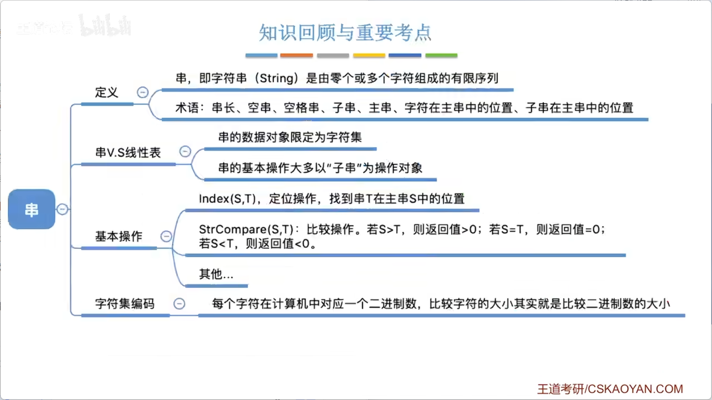
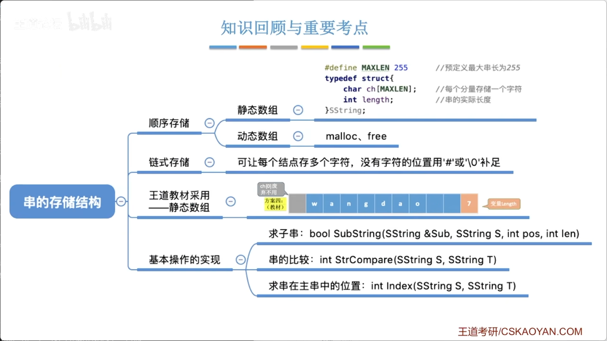
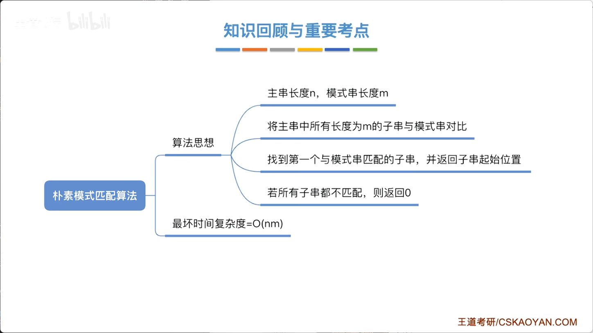

# 4.1_1_串的定义和基本操作

同学们，大家好。现在开始，我们进入一个新的章节——串。串就是字符串。本小节我们先学习串的定义和相关基本操作，也就是探讨它的逻辑结构和基本运算（这是数据结构三要素中的两个要素）。下一小节我们再探讨使用不同存储结构来实现串的操作。

## 一、串的定义
所谓串，其实就是字符串，这是大家既熟悉又陌生的东西。大家编程时都会用到很多字符串，比如我们写的第一个程序“Hello World”中打印的内容就是一个字符串。

字符串是由零个或多个字符组成的**有限序列**。这里有几个概念：
- **串名**：即字符串变量的名字，例如下面这个串的串名是 `S`，另一个是 `T`。
- **串的长度**：串中字符的总个数。若长度为0，则称为**空串**（null string）。

教材中常用单引号括起字符序列，但不同编程语言习惯不同（Java、C 中用双引号，Python 可用单引号）。**注意**：引号只是边界符，不是串的内容。例如字符串 `"hello"` 的长度是5，而不是7。

## 二、几个重要术语
1. **子串**  
   串中任意**连续**的字符组成的子序列。例如从主串中划出任意连续的一段都是子串，空串也是子串。

2. **主串**  
   包含子串的那个串。

3. **字符在串中的位置**  
   字符的编号从 **1** 开始（与线性表一致）。例如字符 `i` 在串 `T` 中是第8个字符，则其位置为8。若无特别说明，位置指第一次出现的位置。注意空格也是一个字符，占一位。

4. **子串在主串中的位置**  
   以子串的第一个字符在主串中的位置为准。例如子串 `"is"` 在 `T` 中，第一个字符 `i` 在第8位，则子串位置为8。

5. **空串与空格串的区别**  
   - 空串：长度0，`''`。  
   - 空格串：由空格字符组成，长度大于0，如 `'   '` 长度为3。每个空格占1字节（8比特）。

## 三、串与线性表的关系
串也是一种**特殊的线性表**，元素之间呈线性关系。区别在于：
- 普通线性表的元素类型任意；串的元素限定为字符（中文、英文、数字、标点等）。
- 线性表的基本操作（增删改查）通常针对**单个元素**；而串的操作通常以**子串**为对象。例如搜索引擎输入一个关键词（子串），去匹配大量文章（主串）。

## 四、串的基本操作（课本推荐）
1. **赋值** `StrAssign(&T, chars)`：将字符串常量 `chars` 赋给 `T`。
2. **复制** `StrCopy(&T, S)`：将串 `S` 复制给 `T`。
3. **判空** `StrEmpty(S)`：判断 `S` 是否为空串，返回布尔值。
4. **求长度** `StrLength(S)`：返回串的长度。
5. **清空** `ClearString(&S)`：逻辑上清空内容，但存储空间保留，可再次写入。
6. **销毁** `DestroyString(&S)`：回收分配的内存空间，之后无法再使用。
7. **串联接** `Concat(&T, S1, S2)`：将 `S1` 和 `S2` 拼接后赋给 `T`。注意拼接可能导致存储空间扩展，设计存储结构时需考虑动态扩容。
8. **求子串** `SubString(&Sub, S, pos, len)`：从串 `S` 的第 `pos` 个位置起取 `len` 个字符，存入 `Sub`。注意空格也要计入长度。
9. **定位（模式匹配）** `Index(S, T)`：查找子串 `T` 在主串 `S` 中第一次出现的位置，若存在则返回位置（从1开始），否则返回0。
10. **串比较** `StrCompare(S, T)`：比较两个串的大小。规则如下：
    - 从第一个字符开始依次比较；
    - 若对应字符不等，则字符编码（ASCII/Unicode）较大的串更大；
    - 若前缀全部相同，则**长度更长**的串更大；
    - 若字符和长度均相同，则两串相等。
    - 返回值：`S>T` 返回正数，`S=T` 返回0，`S<T` 返回负数。

## 五、字符编码与串比较的底层原理
计算机只存储二进制数，因此每个字符都要映射为二进制数，这就是**字符集编码**。例如 ASCII 码中，字母 `A` 的二进制为 `01000001`，`C` 为 `01000011`，所以 `C > A`。空格字符也有对应编码（如 `00100000`），因此空格串在内存中占用多个字节。

对于中文等大量字符，ASCII（256个状态）不够用，于是有了 Unicode 字符集，并衍生出 UTF-8、UTF-16 等编码方案。UTF-8 中一个汉字通常占3个字节。考研通常只考虑 ASCII 情况（每个字符1字节）。

**乱码问题**：文件存储时采用一种编码（如 UTF-8），打开时软件却用另一种解码（如 GBK），导致二进制数映射到错误的字符，即乱码。本质上是因为编解码所用的映射函数不匹配。




# 4.1_2_串的存储结构

本小节我们探讨串的存储结构。上一小节提到过，串是一种特殊的线性表，因此，适用于线性表的存储结构同样也适用于串。区别仅在于：线性表中存储的是任意类型的数据元素，而串中存储的是**字符**。

## 一、顺序存储结构

与线性表的顺序存储类似，串也可以采用数组来实现。

**1. 定长顺序存储（静态数组）**  
我们可以定义一个静态数组来存储字符串，并用一个变量（如 `length`）记录当前串的实际长度。这种方式在声明时由系统在内存中分配一片连续空间，每个字符占1字节（按ASCII编码）。  
**缺点**：数组长度固定，无法动态扩展。若最大长度（如255）不够用，则无法存储更长的串。教材中将此称为“定长顺序存储”。

**2. 堆分配存储（动态数组）**  
为了支持可变长度，可以使用动态数组：在结构体中定义一个字符指针，通过 `malloc` 函数在堆区申请连续空间，指针指向该空间的首地址。  
- 堆区空间需手动释放（调用 `free`）；  
- 静态数组的空间则由系统自动回收（函数结束时释放）。  

**顺序存储的优缺点**（与顺序表一致）：  
- **优点**：支持随机存取，可快速访问任意位置字符。  
- **缺点**：插入、删除操作不便，扩展和收缩空间开销较大。

## 二、顺序存储的具体实现细节（不同教材差异）

**方案一**：用单独的整型变量 `length` 存储串长，字符从数组下标0开始存放。  
**方案二**：用 `ch[0]`（数组第一个位置）充当长度变量，字符从下标1开始存放。  
- 优点：字符位置与下标一一对应（位置从1开始）。  
- 缺点：`ch[0]` 只有1字节，能表示的最大长度为255，无法存储更长的串。  

**王道教材采用的方案**：综合两者优点——**舍弃 `ch[0]` 不用**，字符从 `ch[1]` 开始存放，同时用单独的整型变量 `length` 记录串长。这样既避免了下标转换，又支持更大长度。本课程后续代码均默认采用此方案。

## 三、链式存储结构

串也可以采用链表实现。每个节点存储一个字符，并用指针指向下一节点。  
**问题**：每个字符只占1字节，但指针（在32位系统中）占4字节，存储密度（有效信息占比）很低。  
**改进**：每个链表节点存储**多个字符**（如4个或更多），从而提高存储密度。若最后一个节点未填满，可用特殊字符（如 `#` 或 `'\0'`）填充。

**链式存储的优缺点**（与链表一致）：  
- **优点**：插入、删除操作方便，易于扩展和收缩。  
- **缺点**：不支持随机存取，访问任意位置需遍历。

## 四、基于静态数组实现的基本操作（代码逻辑）

以下操作基于王道教材的存储方案（`ch[1..length]` 存放字符）。

**1. 求串长**：直接返回 `length` 值。  
**2. 清空串**：将 `length` 设为0即可（逻辑上清空，内存中数据仍存在）。  
**3. 求子串（`SubString(&Sub, S, pos, len)`）**  
- 功能：从串 `S` 的第 `pos` 个位置起，取长度为 `len` 的子串，存入 `Sub`。  
- 实现：将 `S.ch[pos]` 到 `S.ch[pos+len-1]` 依次复制到 `Sub.ch[1..len]`，并设置 `Sub.length = len`。  
- 注意：若 `pos+len-1 > S.length`，则越界，返回失败标志。

**4. 串比较（`StrCompare(S, T)`）**  
- 规则：从第一个字符开始依次比较；若对应字符不等，则字符编码较大者对应的串更大；若前缀全部相同，则长度更长的串更大；若长度也相等，则两串相等。  
- 返回值：`S>T` 返回正数，`S<T` 返回负数，`S==T` 返回0。  
- 实现：循环遍历两个串，找到第一个不相等的字符，返回两者ASCII码之差；若遍历完仍未找到不同，则返回 `S.length - T.length`。

**5. 定位操作（`Index(S, T)`）**  
- 功能：查找子串 `T` 在主串 `S` 中第一次出现的位置，若存在则返回位置（从1开始），否则返回0。  
- 实现思路（利用已有基本操作）：  
  1. 求出 `S` 和 `T` 的长度，`n = S.length`，`m = T.length`。  
  2. 从 `i = 1` 到 `n-m+1`，依次取出 `S` 中长度为 `m` 的子串 `Sub`。  
  3. 调用 `StrCompare(Sub, T)`，若结果为0（相等），则返回 `i`。  
  4. 若循环结束未找到，则返回0。

> 上述代码较为基础，建议跨考或基础薄弱的同学在纸上手写一遍，加深理解。

## 五、小结与预告

本小节介绍了串的两种存储结构：顺序存储（定长和堆分配）和链式存储（普通节点及多字符节点），并基于静态数组实现了求子串、比较和定位等基本操作。  





# 4.2_1_朴素模式匹配算法

经过前两小节的学习，我们已经了解了什么是字符串以及字符串的存储实现。本小节将学习**朴素模式匹配算法**（也称暴力匹配算法）。该算法名称听起来复杂，但其核心思想非常直观。

## 一、什么是模式匹配
在日常应用中，我们经常需要在某段文字中搜索指定内容。例如，在 Word 文档中查找某个词，或在搜索引擎中输入关键词检索网页。这些操作本质上都是在**主串**中寻找与**模式串**相同的**子串**，并返回其位置。

- **主串**：被搜索的整个字符串。  
- **模式串**：待搜索的目标内容。  
- **子串**：主串中连续的一段字符，**一定存在**于主串中；而模式串**不一定**能在主串中找到。

## 二、朴素模式匹配算法的基本思想
算法思路非常简单：**暴力枚举**。

设主串长度为 `n`，模式串长度为 `m`。主串中所有长度为 `m` 的子串共有 `n - m + 1` 个。朴素算法依次将这些子串与模式串进行逐字符比较，直到找到第一个完全匹配的子串，或遍历完所有子串均不匹配为止。

- 若找到匹配子串，则返回该子串第一个字符在主串中的位置（从1开始）。  
- 若所有子串均不匹配，则返回0，表示匹配失败。

> 实际上，上一小节介绍的 `Index` 定位操作就是采用朴素模式匹配的思想实现，只是当时使用了封装好的“求子串”和“串比较”两个基本操作。

## 三、直接操作数组的实现方式（不借助基本操作）
我们可以直接使用数组下标和两个扫描指针 `i` 和 `j`，分别指向主串和模式串当前待比较的字符。

**匹配过程**：
1. 初始化 `i = 1`，`j = 1`。  
2. 若 `S[i] == T[j]`，则 `i++`，`j++`，继续比较下一个字符。  
3. 若 `S[i] != T[j]`，说明当前子串匹配失败，则需**回溯**：
   - 主串指针 `i` 回到**下一个子串的起始位置**，即 `i = i - j + 2`；  
   - 模式串指针 `j` 回到1（重新从模式串第一个字符开始比较）。  
4. 当 `j > m` 时，说明模式串全部字符都匹配成功，返回当前子串起始位置，即 `i - m`。  
5. 若 `i > n` 且仍未匹配成功，则返回0。

**示例分析**（模式串长度为6）：
- 从主串第1个字符开始，依次比较，若在第6个字符处失配，则回溯：`i = 1 - 6 + 2 = 2`，`j = 1`，开始匹配主串第2个字符开始的子串。  
- 如此重复，直到找到匹配或遍历结束。

## 四、王道教材中的参考代码逻辑
```c
int Index(SString S, SString T) {
    int i = 1, j = 1;
    while (i <= S.length && j <= T.length) {
        if (S.ch[i] == T.ch[j]) {
            ++i; ++j;  // 继续比较后继字符
        } else {
            i = i - j + 2;  // 主串指针回溯到下一个子串起始位置
            j = 1;          // 模式串指针回到开头
        }
    }
    if (j > T.length)
        return i - T.length;  // 匹配成功，返回子串起始位置
    else
        return 0;             // 匹配失败
}
```

## 五、时间复杂度分析
- 最好情况：第一次匹配即成功，且模式串的第一个字符就与主串不同，则只需比较1次，时间复杂度为 `O(1)`。  
- 最坏情况：每次匹配都直到模式串最后一个字符才发现失配，且每次失配都发生在最后一位。例如：  
  主串为 `"aaaaaaaaab"`，模式串为 `"aaaab"`（前 `m-1` 个字符相同，最后一位不同）。  
  此时每个子串都需要比较 `m` 个字符，共有 `n - m + 1` 个子串，总比较次数为 `(n - m + 1) * m`。  
  由于通常 `n >> m`，时间复杂度约为 `O(n * m)`，即 **O(nm)**。




# 4.2_2_KMP算法(上)

本小节将学习本章唯一的重点——**KMP算法**。该算法是对上一节朴素模式匹配算法的优化。其名称源于三位发明者（Knuth、Morris、Pratt）姓氏的首字母，并非晦涩难懂，不必畏惧。

## 一、朴素算法的问题与优化思路
在朴素模式匹配中，最坏情况是主串扫描指针 `i` 频繁回溯——每前进几步又回退若干位，导致大量时间开销。例如，在主串中搜索模式串 `"go"` 时，朴素算法每次失配后，模式串仅向右移动一位，子串逐个比较，重复扫描了很多已比对过的字符。

事实上，人类在浏览文本时，目光通常不会回退，因为大脑对已扫描的字符有短期记忆，能直接跳过不可能匹配的起始位置。例如，当模式串为 `"google"`（此处示例为方便，简写为 `"go"` 类模式），若在某个位置失配，我们无需检查以失配点之前的某些字符开头的子串，因为它们与模式串的首字符无法匹配。

**KMP的核心思想**：让主串指针 `i` **不回溯**，仅让模式串指针 `j` 适当回退，从而跳过肯定不匹配的子串，提高匹配效率。

## 二、利用模式串自身信息确定 `j` 的回退位置
假设当前正在匹配某个子串，且已成功匹配了模式串的前几个字符，但在第 `j` 个字符处失配（`S[i] != T[j]`）。此时，我们已知 `S[i-j+1 … i-1]` 与 `T[1 … j-1]` 完全相等。

根据这些已匹配的信息，我们无需将 `j` 重置为1再逐一比较，而是可以直接将 `j` 移动到某个新的位置 `k`（`1 ≤ k < j`），使得 `T[1 … k-1]` 与 `S[i-k+1 … i-1]` 对齐，这样 `i` 不必移动，只需继续比较 `S[i]` 与 `T[k]`。

**关键**：`k` 的取值只依赖于模式串本身，与主串无关。因此，我们可以为每个模式串位置 `j` 预先计算出当该位置失配时，`j` 应回退到的位置，这个值记为 `next[j]`。

## 三、`next` 数组的定义与示例
对于模式串 `"google"`（这里假设其长度为6，字符为 `g, o, o, g, l, e`，但原语音中示例更简，以 `"go"` 类说明，此处按原意保留一般性），我们可以通过分析得出不同 `j` 值失配时的回退位置：

- 当 `j = 1` 时失配，即模式串第一个字符就与主串当前位置不匹配，则 `i` 应后移一位，`j` 保持为1。在代码实现中，我们通常令 `next[1] = 0`，然后利用特殊逻辑让 `i++`、`j++` 来实现。
- 当 `j = 2` 时失配，此时已匹配的字符只有 `T[1]`，显然应回退到 `j = 1`。
- 当 `j = 3` 时失配，已匹配 `T[1..2]`，若前缀与后缀有重叠关系，则回退到对应位置；否则回退到1。
- 依此类推，可计算出所有位置的 `next[j]` 值。

例如，对于某模式串（原语音以 `"go"` 系列示例），其 `next` 数组可能为 `[0, 1, 1, 1, 2, 1]` 等（具体值需根据模式串实际计算）。有了 `next` 数组后，KMP算法的匹配过程如下：

## 四、KMP匹配算法逻辑（与朴素算法的区别）
```c
int KMP(SString S, SString T, int next[]) {
    int i = 1, j = 1;
    while (i <= S.length && j <= T.length) {
        if (j == 0 || S.ch[i] == T.ch[j]) {
            ++i; ++j;   // 继续比较后继字符
        } else {
            j = next[j];  // 模式串指针回退，i不回溯
        }
    }
    if (j > T.length)
        return i - T.length;   // 匹配成功
    else
        return 0;              // 匹配失败
}
```
**注意**：
- 当 `j = 0` 时，说明 `next[1]` 触发了特殊处理，此时将 `i++`、`j++`，相当于从主串下一个位置重新开始与模式串第一个字符比较。
- 整个过程中，主串指针 `i` 只增不减，不会回溯，从而提高了效率。

## 小结
KMP算法通过利用模式串自身的匹配信息（`next` 数组），避免了主串指针的回溯，将最坏情况的时间复杂度从朴素算法的 `O(n*m)` 降低至 `O(n+m)`。其核心在于失配时确定 `j` 的正确回退位置，这完全由模式串的结构决定，与主串无关。


# 4.2_3_KMP算法(下)

上一小节我们给出了KMP算法的实现思想，并以模式串 `"go"` 为例求出了对应的 `next` 数组。考研中常考的是**求一个模式串的 `next` 数组**。其用法是：当某个字符失配时，令模式串指针 `j` 回到 `next[j]` 所指示的位置，而主串指针 `i` 保持不变。

本小节重点探讨**如何用手算的方式快速求出 `next` 数组**。

#### 一、直观示例分析

**例1**：模式串为 `"ABCABCE"`（假设字符依次为 A, B, C, A, B, C, E）。当第6个字符匹配失败时，意味着主串中前5个字符肯定与模式串的前5个字符匹配（即 `A B C A B`）。此时我们应让模式串右移，但移几步呢？  
- 右移1位：上下错位，对不上；  
- 右移2位：仍对不上；  
- 右移3位：此时模式串的前3个字符 `A B C` 与主串中刚才匹配成功的部分的后3个字符 `A B C` 对齐。  
因此，当 `j = 6` 时失配，`j` 应回退到3，即 `next[6] = 3`。

**例2**：模式串为 `"ABABAA"`（假设为 A B A B A A），当 `j = 7` 时失配（长度7？原语音示例为7个字符，但似乎有笔误，按逻辑处理）。若在第七个字符失配，说明前面6个字符已匹配。尝试右移1位、2位……直到某位移后，前面某一段能对齐。设最长可对齐的前缀长度为4，则 `next[7] = 5`（即回退到第5个位置）。  
**注意**：虽然右移更多位也可能使部分字符对齐，但我们应优先选择**对齐长度最长**的情况，因为这样可以保留更多已匹配的信息，避免遗漏可能的匹配。

**例3**：模式串 `"AAAAAB"`（前五个A，最后一个B），当 `j = 5` 时失配，前面4个字符均为A。右移1位后，模式串的前4个字符（A A A A）与主串已匹配部分的后4个字符（A A A A）对齐，因此 `next[5] = 4`。同样，虽然继续右移也能对齐，但4是最长长度，优先采用。

**例4**：模式串 `"ABCDE"`，当 `j = 5` 时失配，前面4个字符 `A B C D`。尝试右移1位、2位、3位，均无法让前缀与后缀对齐，因此最长相等前后缀长度为0，`next[5] = 1`。

**特殊情形**：当 `j = 1` 时失配，即模式串第一个字符就与主串当前位置不匹配。此时应让主串指针 `i` 后移一位，再与模式串第一个字符比较。在代码中，我们令 `next[1] = 0`，然后利用 `if (j == 0)` 的逻辑让 `i++`、`j++` 实现这一过程。

#### 二、前缀与后缀的定义

为了形式化描述上述过程，引入两个概念：
- **前缀**：一个串中，包含第一个字符且**不包含最后一个字符**的所有子串。  
- **后缀**：一个串中，包含最后一个字符且**不包含第一个字符**的所有子串。

例如，对于串 `"ABCAB"`，其前缀有 `"A"`、`"AB"`、`"ABC"`、`"ABCA"`，后缀有 `"B"`、`"AB"`、`"CAB"`、`"BCAB"`。其中最长相等的前缀和后缀为 `"AB"`，长度为2。

#### 三、`next` 数组的通用求法

当模式串中第 `j` 个字符失配时，我们考察由前 `j-1` 个字符组成的子串 `S`。令 `k` 为 `S` 的**最长相等前后缀的长度**，则：
- **`next[j] = k + 1`**。
- 特别地，`next[1] = 0`。

**说明**：
- 当 `j = 2` 时，前1个字符组成的串长度为1，其前缀和后缀均为空，最长相等长度为0，故 `next[2] = 1`。因此，**对于任何模式串，`next[1] = 0`，`next[2] = 1` 总是成立**。

#### 四、手算练习

**练习1**：模式串 `"ABABAA"`（长度6，字符：A B A B A A）  
- `next[1] = 0`，`next[2] = 1`。
- `j = 3`：前两个字符为 `"AB"`，最长相等前后缀长度为0 → `next[3] = 1`。
- `j = 4`：前三个字符为 `"ABA"`，前缀 `"A"` 与后缀 `"A"` 相等，长度为1 → `next[4] = 2`。
- `j = 5`：前四个字符为 `"ABAB"`，前缀 `"AB"` 与后缀 `"AB"` 相等，长度为2 → `next[5] = 3`。
- `j = 6`：前五个字符为 `"ABABA"`，前缀 `"ABA"` 与后缀 `"ABA"` 相等，长度为3 → `next[6] = 4`。

因此 `next = [0, 1, 1, 2, 3, 4]`。

**练习2**：模式串 `"AAAAB"`（四个A，一个B）  
- `next[1] = 0`，`next[2] = 1`。
- `j = 3`：前两个 `"AA"`，最长相等前后缀长度为1（`"A"`） → `next[3] = 2`。
- `j = 4`：前三个 `"AAA"`，最长相等前后缀长度为2（`"AA"`） → `next[4] = 3`。
- `j = 5`：前四个 `"AAAA"`，最长相等前后缀长度为3（`"AAA"`） → `next[5] = 4`。

`next = [0, 1, 2, 3, 4]`。

#### 五、与教材表述的对照

王道教材中对 `next` 数组的定义为：  
- 当 `j = 1` 时，`next[1] = 0`；  
- 其他情况下，`next[j]` 等于由前 `j-1` 个字符组成的串的**最长相等前后缀长度加1**；若不存在相等前后缀，则取1。  
这与我们上述方法完全一致。考生可自行总结更易记忆的口诀。

#### 六、时间复杂度分析

KMP算法的整体时间包括两部分：
1. **计算 `next` 数组**：仅需扫描模式串一次，时间复杂度为 `O(m)`（m为模式串长度）。
2. **匹配过程**：主串指针 `i` 从不回溯，最多扫描 `n` 个字符，时间复杂度为 `O(n)`（n为主串长度）。

因此，**KMP算法的平均时间复杂度为 `O(n + m)`**。相比朴素算法的 `O(n*m)`，在重复字符较多的最坏情况下有明显优势。

#### 七、补充说明

朴素模式匹配算法只有在子串与模式串经常能部分匹配时，主串指针才会频繁回溯，此时KMP的优势才显著。若日常使用中这种情形较少，朴素算法因实现简单仍被广泛采用。


# 4.2.2_1_KMP算法
-
# 4.2.2_2_求next数组
-
# 4.2.3_KMP算法的进一步优化
-
# 5.1.1+5.1.2_树的定义和基本术语
-
# 5.1.3 树的性质
-
# 5.2.1_1_二叉树的定义和基本术语
-
# 5.2.1_2_二叉树的性质
-
# 5.2.2_二叉树的存储结构
-
# 5.3.1_1_二叉树的先中后序遍历
-
# 5.3.1_2_二叉树的层次遍历
-
# 5.3_3_由遍历序列构造二叉树
-
# 5.3.2_1_线索二叉树的概念
-
# 5.3.2_2_二叉树的线索化
-
# 5.3.2_3_在线索二叉树中找前驱后继
-
# 5.4.1 树的存储结构
-
# 5.4.2 树、森林与二叉树的转换
-
# 5.4.3 树和森林的遍历
-
# 5.5.1_哈夫曼树
-
# 5.5.2_1_并查集
-
# 5.5.2_2_并查集的进一步优化
-
# 6.1.1_图的基本概念
-
# 6.2.1_邻接矩阵法
-
# 6.2.2_邻接表法
-
# 6.2.3+6.2.4_十字链表、邻接多重表
-
# 6.2.5_图的基本操作
-
# 6.3.1_图的广度优先遍历
-
# 6.3.2_图的深度优先遍历
-
# 6.4.1_最小生成树
-
# 6.4.2_1最短路径问题_BFS算法
-
# 6.4.2_2最短路径问题_Dijkstra算法
-
# 6.4.2_3_最短路径问题_Floyd算法
-
# 6.4.3_有向无环图描述表达式
-
# 6.4.4_拓扑排序
-
# 6.4.5_关键路径
-
# 7.1_查找的基本概念
-
# 7.2.1_顺序查找
-
# 7.2.2_折半查找
-
# 7.2.3_分块查找
-
# 7.3.1 二叉排序树
-
# 7.3.2_1 平衡二叉树
-
# 7.3.2_2_平衡二叉树的删除
-
# 7.3.3_1_红黑树的定义和性质
-
# 7.3.3_2_红黑树的插入
-
# 7.3.3_3_红黑树的删除
-
# 7.4.1_1_B树
-
# 7.4.1_2_B树的插入删除
-
# 7.4.2_B+树
-
# 7.5.1 散列表的基本概念
-
# 7.5.2 散列函数的构造
-
# 7.5.3_1 处理冲突的方法_拉链法
-
# 7.5.3_2 处理冲突的方法_开放定址法
-
# 7.5.4 散列查找的性能分析
-
# 8.1_排序的基本概念
-
# 8.2.1+8.2.2_插入排序
-
# 8.2.3_希尔排序
-
# 8.3.1_冒泡排序
-
# 8.3.2_快速排序
-
# 8.4.1_简单选择排序
-
# 8.4.2_1_堆排序
-
# 8.4.2_2_堆的插入删除
-
# 8.5.1_归并排序
-
# 8.5.2_基数排序
-
# 8.5.3 计数排序
-
# 8.7.1+8.7.2_外部排序
-
# 8.7.3_败者树
-
# 8.7.4_置换-选择排序
-
# 8.7.5_最佳归并树