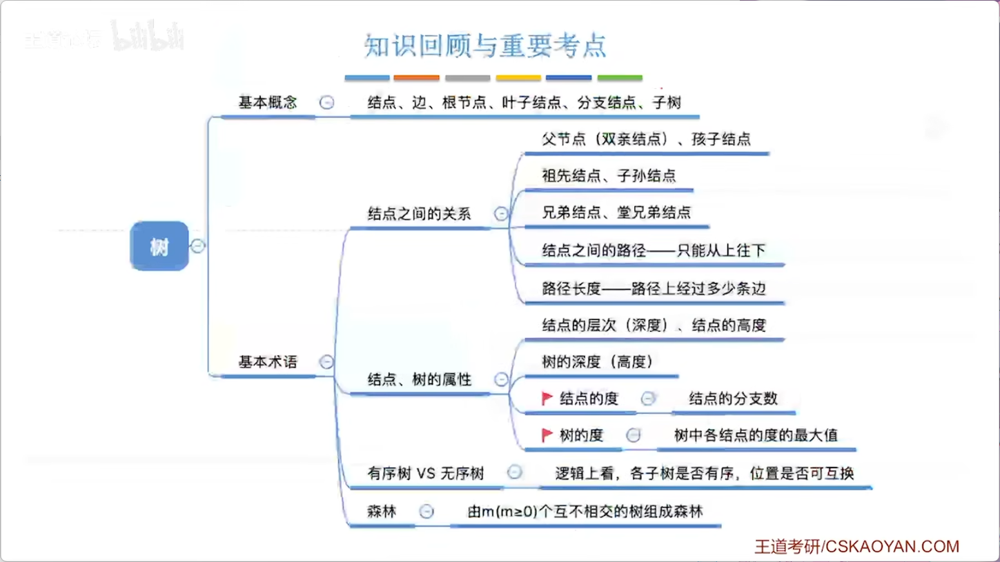
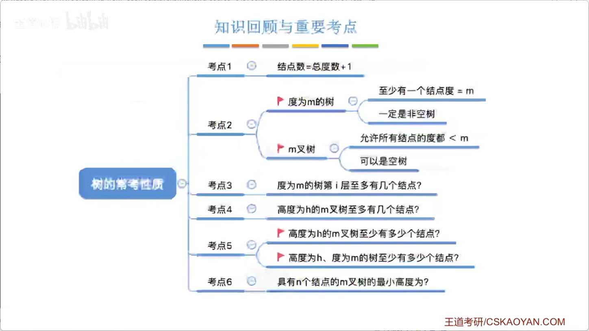
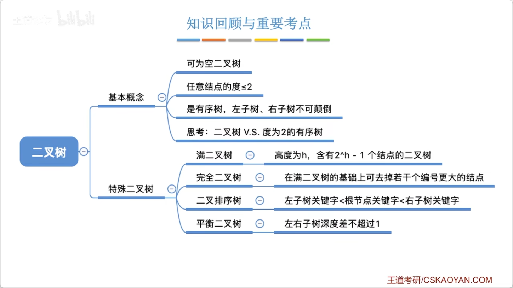

# 5.1.1+5.1.2_树的定义和基本术语

各位同学，大家好。从本小节开始，我们将进入一个全新的章节，学习一种新的数据结构——**树**。二叉树是一种特殊的树，由于二叉树应用广泛，同时也是考研的重点内容，因此我们将专门用几个小节来讲解二叉树。本小节我们先来认识**树**这种数据结构在逻辑上呈现的特性，即它的逻辑结构，同时介绍几个与树相关的基本术语，这些术语将在考试中出现，并在后续讲解中频繁使用。

#### 一、树的逻辑结构

树的逻辑结构，顾名思义，与我们在大自然中看到的树很相似：从一个树根出发，向上生长，会长出很多分支，每个分支又会长出新的小分支。在我们的数据结构中，逻辑上也呈现同样的特性——从一个被称为**根节点**的节点出发，依次长出各个分支，每个分支上又可以连接一个新的节点，这些分支可称为**边**。

在上图中，橙色节点下面还有下一级分支，称为**分支节点**；绿色节点下面没有分支，称为**叶子节点**（或叶节点）。树中的各个节点用于存放数据元素，如数字、字符、字符串等，节点之间呈现分层分支的关系。

树还有一种特殊形态——**空树**，即节点数为零。与之对应的是**非空树**。对于非空树，有且仅有一个根节点。

在线性表中我们提到过前驱和后继的概念。树中同样存在前驱和后继。例如，节点 `B` 是 `A` 的后继，`G` 是 `C` 的后继；前驱也类似，如 `B` 是 `N` 的前驱。需要注意的是，在非空树中，**只有根节点没有前驱**，其他所有节点都有且仅有一个前驱；**叶子节点没有后继**，而有后继的节点是分支节点（也称非终端节点）。若某个节点有两个前驱（如下图右），则不是树，而是图结构（将在后续章节学习）。因此，树的定义要求：除根节点外，每个节点有且仅有一个前驱。

#### 二、子树与递归定义

树还有一个重要概念——**子树**。例如，根节点 `A` 有三棵子树，且这些子树互不相交。互不相交的含义与“每个节点只有一个前驱”等价——若在两个子树之间再建立一条边，它们就相交了，同时某些节点就会有两个前驱，不满足树的定义。因此，根节点的各子树必须互不相交。

子树本身也可以看作一棵新的树，例如以 `B` 为根的子树，`B` 成为该子树的根节点；该子树又可以继续划分为更小的子树。由此可看出，**树是一种递归定义的数据结构**：任何一棵树都可以看作由根节点和若干棵互不相交的子树组成。

#### 三、树的应用

树形逻辑结构在生活中有广泛的应用，例如：
- 国家行政区域的划分（省、市、区等）；
- 计算机文件系统（磁盘→文件夹→子文件夹→文件）；
- 思维导图等软件。

#### 四、基本术语

##### 1. 节点之间关系的描述（类比家谱）
- **祖先节点**：从某节点出发，沿父节点向上直到根节点的路径上经过的所有节点，都是该节点的祖先。
- **子孙节点**：从某节点出发，其所有分支下的节点都是它的子孙。
- **双亲节点（父节点）**：一个节点的直接前驱。
- **孩子节点**：一个节点的直接后继。
- **兄弟节点**：同一父节点的孩子之间互为兄弟。
- **堂兄弟节点**：处于同一层但父节点不同的节点（一般指不同父节点的同层节点）。该术语使用较少，考试中若出现，通常表示“同一层”。

##### 2. 路径与路径长度
- **路径**：从树中一个节点到另一个节点所经过的边（方向只能从上往下，因为边是有向的）。
- **路径长度**：路径上经过的边数。例如从根节点到某节点经过2条边，则路径长度为2。由于方向限制，从下往上不存在路径。

##### 3. 节点的属性
- **节点的层次（深度）**：从根节点开始，根为第1层，依次往下数。
- **节点的高度**：从下往上数，叶节点高度为1，越往上层高度越大。
- **树的高度（深度）**：树中节点的最大层数，即总共多少层。

（注意：个别教材可能将根节点层次设为0，但考研默认从1开始。）

##### 4. 度
- **节点的度**：该节点的孩子数（即分支数）。度为0的节点是叶子节点；度大于0的是分支节点（非终端节点）。
- **树的度**：树中所有节点度的最大值。例如，若根节点有3个孩子，其他节点度均≤3，则树的度为3。

##### 5. 有序树与无序树
- **有序树**：各子树从左至右有次序，不可互换（如家谱按长幼顺序排列）。
- **无序树**：各子树从左至右无次序，可互换（如行政区划）。
具体取决于实际应用是否需要利用左右位置关系表达额外含义。

##### 6. 森林
- **森林**：由 `m`（`m ≥ 0`）棵互不相交的树组成的集合。空森林（`m = 0`）是允许的。
- 若给森林加上一个共同的根节点，则森林可转换为一棵树；反之，一棵树去掉根节点，就变为森林。树与森林的转换是考研常考点。

#### 五、小结

本小节介绍了树的基本概念，重点理解：
- 递归定义：树由根节点和若干互不相交的子树组成；
- 前驱/后继的唯一性（根无前驱，叶无后继）；
- 节点度与树的度的区别；
- 路径方向性（从上至下）；
- 有序/无序树、森林等术语。

# 5.1.3 树的性质

本小节介绍树的一些常考性质。

#### 性质一：节点数 = 总度数 + 1

树的节点总数等于所有节点度数之和再加 1。因为每个节点的度数表示其孩子数（分支数），每个非根节点都有一个父节点（即“头上有一条边”），只有根节点没有父节点，所以节点总数 = 总度数 + 1。

#### 性质二：度为 m 的树 与 m 叉树的区别

- **树的度**：树中所有节点度的最大值。  
- **m 叉树**：每个节点最多只能有 m 个孩子的树。

两者容易混淆。例如：
- 一棵**度为 3 的树**，意味着该树中**至少有一个节点**的度数为 3（即至少有 3 个孩子）。
- 一棵**3 叉树**，只规定每个节点最多 3 个孩子，但所有节点的孩子数都可以小于 3，甚至可以是空树（0 个节点）。

因此，度为 m 的树一定是非空树，且至少有一个节点有 m 个孩子，故至少会有 **m + 1** 个节点（根节点 + m 个孩子）。而 m 叉树允许所有节点度数均小于 m，甚至为空。

#### 性质三：度为 m 的树第 i 层最多有 m^(i-1) 个节点

第一层（根节点）最多 1 个；若树的度为 m，则每个节点最多有 m 个孩子，因此：
- 第 2 层最多 m 个；
- 第 3 层最多 m^2 个；
- 第 i 层最多 **m^(i-1)** 个。

该结论对 m 叉树同样成立。

#### 性质四：高度为 h 的 m 叉树最多有 (m^h - 1)/(m - 1) 个节点

将每一层的最大节点数相加，即等比数列求和：
1 + m + m^2 + … + m^(h-1) = (m^h - 1)/(m - 1)（m ≠ 1）。

#### 性质五：高度为 h 的 m 叉树最少节点数

对于 m 叉树，只限制了节点孩子数的上限，未设下限，所以最少情况是：从根节点开始，每层只有一个节点（即每个节点只有一个孩子），因此最少节点数为 **h**。

但对于**度为 m 的树**，必须保证至少有一个节点的度为 m，因此最少节点数为 **m + 1**（根节点 + 它的 m 个孩子），并且高度至少为 2。

#### 性质六：具有 n 个节点的 m 叉树的最小高度

要使高度最小，应让树尽量“宽”，即每个节点都尽可能有 m 个孩子（除最后一层可能不满）。设最小高度为 h，则：
- 高度为 h 的 m 叉树最多能容纳的节点数为 (m^h - 1)/(m - 1)；
- 高度为 h-1 的 m 叉树最多能容纳的节点数为 (m^(h-1) - 1)/(m - 1)。

由于 n 个节点至少需要 h 层，因此满足：
(m^(h-1) - 1)/(m - 1) < n ≤ (m^h - 1)/(m - 1)

对不等式取对数，可解得：
h = ⌈log_m( n(m - 1) + 1 )⌉  
（向上取整）

#### 小结

本小节重点：
- 节点数 = 总度数 + 1；
- 度为 m 的树与 m 叉树的区别（前者至少有一个节点度为 m，后者无此要求）；
- 每层最多节点数、整棵树最多节点数、最少节点数的计算；
- 最小高度的推导公式。

# 5.2.1_1_二叉树的定义和基本术语

本小节将学习二叉树的定义和基本术语。由于二叉树应用广泛，是考研中的高频考点，需要重点掌握。

#### 一、二叉树的定义

二叉树是上一小节介绍的 m 叉树中 m=2 的特殊情况。理解了 m 叉树，二叉树就很容易理解。

一棵二叉树要么是空二叉树（没有节点），要么由**根节点**和**左子树**、**右子树**组成，且左右子树本身又各是一棵二叉树。例如，将某个节点的左分支单独拎出来，该节点成为其左子树的根节点；若某侧没有分支，则对应子树为空二叉树。

二叉树的特点：
- 每个节点最多只有两棵子树；
- 左右子树**不能颠倒**，因此二叉树是**有序树**。

**注意**：二叉树与**度为2的有序树**的区别：
- 度为2的有序树中，至少存在一个节点度数为2；
- 二叉树允许所有节点度数均小于2，甚至可以是空树。

二叉树是一种**递归定义**的数据结构，可由根节点和两个互不相交的左右子树组成。总体而言，二叉树有以下五种基本形态：
1. 空二叉树；
2. 只有根节点；
3. 只有左子树（右子树为空）；
4. 只有右子树（左子树为空）；
5. 左右子树均非空。

#### 二、几种特殊的二叉树

##### 1. 满二叉树

满二叉树指除了最下面一层的叶子节点外，其他所有分支节点都恰好有两个孩子（即度均为0或2，不存在度为1的节点）。

对于高度为 h 的满二叉树：
- 第 i 层节点数为 \(2^{i-1}\)；
- 总节点数为 \(2^h - 1\)。

若按**从上至下、从左至右**的层次顺序从1开始编号，则：
- 编号为 i 的节点，其左孩子编号为 \(2i\)，右孩子编号为 \(2i+1\)；
- 父节点编号为 \(\lfloor i/2 \rfloor\)。

这一性质非常重要，后续在顺序存储中会用到。

##### 2. 完全二叉树

完全二叉树可以理解为：在一棵满二叉树的基础上，从**编号最大的节点**开始，依次删除若干个节点后得到的树。

若按层次编号后，完全二叉树中每个节点的编号都能与满二叉树对应位置一一对应，则为完全二叉树。

**完全二叉树的重要性质**：
- 叶子节点只可能出现在**最后两层**；
- 最多只可能有**一个度为1**的节点（该节点必然只有左孩子）；
- 同样满足满二叉树的编号规律（左孩子 \(2i\)，右孩子 \(2i+1\)，父节点 \(\lfloor i/2 \rfloor\)）；
- 若总节点数为 n，则：
  - 编号 \(i \le \lfloor n/2 \rfloor\) 的节点均为分支节点；
  - 编号 \(i > \lfloor n/2 \rfloor\) 的节点均为叶子节点。

（完全二叉树是选择题的高频考点，需熟练掌握。）

##### 3. 二叉排序树（BST）

二叉排序树具有以下性质：
- 左子树上**所有**节点的关键字均**小于**根节点的关键字；
- 右子树上**所有**节点的关键字均**大于**根节点的关键字；
- 左右子树本身也各是一棵二叉排序树。

利用这一性质，可以快速实现搜索和插入操作。例如，搜索关键字 60，从根节点出发，若目标大于当前节点则向右走，小于则向左走，直到找到目标或到达空位。二叉排序树在元素排序和搜索中应用广泛，后续章节将详细讲解。

##### 4. 平衡二叉树

平衡二叉树指**任意节点的左子树和右子树的高度之差（平衡因子）绝对值不超过1**。

例如，某树根节点的左子树高度为2，右子树高度为3，差值1，满足平衡条件。若某节点左子树高度为1，右子树高度为6，差值为5，则不满足平衡条件。

平衡二叉树（尤其是平衡的二叉排序树）能有效降低树的高度，从而提升搜索效率。例如，在平衡树中搜索某个节点可能只需比较 2～3 次，而在不平衡树中可能需要比较很多次。这部分内容将在后续章节深入讲解。

#### 三、小结

本小节重点掌握：
- 二叉树的递归定义及与度为2的有序树的区别；
- **满二叉树**和**完全二叉树**的定义与关键性质（考试高频）；
- **二叉排序树**和**平衡二叉树**的基本概念（后续会详细展开）。

# 5.2.1_2_二叉树的性质

本小节介绍二叉树的一些常考性质。

#### 性质一：叶子节点数 = 度为2的节点数 + 1

用 \( n_0 \)、\( n_1 \)、\( n_2 \) 分别表示一棵非空二叉树中度为0、1、2的节点个数，则有：
\[
n_0 = n_2 + 1
\]

推导过程：
- 节点总数 \( n = n_0 + n_1 + n_2 \)。
- 根据树的性质“节点数 = 总度数 + 1”，二叉树中总度数为 \( n_1 + 2n_2 \)，因此：
\[
n = n_1 + 2n_2 + 1
\]
- 两式相减可得 \( n_0 = n_2 + 1 \)。

该性质在选择题中非常常用，需牢记。

#### 性质二：二叉树第 i 层最多有 \( 2^{i-1} \) 个节点

由二叉树每个节点最多两个孩子，逐层推导即可，与之前 m 叉树的结论一致。

#### 性质三：高度为 h 的二叉树最多有 \( 2^h - 1 \) 个节点

该情况对应满二叉树，由等比数列求和得出。

#### 性质四：完全二叉树的高度与节点数的关系

若完全二叉树共有 \( n \) 个节点，其高度 \( h \) 满足：
\[
h = \lceil \log_2(n+1) \rceil
\]
或
\[
h = \lfloor \log_2 n \rfloor + 1
\]

推导思路：
- 高度为 \( h \) 的完全二叉树，前 \( h-1 \) 层必须是满的，节点数为 \( 2^{h-1} - 1 \)；
- 最后一层至少1个、至多 \( 2^{h-1} \) 个节点；
- 因此 \( 2^{h-1} \le n \le 2^h - 1 \)，取对数即可得到上述公式。

掌握这两种计算方式，可灵活应对选择题。

#### 性质五：根据节点数推断完全二叉树中各度节点的个数

已知完全二叉树中：
- 最多只有一个度为1的节点（即 \( n_1 = 0 \) 或 \( 1 \)）；
- 且有 \( n_0 = n_2 + 1 \)。

因此：
- 若节点总数 \( n \) 为偶数，则 \( n_1 = 1 \)，此时：
  \[
  n_0 = n/2,\quad n_2 = n/2 - 1
  \]
- 若节点总数 \( n \) 为奇数，则 \( n_1 = 0 \)，此时：
  \[
  n_0 = (n+1)/2,\quad n_2 = (n-1)/2
  \]

这一结论常用于快速判断完全二叉树的叶子节点数和分支节点数。

#### 小结

本小节重点掌握：
- 叶子节点与度为2节点数量关系 \( n_0 = n_2 + 1 \)；
- 二叉树层次节点数、总节点数的最大取值；
- 完全二叉树高度与节点数的两种计算公式；
- 根据节点总数 \( n \) 直接确定 \( n_0, n_1, n_2 \) 的取值。

# 5.2.2_二叉树的存储结构
-
# 5.3.1_1_二叉树的先中后序遍历
-
# 5.3.1_2_二叉树的层次遍历
-
# 5.3_3_由遍历序列构造二叉树
-
# 5.3.2_1_线索二叉树的概念
-
# 5.3.2_2_二叉树的线索化
-
# 5.3.2_3_在线索二叉树中找前驱后继
-
# 5.4.1 树的存储结构
-
# 5.4.2 树、森林与二叉树的转换
-
# 5.4.3 树和森林的遍历
-
# 5.5.1_哈夫曼树
-
# 5.5.2_1_并查集
-
# 5.5.2_2_并查集的进一步优化
-
# 6.1.1_图的基本概念
-
# 6.2.1_邻接矩阵法
-
# 6.2.2_邻接表法
-
# 6.2.3+6.2.4_十字链表、邻接多重表
-
# 6.2.5_图的基本操作
-
# 6.3.1_图的广度优先遍历
-
# 6.3.2_图的深度优先遍历
-
# 6.4.1_最小生成树
-
# 6.4.2_1最短路径问题_BFS算法
-
# 6.4.2_2最短路径问题_Dijkstra算法
-
# 6.4.2_3_最短路径问题_Floyd算法
-
# 6.4.3_有向无环图描述表达式
-
# 6.4.4_拓扑排序
-
# 6.4.5_关键路径
-
# 7.1_查找的基本概念
-
# 7.2.1_顺序查找
-
# 7.2.2_折半查找
-
# 7.2.3_分块查找
-
# 7.3.1 二叉排序树
-
# 7.3.2_1 平衡二叉树
-
# 7.3.2_2_平衡二叉树的删除
-
# 7.3.3_1_红黑树的定义和性质
-
# 7.3.3_2_红黑树的插入
-
# 7.3.3_3_红黑树的删除
-
# 7.4.1_1_B树
-
# 7.4.1_2_B树的插入删除
-
# 7.4.2_B+树
-
# 7.5.1 散列表的基本概念
-
# 7.5.2 散列函数的构造
-
# 7.5.3_1 处理冲突的方法_拉链法
-
# 7.5.3_2 处理冲突的方法_开放定址法
-
# 7.5.4 散列查找的性能分析
-
# 8.1_排序的基本概念
-
# 8.2.1+8.2.2_插入排序
-
# 8.2.3_希尔排序
-
# 8.3.1_冒泡排序
-
# 8.3.2_快速排序
-
# 8.4.1_简单选择排序
-
# 8.4.2_1_堆排序
-
# 8.4.2_2_堆的插入删除
-
# 8.5.1_归并排序
-
# 8.5.2_基数排序
-
# 8.5.3 计数排序
-
# 8.7.1+8.7.2_外部排序
-
# 8.7.3_败者树
-
# 8.7.4_置换-选择排序
-
# 8.7.5_最佳归并树